# 77Faithful — Application Navigation & UX Contract

**Intended project path:** `docs/APP_NAVIGATION_AND_UX.md`  
**Document role:** Single source of truth for pages, navigation, screen relationships, major user flows, navigation state, and navigation-related UI/UX behavior.  
**Last updated:** 2026-09-07  
**Product scope:** V1 personal 77-day journey, with future community architecture documented separately.

> [!IMPORTANT]
> **Repository verification status:** The source archive referenced for this task was not available to the active execution environment, and no connected GitHub repository for 77Faithful was accessible. Therefore, this document does **not** claim that any route, route group, provider, component, Firebase implementation, or navigation helper has been verified from source code. Product behavior below is a **recommended V1 contract** based on the supplied 77Faithful product requirements. Any item labeled **Existing** must be verified against the repository before an implementation agent treats it as a code fact.
>
> This limitation is intentionally explicit so an AI coding agent does not mistake a recommended architecture for an already-implemented one.

---

## 1. Authority and Status Vocabulary

Use the following labels consistently when reconciling this document with the codebase.

| Label | Meaning |
| --- | --- |
| **Existing** | Verified in source code. No code-specific items are verified in this revision because the repository was unavailable. |
| **Provided product context** | Explicitly supplied as a product requirement, but not verified in source code. |
| **Planned — V1** | Expected in the first personal-journey release. |
| **Future** | Intentionally excluded from V1 navigation. |
| **Optional / undecided** | Product behavior remains legitimately unresolved. |
| **Recommended change** | Preferred behavior if the current code differs, subject to codebase reconciliation. |
| **Unverified** | Must not be assumed to exist until source inspection confirms it. |

### 1.1 Conflict precedence

When implementation, older documentation, and this contract disagree, use this order until the repository can be fully reconciled:

1. Explicit current product requirements from the product owner.
2. This navigation/UX contract for intended V1 behavior.
3. Existing implementation where it does not conflict with product requirements.
4. Older mockups, TODOs, placeholder screens, or boilerplate behavior.

Do **not** silently rewrite working architecture just to match example file paths in this document. If the codebase uses React Navigation rather than Expo Router, preserve the existing navigation technology unless there is a concrete architectural reason to migrate.

---

## 2. Product UX Guardrails

77Faithful is a Christian spiritual formation application, not a competitive habit tracker.

The navigation and UI must reinforce the following product principles:

- Scripture is central to the daily experience.
- The app supports faithfulness and continued participation rather than perfection.
- Missing a practice or an entire day never restarts the user at Day 1.
- Spiritual maturity is never represented as a score.
- No leaderboard, rank, popularity metric, or competitive holiness mechanic belongs in V1.
- A complete day means the user recorded all five daily practices as complete; it does not mean the app is evaluating the user's spiritual condition.
- Personal intention text, reflection text, prayer content, and journal-like content are private by default.
- Future community features must never make private reflection/journal content public unless the user explicitly chooses to share a specific item.
- Avoid artificial urgency, shame-based copy, punitive missed-day UI, excessive celebration animation, and repeated interruption.
- Progress should be visible enough for accountability without becoming the emotional center of the experience.

---

## 3. Provided Product Context vs. Code Verification

### 3.1 Provided product context

The following are product requirements supplied for 77Faithful:

- Expo + React Native mobile application.
- Firebase is the intended backend/authentication/synchronization platform.
- API.Bible is the intended Scripture provider.
- The V1 experience is a personal 77-day journey.
- Every day has five practices:
  1. Scripture — required.
  2. Prayer — required.
  3. Reflection — required.
  4. Optional practice A — user-selected.
  5. Optional practice B — user-selected.
- The journey is divided into 11 seven-day themes.
- Communities are future scope.
- The service is intended to remain free to the user.

### 3.2 Source items that must be verified before implementation work

The first agent with repository access must inspect and update this document with the actual state of:

- `package.json` and installed Expo SDK/router versions.
- Whether routing uses Expo Router, plain React Navigation, or a combination.
- `app/` or `src/app/` route tree.
- Every `_layout.tsx` / navigator configuration.
- Existing route groups, tab definitions, stacks, modals, and dynamic routes.
- Auth/session provider and Firebase Auth initialization.
- Firebase Firestore/Realtime Database usage.
- Session restoration/loading behavior.
- Existing onboarding state and persistence.
- Current day/journey calculation logic.
- API.Bible client and selected-translation persistence.
- Global state/context/store/provider architecture.
- Existing theme/design tokens and shared layout components.
- Existing notification implementation.
- Offline/local persistence implementation.
- Deep-link `scheme`, universal links, or Android App Links configuration.
- Existing analytics/event logging, especially around private text.
- Existing docs, mockups, TODOs, placeholder screens, and feature flags.

### 3.3 Required repository reconciliation output

After code inspection, update:

- **Screen Inventory** — set each row to Existing / Planned / Recommended change.
- **Route Registry** — replace recommended route paths with actual paths where appropriate.
- **Existing UX / Navigation Issues** — add only observed problems.
- **Architecture / Product Conflicts** — document real contradictions.
- **Validation Results** — mark codebase checks as passed/failed.

---

## 4. Core Product Model That Drives Navigation

Navigation depends on a small set of conceptual state. Exact Firebase schemas are intentionally out of scope.

### 4.1 Session state

```text
authStatus = restoring | signedOut | signedIn
```

`restoring` is a first-class state. Do not render the signed-out UI until Firebase has finished restoring the session.

### 4.2 Onboarding state

```text
onboardingStatus = incomplete | complete
```

Onboarding is complete only after the user has:

- accepted/continued through the journey explanation,
- selected exactly two optional practices,
- selected a supported Bible translation,
- confirmed and started the journey.

Notification permission is **not** a blocker for onboarding completion.

### 4.3 Journey state

```text
journeyStatus = notStarted | active | ended
```

Recommended V1 behavior:

- `notStarted`: authenticated user has not confirmed a journey start.
- `active`: current calendar day is Day 1 through Day 77.
- `ended`: the local journey calendar has advanced beyond the Day 77 calendar date. Completing Day 77 may open the Journey Completion screen immediately, but the journey remains the current Day 77 experience until the calendar period ends.

### 4.4 Day status

```text
dayStatus = futureLocked | notStarted | inProgress | complete
```

For an unlocked day:

- `notStarted` = 0 of 5 practices complete.
- `inProgress` = 1–4 of 5 practices complete.
- `complete` = all 5 practices complete.

Do not introduce a `failed` day status.

### 4.5 Current-day calculation — Recommended V1

The journey advances by **calendar day**, not by number of completed days.

```text
currentDay = min(77, calendarDayDifference(journeyStartDate, today) + 1)
```

Rules:

- Day 1 begins when the user confirms the journey.
- Missing Day 4 does not make the next calendar day still Day 4.
- The next calendar day becomes Day 5.
- Day 4 remains reviewable/editable as an incomplete historical day.
- Completion count never controls which day is current.
- Never reset `journeyStartDate` because a day is incomplete.

**Recommended implementation detail:** store the journey start as a calendar date plus a stable journey time-zone identifier. Do not calculate day number solely from elapsed 24-hour intervals or UTC timestamps, because DST and time-zone changes can produce incorrect day boundaries.

### 4.6 Weekly theme calculation

77 days is exactly 11 weeks.

```text
weekNumber = floor((dayNumber - 1) / 7) + 1
```

Recommended theme sequence unless content requirements specify otherwise:

| Week | Days | Theme |
| ---: | ---: | --- |
| 1 | 1–7 | Abiding in Christ |
| 2 | 8–14 | Scripture |
| 3 | 15–21 | Prayer |
| 4 | 22–28 | Renewal |
| 5 | 29–35 | Identity in Christ |
| 6 | 36–42 | Love |
| 7 | 43–49 | Service |
| 8 | 50–56 | Stewardship |
| 9 | 57–63 | Christian Community |
| 10 | 64–70 | Mission |
| 11 | 71–77 | Perseverance |

If content data defines different theme names or ordering, content data is authoritative; do not duplicate the theme mapping in navigation code.

---

# 5. Recommended Top-Level Navigation Architecture

## 5.1 V1 main navigation: two tabs

V1 should use **two permanent bottom tabs**:

| Tab | Purpose | Default screen | Icon concept | Badge |
| --- | --- | --- | --- | --- |
| **Today** | Complete and review the current day's journey | Current Day / Today | Today/calendar/sunrise concept | None |
| **Journey** | Review Day 1–77, weekly themes, history, and progress | Journey Overview | Calendar/path/list concept | None |

### Why only two tabs

- Today and Journey are the only high-frequency top-level destinations in V1.
- Settings, account, help, and about are infrequent utilities and do not justify permanent tab space.
- A consistent header settings/profile action should open Settings from either tab.
- Community must not appear as a disabled or empty V1 tab.
- When Community ships, it can become a third tab if community use is frequent enough to justify permanent navigation.

## 5.2 Root stack

The root application stack should contain:

- bootstrap/session route,
- authentication group,
- onboarding group,
- protected app group,
- focused day routes,
- settings routes,
- journey-completion route,
- future invitation routes only when community ships.

## 5.3 Focused routes vs. inline sections

V1 should avoid splitting every practice into a separate screen.

**Separate focused routes are justified for:**

- Scripture Reader — focused reading, API state, translation context.
- Reflection — text input, keyboard behavior, autosave, privacy.
- Historical Day Detail — viewing/editing a previous day.
- Settings subpages — clear preference management.
- Account deletion — deliberate destructive flow.

**Keep inline on Today / Day Detail:**

- prayer prompt,
- prayer completion,
- optional practice completion controls,
- morning intention summary/editor,
- weekly theme summary,
- day progress summary.

Do not create separate daily Prayer or Practices routes unless later usability testing demonstrates a real need.

---

## 6. Recommended Expo Router Mapping

Use this structure **only if Expo Router is already the project router or is already an intended dependency**. If the codebase uses React Navigation directly, implement equivalent stacks/tabs without creating a parallel Expo Router architecture. The example uses `src/app/`; preserve `app/` instead if that is the project's established route root.

```text
src/app/
├── _layout.tsx                       # Providers + root stack/route guards
├── index.tsx                         # Bootstrap redirect after auth state resolves
│
├── (auth)/
│   ├── _layout.tsx
│   └── auth/
│       ├── welcome.tsx
│       ├── sign-in.tsx
│       ├── sign-up.tsx
│       ├── forgot-password.tsx
│       └── verify-email.tsx          # Optional / only if verification is enforced
│
├── (onboarding)/
│   ├── _layout.tsx
│   └── onboarding/
│       ├── index.tsx                 # Journey overview + foundational practices
│       ├── practices.tsx             # Choose exactly two optional practices
│       ├── bible-translation.tsx     # Select supported translation
│       └── confirm.tsx               # Review + Start Day 1
│
└── (app)/
    ├── _layout.tsx                   # Authenticated + onboarding-complete guard
    │
    ├── (tabs)/
    │   ├── _layout.tsx
    │   ├── today/
    │   │   └── index.tsx
    │   └── journey/
    │       └── index.tsx
    │
    ├── day/
    │   └── [dayNumber]/
    │       ├── index.tsx             # Historical day detail
    │       ├── scripture.tsx
    │       └── reflection.tsx
    │
    ├── settings/
    │   ├── _layout.tsx
    │   ├── index.tsx
    │   ├── practices.tsx
    │   ├── bible-translation.tsx
    │   ├── notifications.tsx
    │   ├── privacy.tsx
    │   ├── account.tsx
    │   ├── about.tsx
    │   ├── help-feedback.tsx
    │   └── account/
    │       └── delete.tsx
    │
    └── journey-complete.tsx
```

### 6.1 Router conventions

- Route groups organize navigation/state but should not be relied on as user-visible URL segments.
- Protect authenticated/onboarding routes centrally rather than duplicating redirect effects in every screen.
- Use native stack behavior for push screens.
- Use normal pushed screens for Scripture and Reflection; they are primary content, not temporary dialogs.
- Use modal/form-sheet presentation only for short transient tasks where dismissal is expected.
- Avoid custom navigators unless the existing codebase already requires them.

### 6.2 If the installed Expo Router version supports protected routes

Prefer centralized guards such as `Stack.Protected` or the equivalent current Expo Router mechanism instead of per-screen redirect effects.

If the installed version does not support that API, preserve the current version and implement one centralized auth/onboarding gate. Do not upgrade Expo solely to obtain a navigation API without reviewing upgrade impact.

---

# 7. Launch and Navigation State Rules

## 7.1 Initial launch gate

```text
IF authStatus == restoring
    → Keep native splash/bootstrap surface visible
    → Do not show auth or app UI yet

ELSE IF authStatus == signedOut
    → /auth/welcome

ELSE IF onboardingStatus == incomplete
    → Resume the first incomplete onboarding step

ELSE
    → /today
```

## 7.2 Journey gate

```text
IF authenticated AND onboarding complete AND journeyStatus == active
    → /today

IF authenticated AND onboarding complete AND journeyStatus == ended
    → /today in post-journey state
    → User may open /journey-complete
```

A user should not normally reach `onboardingStatus == complete` with `journeyStatus == notStarted`; the confirmation step should atomically establish the journey start. If code allows this inconsistent state, route to `/onboarding/confirm` rather than crashing or inventing Day 1 client-side.

## 7.3 Day route validation

For any `/day/[dayNumber]` route:

```text
IF dayNumber is not an integer from 1 through 77
    → Replace with /journey

ELSE IF dayNumber > currentDay
    → Replace with /journey
    → Optionally announce "That day has not opened yet."

ELSE IF dayNumber == currentDay AND route is day detail index
    → Replace with /today

ELSE
    → Render historical day detail
```

`scripture` and `reflection` child routes are valid for current or previous days, but never for future days.

---

# 8. Navigation Map

## 8.1 Authentication, onboarding, and main application

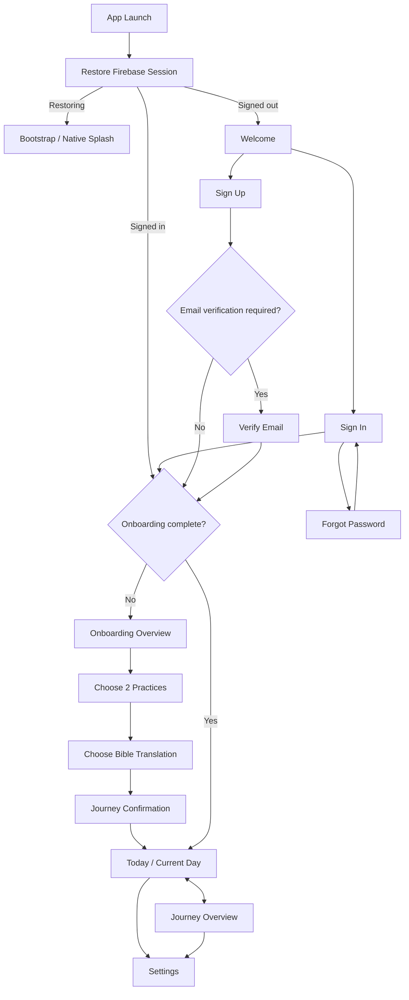

## 8.2 Daily experience

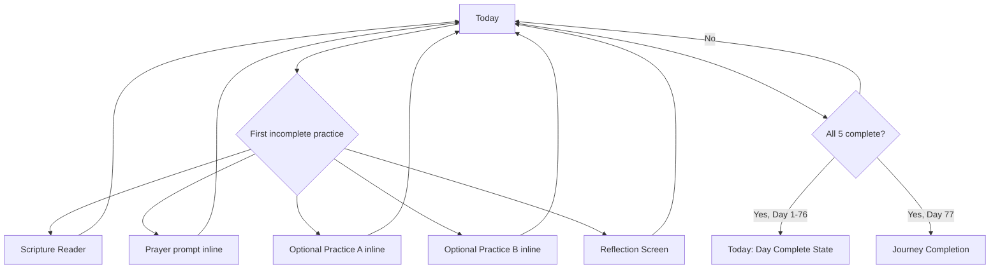

## 8.3 Journey/history

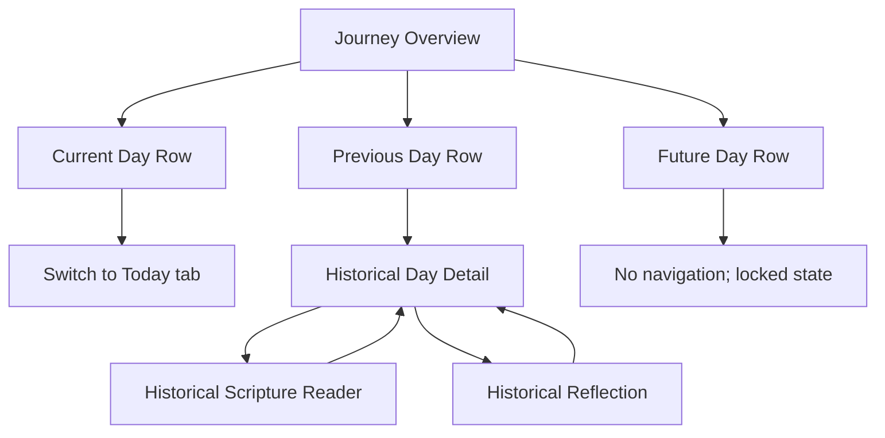

## 8.4 Settings

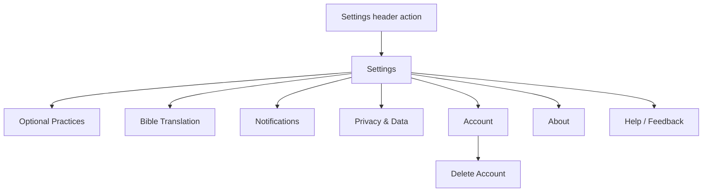

---

# 9. Complete Screen Inventory

> **Implementation status note:** all route existence is **Unverified** until repository inspection is completed.

| Screen | Recommended route | Purpose | Entry points | Primary exit / destination | Auth | Scope |
| --- | --- | --- | --- | --- | --- | --- |
| Bootstrap / Session Gate | `/` | Restore session and route without UI flash | App launch, external route fallback | Auth / Onboarding / Today | No | V1 |
| Welcome | `/auth/welcome` | Entry for signed-out users | Bootstrap, sign-out | Sign Up or Sign In | No | V1 |
| Sign In | `/auth/sign-in` | Authenticate existing account | Welcome, protected-route redirect | Onboarding or Today | No | V1 |
| Sign Up | `/auth/sign-up` | Create account | Welcome | Onboarding / Verify Email | No | V1 |
| Forgot Password | `/auth/forgot-password` | Request password reset | Sign In | Sign In | No | V1 |
| Verify Email | `/auth/verify-email` | Verification gate if enabled | Sign Up / auth gate | Onboarding | Yes, unverified email | Optional / undecided |
| Onboarding Overview | `/onboarding` | Explain journey + 3 required practices | Auth gate | Practice Selection | Yes | V1 |
| Practice Selection | `/onboarding/practices` | Choose exactly 2 optional practices | Onboarding Overview | Bible Translation | Yes | V1 |
| Bible Translation Onboarding | `/onboarding/bible-translation` | Select supported API.Bible translation | Practice Selection | Journey Confirmation | Yes | V1 |
| Journey Confirmation | `/onboarding/confirm` | Review configuration and start Day 1 | Bible Translation | Today | Yes | V1 |
| Today | `/today` | Complete current day's journey | Launch, Today tab, current-day Journey row | Scripture / Reflection / Settings | Yes | V1 |
| Journey Overview | `/journey` | Review all 77 days + weekly groupings | Journey tab | Historical Day / Today / Settings | Yes | V1 |
| Historical Day Detail | `/day/[dayNumber]` | Review/edit previous unlocked day | Journey previous-day row | Scripture / Reflection / Back | Yes | V1 |
| Scripture Reader | `/day/[dayNumber]/scripture` | Read day's passage and record Scripture practice | Today / Historical Day | Return to source | Yes | V1 |
| Reflection | `/day/[dayNumber]/reflection` | Respond to reflection question or record private reflection completion | Today / Historical Day | Return to source | Yes | V1 |
| Journey Completion | `/journey-complete` | Acknowledge reaching the end and offer review | Day 77 completion, post-Day-77 Today | Journey / Today | Yes | V1 |
| Settings | `/settings` | Preference/account hub | Header action from Today/Journey | Settings subpage / Back | Yes | V1 |
| Practice Settings | `/settings/practices` | Change 2 optional practices | Settings | Save → Settings | Yes | V1 |
| Bible Translation Settings | `/settings/bible-translation` | Change Scripture translation | Settings | Save → Settings | Yes | V1 |
| Notification Settings | `/settings/notifications` | Configure optional reminders | Settings | Back → Settings | Yes | Optional V1 |
| Privacy & Data | `/settings/privacy` | Explain private data, policy links, data controls | Settings | Back → Settings | Yes | V1 |
| Account | `/settings/account` | Account identity, sign out, deletion entry | Settings | Back / Sign Out / Delete Account | Yes | V1 |
| Delete Account | `/settings/account/delete` | Confirm destructive deletion | Account | Sign-out completion or Back | Yes | V1 if account creation exists |
| About | `/settings/about` | Product purpose, version, legal/about links | Settings | Back → Settings | Yes | V1 |
| Help / Feedback | `/settings/help-feedback` | Support and feedback path | Settings | Back / external support action | Yes | V1 |
| Communities | `/communities` | Private community list | Future Community tab | Community Detail | Yes | Future |
| Community Detail | `/communities/[communityId]` | Community home | Communities / invite | Prayer / Discussion / Progress | Yes | Future |
| Community Prayer Requests | `/communities/[communityId]/prayer` | Shared prayer requests | Community Detail | Request interaction within screen | Yes | Future |
| Community Discussion | `/communities/[communityId]/discussion` | Weekly/group discussion | Community Detail | Discussion interaction within screen | Yes | Future |
| Group Progress | `/communities/[communityId]/progress` | High-level group participation | Community Detail | Back | Yes | Future |
| Community Settings | `/communities/[communityId]/settings` | Membership/admin settings | Community Detail | Back | Yes | Future |
| Community Invite | `/invite/[inviteId]` | Accept private invitation | External deep link | Auth → Onboarding → Community | Depends | Future |

---

# 10. Detailed Screen Specifications

## 10.1 Bootstrap / Session Gate

| Field | Specification |
| --- | --- |
| **Purpose** | Restore authentication and required app state without showing the wrong navigation tree. |
| **Route** | `/` |
| **Context** | Root stack; routing-only surface. |
| **Entry points** | Cold launch, app reload, external route fallback. |
| **Primary action** | None. Automatic state resolution only. |
| **Destinations** | Signed out → Welcome. Signed in + onboarding incomplete → first incomplete onboarding step. Signed in + onboarding complete → Today. |
| **Back behavior** | Not applicable. This route should be replaced, not pushed beneath the destination. |
| **Required data** | Firebase auth restoration; minimal profile/onboarding state after auth resolves. |
| **Persistence** | None directly. Reads persisted auth/onboarding state. |

**States**

- **Restoring:** keep native splash or neutral bootstrap surface; do not flash Welcome.
- **Auth restore failure:** if Firebase definitively reports no valid session, route to Welcome. If network failure leaves cached Firebase session valid, follow the Firebase SDK's actual session semantics rather than force-signing out.
- **Profile/onboarding fetch loading:** keep protected neutral shell/splash until enough state exists to route safely.
- **Profile fetch error:** show a retryable bootstrap error only after auth is known; do not alternate between signed-in and signed-out trees.

---

## 10.2 Welcome

| Field | Specification |
| --- | --- |
| **Purpose** | Give signed-out users a concise entry into account creation or sign-in. |
| **Route** | `/auth/welcome` |
| **Context** | Authentication stack; headerless. |
| **Entry points** | Bootstrap when signed out; successful sign-out; protected-route redirect. |
| **Primary action** | `Get Started` → Sign Up. |
| **Secondary actions** | `I already have an account` → Sign In. Privacy/Terms links may open external documents if required. |
| **Back behavior** | Android back may exit/minimize the app when this is the root auth screen. No artificial previous screen. |
| **Required data** | None beyond static product copy and configured auth-provider availability. |
| **Persistence** | None. |

**States**

- Avoid a carousel or multi-screen marketing tour before account creation.
- Do not imply performance, streak, or scoring benefits here.
- Only show authentication providers actually configured in Firebase/source code.

---

## 10.3 Sign In

| Field | Specification |
| --- | --- |
| **Purpose** | Authenticate an existing user. |
| **Route** | `/auth/sign-in` |
| **Context** | Auth stack; pushed from Welcome. |
| **Entry points** | Welcome; protected deep-link redirect if supported. |
| **Primary action** | `Sign In` → auth gate → Onboarding or Today. |
| **Secondary actions** | `Forgot password?` → Forgot Password; `Create account` → Sign Up. |
| **Back behavior** | Back → Welcome unless entered as an auth gate from a deep link; destination preservation must not create a loop. |
| **Required data** | Configured Firebase Auth methods. |
| **Persistence** | Firebase Auth session on success. Form input is transient; password is never persisted by app state. |

**States**

- **Submitting:** disable duplicate submission while preserving entered email.
- **Invalid credentials:** inline error; remain on screen.
- **Network error:** clear retryable error; remain on screen.
- **Success:** use `replace`, not `push`, so Back cannot return to Sign In.
- **Authenticated but onboarding incomplete:** resume onboarding; do not route directly to Today.

---

## 10.4 Sign Up

| Field | Specification |
| --- | --- |
| **Purpose** | Create a Firebase-backed user account. |
| **Route** | `/auth/sign-up` |
| **Context** | Auth stack. |
| **Entry points** | Welcome; Sign In. |
| **Primary action** | `Create Account` → optional Verify Email or Onboarding. |
| **Secondary actions** | `Sign in instead` → Sign In. |
| **Back behavior** | Back → previous auth screen. |
| **Required data** | Only fields required by actual configured authentication method. |
| **Persistence** | Firebase Auth account and minimal user profile/onboarding record. |

**States**

- **Validation:** show field-level errors without clearing form.
- **Duplicate account:** explain existing-account path and link to Sign In.
- **Network error:** preserve form except password according to security decisions.
- **Success:** replace auth stack with verification/onboarding destination.

Do not collect profile fields solely because future Community might need them.

---

## 10.5 Forgot Password

| Field | Specification |
| --- | --- |
| **Purpose** | Trigger Firebase password-reset flow if email/password authentication exists. |
| **Route** | `/auth/forgot-password` |
| **Context** | Auth stack. |
| **Entry points** | Sign In. |
| **Primary action** | `Send reset email`. |
| **Secondary actions** | Back to Sign In. |
| **Back behavior** | Standard back → Sign In. |
| **Required data** | Email address. |
| **Persistence** | No app persistence. Firebase handles reset request. |

**States**

- Success should show a calm confirmation with `Back to Sign In`.
- Avoid revealing whether an email address exists if the chosen auth/security pattern intentionally prevents account enumeration.

---

## 10.6 Verify Email — Optional / Undecided

| Field | Specification |
| --- | --- |
| **Purpose** | Gate onboarding only if product/security policy requires verified email. |
| **Route** | `/auth/verify-email` |
| **Context** | Auth stack with authenticated but unverified session. |
| **Entry points** | Sign Up; session gate if verification is mandatory. |
| **Primary action** | `I've verified my email` / refresh verification state. |
| **Secondary actions** | Resend verification; sign out. |
| **Back behavior** | Must not bypass the verification gate if verification is required. |
| **Required data** | Firebase user email verification state. |
| **Persistence** | Firebase Auth verification state. |

**Recommended V1:** do not make email verification a hard navigation gate unless there is a concrete abuse/security requirement. It adds friction before the user has experienced the product.

---

## 10.7 Onboarding Overview

| Field | Specification |
| --- | --- |
| **Purpose** | Explain what the 77-day journey is and the five-practice structure. |
| **Route** | `/onboarding` |
| **Context** | Onboarding stack. |
| **Entry points** | Auth gate; resumed incomplete onboarding. |
| **Primary action** | `Continue` → Practice Selection. |
| **Secondary actions** | Sign out through a small account action if needed; no extra marketing pages. |
| **Back behavior** | If entered after sign-up, back may return to previous onboarding/auth context only if it does not expose signed-out routes incorrectly. Progress is saved. |
| **Required data** | Static product copy; optional saved onboarding progress. |
| **Persistence** | Mark overview step viewed/advanced if onboarding resume is step-based. |

**Must communicate:**

- 77 calendar days.
- Scripture, Prayer, Reflection are foundational.
- User chooses two additional practices.
- Missing a day does not restart the journey.
- The goal is consistent participation, not earning favor or scoring spirituality.

Keep this to one screen unless content cannot be made readable with scrolling.

---

## 10.8 Practice Selection — Onboarding

| Field | Specification |
| --- | --- |
| **Purpose** | Choose exactly two optional practices. |
| **Route** | `/onboarding/practices` |
| **Context** | Onboarding stack. |
| **Entry points** | Onboarding Overview; back from Bible Translation. |
| **Primary action** | `Continue` → Bible Translation; enabled only when exactly 2 distinct practices are selected. |
| **Secondary actions** | Select/deselect optional practice cards. |
| **Back behavior** | Back → Onboarding Overview; selected values remain saved. |
| **Required data** | Allowed practice catalog; current selections. |
| **Persistence** | Save selection as onboarding configuration after each change or on Continue; final selection becomes journey configuration at Start. |

**States**

- **0–1 selected:** Continue disabled with accessible explanation.
- **2 selected:** Continue enabled.
- **Attempt third selection:** either prevent selection with explanatory text or replace only after explicit deselection; do not silently drop an existing choice.
- **Catalog loading error:** retry; do not proceed with missing practice identifiers.

Required practices are visible as context but cannot be deselected.

---

## 10.9 Bible Translation — Onboarding

| Field | Specification |
| --- | --- |
| **Purpose** | Select a supported API.Bible translation before the journey begins. |
| **Route** | `/onboarding/bible-translation` |
| **Context** | Onboarding stack. |
| **Entry points** | Practice Selection; back from Confirmation. |
| **Primary action** | `Continue` → Journey Confirmation. |
| **Secondary actions** | Search/filter supported translations if the list is long. |
| **Back behavior** | Back → Practice Selection. |
| **Required data** | Supported/allowed API.Bible translation list. |
| **Persistence** | Save selected translation preference. |

**States**

- **Loading:** skeleton/list placeholder; keep page structure stable.
- **Error:** show retry; do not invent unsupported translations.
- **No selection:** Continue disabled.
- **Selection unavailable later:** reader should prompt for replacement translation without corrupting day progress.

Do not hard-code translation availability in navigation code.

---

## 10.10 Journey Confirmation

| Field | Specification |
| --- | --- |
| **Purpose** | Review the selected practices and translation, then create the journey. |
| **Route** | `/onboarding/confirm` |
| **Context** | Final onboarding screen. |
| **Entry points** | Bible Translation. |
| **Primary action** | `Start Day 1` → create journey → replace with Today. |
| **Secondary actions** | Edit practices → Practice Selection; edit translation → Bible Translation. |
| **Back behavior** | Back → Bible Translation before journey starts. After successful start, onboarding is removed from navigation history. |
| **Required data** | Exactly 2 optional practices; selected Bible translation; authenticated user. |
| **Persistence** | Persist onboarding complete, journey start calendar date/time zone, selected practices, translation preference. |

**Important behavior**

- V1 starts Day 1 **today**. Do not add a future start-date picker unless explicitly requested.
- Submission must be idempotent. Double-tap/network retry must not create multiple journeys.
- If write partially fails, remain on Confirmation with retry; do not route to Today until the journey state can be read coherently.

---

## 10.11 Today

| Field | Specification |
| --- | --- |
| **Purpose** | Primary daily home and current-day spiritual formation experience. |
| **Route** | `/today` |
| **Context** | Default tab. |
| **Entry points** | Launch after gate; Today tab; Journey current-day row; completion return. |
| **Primary action** | `Continue Day N` → scroll/focus first incomplete practice, or open the destination if that practice has a focused route. |
| **Secondary actions** | Scripture Reader; Reflection; prayer completion; optional-practice completion; intention edit; Settings header action. |
| **Back behavior** | As root tab, Android back exits/minimizes according to platform navigation conventions rather than navigating to auth/onboarding. |
| **Required data** | Current journey/day, weekly theme, day's content, passage reference, prayer prompt, reflection question, five practice definitions/statuses, intention/reflection summary, selected translation. |
| **Persistence** | Practice completion, intention text, sync metadata; navigation/expanded-card state remains transient. |

### Required content order

1. Day number + weekly theme.
2. Scripture passage reference and Scripture card.
3. Morning intention area.
4. Five-practice progress/controls in a clear sequence.
5. Reflection entry near the end of the daily flow.
6. Day-complete state when applicable.

The exact visual order can evolve, but Scripture must not be visually demoted beneath generic habit statistics.

### Practice interaction

Recommended ordering:

1. Scripture — tap card → Scripture Reader.
2. Prayer — prompt displayed/expanded inline; explicit completion control.
3. Optional Practice A — inline completion control.
4. Optional Practice B — inline completion control.
5. Reflection — tap → Reflection screen.

### Primary `Continue Day N` behavior

The primary CTA should act on the **first incomplete practice** using this sequence:

```text
Scripture → Prayer → Optional A → Optional B → Reflection
```

- If Scripture is first incomplete, open Scripture Reader.
- If Prayer is first incomplete, scroll/focus Prayer card.
- If Optional A/B is first incomplete, scroll/focus that practice.
- If Reflection is first incomplete, open Reflection.
- If all five are complete, replace the CTA with a non-urgent `Day N complete` state and review actions.

### Morning intention

- Intention is encouraged but **does not count as one of the five practices**.
- It is optional for daily-complete calculation.
- It should be editable on the current day and viewable/editable on previous days.
- Recommended interaction: inline expandable editor or lightweight sheet, not a dedicated route.
- Treat intention text as private journal-like data.

### Current-day states

**Not started**

- Show 0 of 5 recorded without negative language.
- Primary CTA = Begin/Continue with Scripture.

**In progress**

- Show actual completed controls.
- Primary CTA points to first incomplete practice.

**Complete**

- Show a calm completion acknowledgement.
- Keep all content accessible and editable.
- Do not auto-lock the day after completion.
- Do not automatically advance to tomorrow; calendar day controls progression.

**Previous day incomplete notice**

If yesterday is incomplete, show at most one understated notice such as:

> Yesterday is still incomplete. You can review it, or continue with today.

`Continue today` remains the dominant action. `Review yesterday` opens Historical Day Detail.

Do not surface a growing stack of missed-day warnings on Today. Journey is the place for full history.

**Post-Day-77**

- Replace daily CTA with a journey-end summary.
- Primary action = `Review your journey` → Journey.
- Secondary action = `View journey completion` → Journey Completion.
- Do not auto-create another journey.

---

## 10.12 Journey Overview

| Field | Specification |
| --- | --- |
| **Purpose** | Provide a readable overview of all 77 days and historical participation. |
| **Route** | `/journey` |
| **Context** | Second permanent tab. |
| **Entry points** | Journey tab; Journey Completion; post-journey Today. |
| **Primary action** | Contextual: current-day row → Today; previous-day row → Historical Day Detail. |
| **Secondary actions** | Settings header action; week expansion if used. |
| **Back behavior** | Root tab behavior. |
| **Required data** | Journey start, current day, per-day status, weekly themes, completed-practice counts. |
| **Persistence** | None for navigation; expansion/filter state may remain transient. |

### Recommended layout

Group days by Week 1–11, with each week showing theme and Days 1–7 for that week.

Per-day status can use text/icon combinations:

- `Complete`
- `3 of 5`
- `Not recorded`
- `Today`
- `Upcoming`

Do not use red `failed` states for incomplete past days.

### Row behavior

- **Current day:** tap → switch/replace to Today, not duplicate current day in Historical Day Detail.
- **Previous day:** tap → `/day/[dayNumber]`.
- **Future day:** non-navigable. It may show day number and week/theme context, but daily content stays locked.

### Progress summary

Acceptable V1 summary examples:

- Current Day: 24 of 77.
- Days recorded/completed.
- Current complete-day streak, if implemented.

Avoid:

- percentage labeled as faithfulness/spiritual score,
- ranking,
- grades,
- comparative performance.

---

## 10.13 Historical Day Detail

| Field | Specification |
| --- | --- |
| **Purpose** | Review and optionally correct a previous unlocked day's record. |
| **Route** | `/day/[dayNumber]` |
| **Context** | Root push over tabs; tab bar may be hidden for focus. |
| **Entry points** | Previous-day row in Journey; yesterday-incomplete notice on Today. |
| **Primary action** | Contextual `Continue this day` → first incomplete practice for that historical day. |
| **Secondary actions** | Scripture Reader; Reflection; edit intention; toggle manual practice completion. |
| **Back behavior** | Back returns to the actual source stack when navigated internally; deep-link fallback should return to Journey. |
| **Required data** | Valid previous day number; historical content and progress snapshot; practice configuration applicable to that day. |
| **Persistence** | Historical edits persist and may recompute derived status/streak. |

### Important rules

- Previous days remain editable in V1.
- Editing a previous day never changes the current day number.
- Historical days must retain the optional practices that applied to that day. Changing current settings must not rewrite old day labels.
- If a past day becomes complete after an edit, recompute any derived complete-day streak rather than preserving a stale value.
- If `dayNumber == currentDay`, redirect to Today.
- If `dayNumber > currentDay`, redirect to Journey.

---

## 10.14 Scripture Reader

| Field | Specification |
| --- | --- |
| **Purpose** | Provide focused Scripture reading for the day's assigned passage. |
| **Route** | `/day/[dayNumber]/scripture` |
| **Context** | Pushed focused screen. |
| **Entry points** | Today Scripture card; Historical Day Detail Scripture card. |
| **Primary action** | `Mark Scripture complete` / `Scripture complete` toggle. |
| **Secondary actions** | Back; translation context; optional `I read this passage elsewhere` path if API content is unavailable or the user uses a physical Bible. |
| **Back behavior** | Standard back to source. Reading progress is not required to be saved unless implemented. |
| **Required data** | Valid unlocked day; passage reference; selected translation; API.Bible response or cached content if licensing permits caching. |
| **Persistence** | Scripture practice completion; selected translation is a separate user preference. |

### Completion behavior

Opening, scrolling, or reaching the bottom of the passage must **not** automatically mark Scripture complete.

The user may manually mark Scripture complete because:

- they may read the same assigned passage in a physical Bible,
- they may use another Bible app,
- API.Bible may be temporarily unavailable.

This manual path should still show the assigned passage reference so the practice remains tied to the day's Scripture.

### API.Bible failure

If Scripture text cannot load:

1. Keep the passage reference visible if already known.
2. Show a clear retry action.
3. Keep the rest of the day's experience accessible.
4. Do not auto-complete Scripture.
5. If product permits external reading, provide `I read this passage elsewhere` as an explicit manual completion action.

### Translation changes

If the user changes translation in Settings, both current and historical Scripture Reader screens should render the selected translation for the same passage reference. Translation preference is a display preference, not part of historical completion state.

---

## 10.15 Reflection

| Field | Specification |
| --- | --- |
| **Purpose** | Help the user intentionally reflect on the day's prompt and optionally preserve a private written response. |
| **Route** | `/day/[dayNumber]/reflection` |
| **Context** | Pushed focused editor. |
| **Entry points** | Today; Historical Day Detail. |
| **Primary action** | `Save & mark reflection complete` when text exists. |
| **Secondary actions** | `I reflected without writing`; Back. |
| **Back behavior** | Normal back if draft autosave is reliable. If drafts are not autosaved, leaving a changed unsaved response requires a confirmation. |
| **Required data** | Valid unlocked day; reflection question; existing private response; reflection completion state. |
| **Persistence** | Private reflection text/draft and reflection completion. |

### Recommended completion rule

Reflection is complete when either:

1. the user saves a non-empty reflection response, **or**
2. the user explicitly chooses `I reflected without writing`.

This preserves Reflection as a real practice without forcing journaling as a condition of spiritual participation.

### Privacy

- Reflection content is private by default.
- Do not show community sharing controls in V1.
- Do not include raw reflection text in analytics, crash breadcrumbs, push notifications, logs, or support diagnostics.
- Future sharing must require a deliberate item-specific action.

### Editing

- Current and previous reflection responses may be edited later.
- Editing text does not un-complete Reflection unless the user explicitly marks it incomplete.
- Clearing all text from a completed written reflection should either preserve completion with an explicit `reflected without writing` state or ask whether the practice should remain complete; do not silently create inconsistent state.

---

## 10.16 Journey Completion

| Field | Specification |
| --- | --- |
| **Purpose** | Mark the end of the 77-day period without implying perfect performance. |
| **Route** | `/journey-complete` |
| **Context** | Root pushed screen; may be presented after Day 77 completion. |
| **Entry points** | Completion of final Day 77 practice; post-journey Today action. |
| **Primary action** | `Review your journey` → Journey. |
| **Secondary actions** | `Back to Today`. Future `Start another journey` only if multi-journey history exists. |
| **Back behavior** | Back → Today or source; must not expose onboarding. |
| **Required data** | Journey dates, participation summary, Day 77 status. |
| **Persistence** | Optional one-time `completionAcknowledged` UI flag; no spiritual score. |

### Copy principle

Say that the user has **reached the end of the 77-day journey**, not that they achieved perfection.

A journey can end with incomplete days. The end state should still allow reviewing and completing/correcting historical records if V1 keeps historical editing enabled.

### Repeating the journey

Do not show `Start another 77 days` unless the data model can safely preserve multiple historical journeys. This is an open product decision.

---

## 10.17 Settings

| Field | Specification |
| --- | --- |
| **Purpose** | Central hub for preferences, privacy, account, and support. |
| **Route** | `/settings` |
| **Context** | Root push from either main tab. |
| **Entry points** | Consistent header settings/account icon on Today and Journey. |
| **Primary action** | None; this is a destination list. |
| **Secondary actions** | Practices, Bible Translation, Notifications, Privacy, Account, About, Help/Feedback. |
| **Back behavior** | Back returns to the tab from which Settings was opened. |
| **Required data** | User preference summaries, auth identity basics. |
| **Persistence** | None directly. |

Use standard list-row navigation. Do not make rows look like toggles unless they are actual inline toggles.

---

## 10.18 Practice Settings

| Field | Specification |
| --- | --- |
| **Purpose** | Allow the user to change the two optional practices without altering required practices. |
| **Route** | `/settings/practices` |
| **Context** | Settings stack. |
| **Entry points** | Settings. |
| **Primary action** | `Save Changes` → Settings. |
| **Secondary actions** | Select/deselect practice cards. |
| **Back behavior** | If changed but not saved, confirm discard; otherwise back → Settings. |
| **Required data** | Current two optional practices; allowed practice catalog; current journey day. |
| **Persistence** | Effective-dated practice configuration. |

### Recommended V1 rule for mid-journey changes

Changing optional practices is allowed, but once a journey has started the change takes effect **the next calendar day**.

Example:

```text
Current day: Day 18
Current optional practices: Movement + Gratitude
User changes to: Service + Memorization
Day 18 keeps Movement + Gratitude
Day 19 and later use Service + Memorization
Days 1–18 history remains unchanged
```

Reasons:

- preserves historical meaning,
- prevents a partially completed current day from changing requirements mid-day,
- avoids rewriting previous day records,
- still allows the journey to adapt to changing circumstances.

Before Day 1 is started, changes apply immediately.

The Save confirmation should state when the change begins. No additional confirmation dialog is needed unless data would be lost.

---

## 10.19 Bible Translation Settings

| Field | Specification |
| --- | --- |
| **Purpose** | Change the translation used by the Scripture Reader. |
| **Route** | `/settings/bible-translation` |
| **Context** | Settings stack. |
| **Entry points** | Settings. |
| **Primary action** | Select translation and `Save` → Settings, or autosave with explicit selected state if existing settings patterns use autosave. |
| **Secondary actions** | Search/filter supported translations. |
| **Back behavior** | If explicit Save is used and selection changed, confirm discard; otherwise standard back. |
| **Required data** | Supported API.Bible translations; current selection. |
| **Persistence** | User translation preference. |

Change applies immediately to all Scripture Reader screens, current and historical. It does not change completion state.

---

## 10.20 Notification Settings — Optional V1

| Field | Specification |
| --- | --- |
| **Purpose** | Configure optional daily reminder behavior. |
| **Route** | `/settings/notifications` |
| **Context** | Settings stack. |
| **Entry points** | Settings; optional contextual invitation after the user has experienced the app. |
| **Primary action** | Enable/disable reminder and set time if supported. |
| **Secondary actions** | Open OS Settings when permission is denied. |
| **Back behavior** | Standard back; preferences should save immediately or through one consistent Save pattern. |
| **Required data** | OS permission state; existing reminder preference. |
| **Persistence** | Local notification scheduling settings and any synced preference required by implementation. |

### Permission behavior

- Do not make notification permission part of required onboarding.
- Do not repeatedly prompt after denial.
- Explain the benefit before triggering the OS prompt.
- If permission is denied, show `Open Settings` rather than re-request loops.

If notifications are not implemented in V1, omit this row from the rendered Settings screen rather than showing a dead destination.

---

## 10.21 Privacy & Data

| Field | Specification |
| --- | --- |
| **Purpose** | Explain data privacy and provide access to privacy/data controls. |
| **Route** | `/settings/privacy` |
| **Context** | Settings stack. |
| **Entry points** | Settings. |
| **Primary action** | Read/access Privacy Policy; no forced action. |
| **Secondary actions** | Links to data/account controls where implemented. |
| **Back behavior** | Back → Settings. |
| **Required data** | Privacy-policy URL/text and actual data-handling disclosures. |
| **Persistence** | None unless consent controls are implemented. |

Must state accurately that reflection/intention/journal-like content is private by default. Do not promise encryption, offline privacy, deletion timing, or data retention behavior that is not actually implemented.

---

## 10.22 Account

| Field | Specification |
| --- | --- |
| **Purpose** | Manage authentication/account actions. |
| **Route** | `/settings/account` |
| **Context** | Settings stack. |
| **Entry points** | Settings. |
| **Primary action** | None; display account actions. |
| **Secondary actions** | Sign Out; Delete Account; provider-specific security actions if implemented. |
| **Back behavior** | Back → Settings. |
| **Required data** | Firebase current user and configured auth providers. |
| **Persistence** | Auth/session changes only when user acts. |

### Sign out

- Sign Out should end the Firebase session, clear sensitive in-memory state, and replace the protected navigation tree with Welcome.
- Do not let Back return to Today after sign-out.
- If local unsynced private data exists, resolve the sync/local-storage policy before clearing it. Do not silently discard a reflection draft.

---

## 10.23 Delete Account

| Field | Specification |
| --- | --- |
| **Purpose** | Let users initiate permanent account and associated-data deletion. |
| **Route** | `/settings/account/delete` |
| **Context** | Dedicated destructive push screen, not a one-line alert. |
| **Entry points** | Account. |
| **Primary action** | `Delete my account` after explicit confirmation/reauthentication as required. |
| **Secondary actions** | `Cancel` → Account. |
| **Back behavior** | Back/cancel safely aborts. After success, replace with Welcome. |
| **Required data** | Authenticated Firebase user; deletion requirements; reauthentication state if needed. |
| **Persistence** | Permanent backend deletion plus sign-out on success. |

Use a dedicated screen because the action is consequential and may require reauthentication/network work.

If the app permits in-app account creation, account deletion belongs in V1 rather than being deferred as a convenience feature.

---

## 10.24 About

| Field | Specification |
| --- | --- |
| **Purpose** | Explain 77Faithful's purpose and show app/version/legal information. |
| **Route** | `/settings/about` |
| **Context** | Settings stack. |
| **Entry points** | Settings. |
| **Primary action** | None. |
| **Secondary actions** | Privacy/terms/site links as applicable. |
| **Back behavior** | Back → Settings. |
| **Required data** | App version/build number; static product copy. |
| **Persistence** | None. |

Keep this informational. Do not duplicate onboarding or create a marketing feed.

---

## 10.25 Help / Feedback

| Field | Specification |
| --- | --- |
| **Purpose** | Give users a clear support/feedback path. |
| **Route** | `/settings/help-feedback` |
| **Context** | Settings stack. |
| **Entry points** | Settings; recoverable error screens may link here when appropriate. |
| **Primary action** | Send feedback/open configured support destination. |
| **Secondary actions** | FAQ/help links if they exist. |
| **Back behavior** | Back → Settings. |
| **Required data** | Configured support destination. |
| **Persistence** | None unless an in-app feedback form is implemented. |

Never prefill support diagnostics with private Scripture reflection, intention, prayer, or journal text.

---

# 11. Core Daily User Flow

## 11.1 Normal returning day

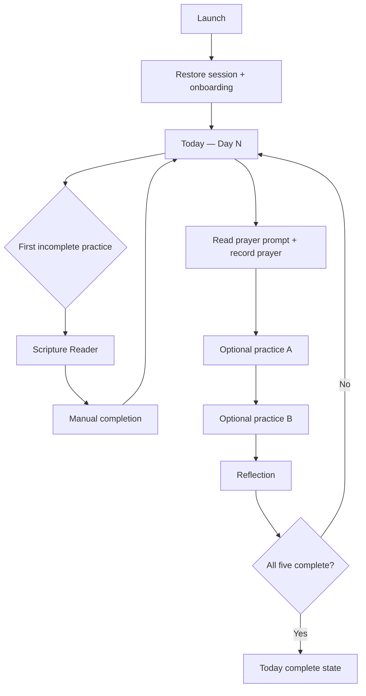

The user does not need to follow the sequence rigidly. They may complete practices in any order. `Continue Day N` simply directs them to the first incomplete item in the recommended sequence.

## 11.2 Scripture behavior

- The user taps the Scripture card from Today.
- Reader loads the assigned passage in the selected translation.
- Opening or scrolling never auto-completes the practice.
- User explicitly marks Scripture complete.
- User may mark it complete after reading the assigned passage outside the app.
- Back returns to Today or Historical Day Detail.

## 11.3 Prayer behavior

- Prayer prompt is visible or expandable inline on Today/Day Detail.
- User reads the prompt and prays outside any tracked timer.
- User explicitly marks Prayer complete.
- Do not require a prayer text entry.
- Do not time the prayer.

## 11.4 Optional practices

- Display the two practices chosen for that day.
- Each has one clear completion control.
- Tapping the completion control records/unrecords completion.
- Tapping the explanatory area may expand instructions if needed, but should not unexpectedly navigate unless the card clearly looks navigational.

## 11.5 Reflection behavior

- Reflection opens a focused screen.
- User can write and save a response or explicitly choose that they reflected without writing.
- Returning to Today updates the practice status.

## 11.6 Daily completion

A day becomes complete when all five practice states are complete:

```text
scripture == complete
AND prayer == complete
AND optionalPracticeA == complete
AND optionalPracticeB == complete
AND reflection == complete
```

Morning intention is not included in this calculation.

After the final practice:

- update the current screen immediately,
- persist the change,
- show a calm `Day N complete` state,
- keep the day editable,
- do not navigate to tomorrow,
- do not require a completion modal.

If this is Day 77, offer/navigate to Journey Completion after state persistence succeeds.

---

# 12. Missed-Day UX

Missed-day behavior is a core product contract.

## 12.1 Progression rule

77Faithful is calendar-based.

Example:

```text
Monday = Day 10, user completes 3 of 5
Tuesday = Day 11

The app does NOT:
- reset to Day 1
- force completion of Day 10 before Day 11
- rename Tuesday as Day 10
```

## 12.2 How the previous day appears

On Today:

- if only yesterday is incomplete, one subtle non-blocking notice may appear,
- primary action remains today's journey,
- secondary action opens yesterday.

On Journey:

- previous incomplete day shows `Not recorded` or `N of 5`, depending on actual state,
- it remains tappable,
- no red failure icon is required.

## 12.3 Can previous days be edited later?

**Recommended V1: yes.**

Users may:

- mark/unmark practice completion,
- add/edit intention,
- add/edit reflection,
- open historical Scripture.

Historical edits never change the current day number.

## 12.4 Streak behavior

A complete-day streak, if implemented, is derived from consecutive calendar days with all five practices complete.

- An incomplete day breaks the derived streak.
- The journey continues regardless.
- If the user later corrects a historical record, recompute the streak from recorded state.
- Do not make streak loss the primary message on Today.
- Do not show streak restoration animations intended to pressure daily completion.

**Recommended placement:** Journey summary, not the main Today hero.

## 12.5 Appropriate missed-day language

Prefer factual, non-punitive language:

- `Day 12 — 3 of 5 recorded`
- `Yesterday is incomplete`
- `Review Day 12`
- `Continue with Day 13`

Avoid:

- `You failed Day 12`
- `Your journey is broken`
- `Start over`
- `You lost everything`
- `Don't lose your streak!`

---

# 13. Journey Progression — Day 1 Through Day 77

## 13.1 Day 1

- Created only after Journey Confirmation succeeds.
- Immediately becomes current day.
- Today opens Day 1.
- Journey shows Day 1 as Today and Days 2–77 as Upcoming.

## 13.2 Previous days

- Always visible in Journey.
- Tappable.
- Editable in V1.
- Use historical practice configuration that applied on that date.

## 13.3 Current day

- Current-day row in Journey navigates to Today.
- Today is the canonical current-day screen.
- Do not create a duplicate current-day detail route with slightly different controls.

## 13.4 Future days

**Recommended V1:** future days are visible in Journey but locked.

They may show:

- day number,
- week number/theme,
- `Upcoming` state.

They should not allow:

- completion changes,
- reflection entry,
- intention entry,
- Scripture Reader access for the future day.

Do not expose an interactive lock screen. The row can simply be disabled/non-navigable with an accessibility label such as `Day 28, upcoming`.

## 13.5 Weekly transitions

- Week changes automatically based on day number.
- Today should show the current week theme.
- Journey groups days under weekly theme headings.
- A separate Weekly Theme screen is **not** required in V1.
- If longer weekly content is later authored, add a theme-detail route only after there is meaningful content that warrants a screen.

## 13.6 Day 77

Day 77 works like any other day until the final practice is complete.

After all five are complete:

1. persist Day 77 completion,
2. update Today state,
3. offer/navigate to Journey Completion,
4. keep Journey and historical entries accessible.

## 13.7 End of the calendar period with incomplete Day 77

If the calendar advances beyond Day 77 while Day 77 or earlier days remain incomplete:

- journey status becomes `ended`,
- Today becomes a post-journey summary rather than creating Day 78,
- Journey remains fully accessible,
- historical days remain editable under the V1 recommendation,
- completion copy must say the 77-day period has ended, not that every practice was completed.

## 13.8 Starting another journey

**Optional / undecided.**

Recommended V1 behavior is to **not** expose a restart/new-journey action until the backend supports multiple journey records without overwriting the first journey.

---

# 14. Major User Flow Diagrams

## 14.1 First-time user

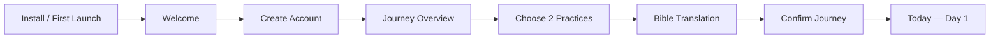

## 14.2 Returning user

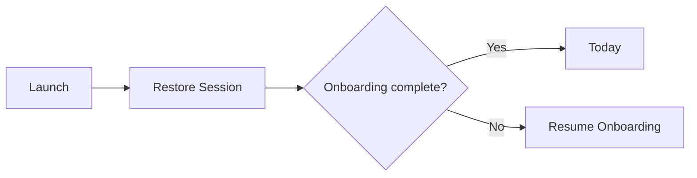

## 14.3 Complete daily journey

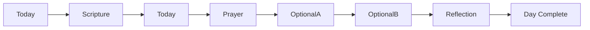

Order may vary by user action; this is the recommended `Continue` order.

## 14.4 Missed / incomplete previous day

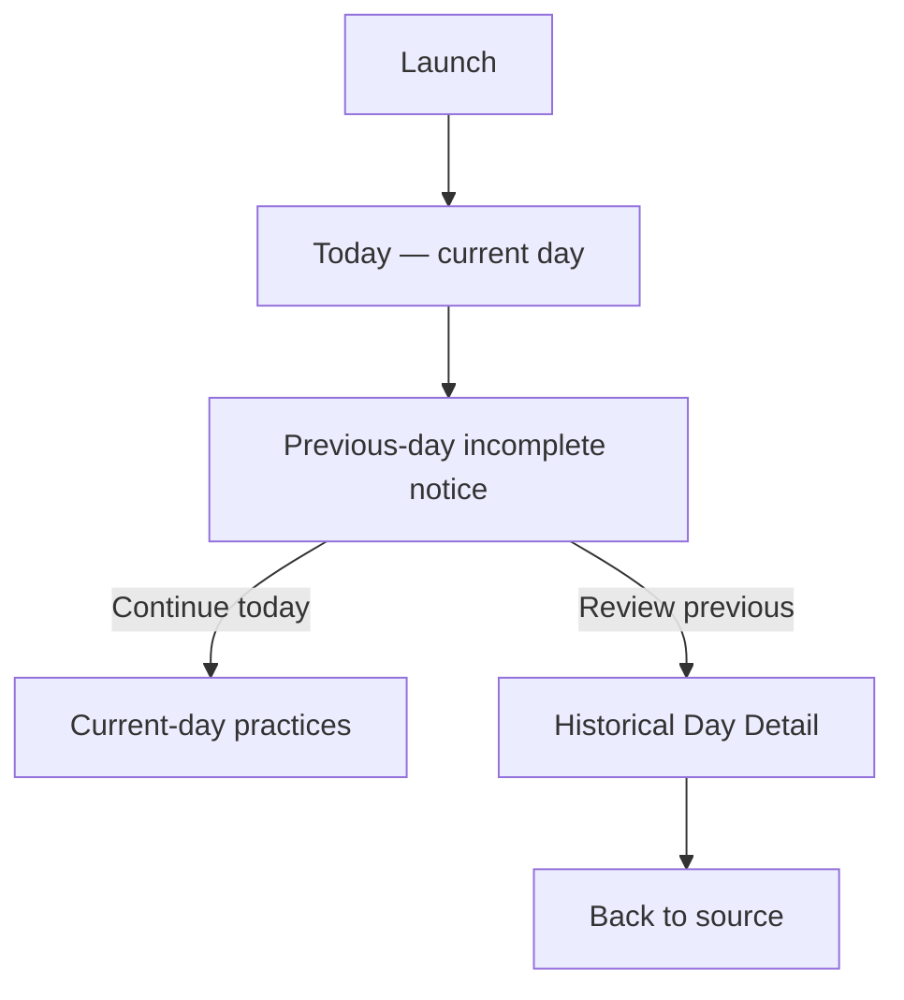

The previous day never blocks the current day.

## 14.5 Change optional practices

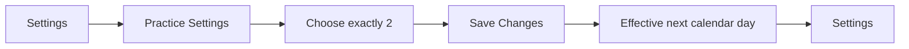

Past and current-day practice definitions remain unchanged.

## 14.6 Change Bible translation

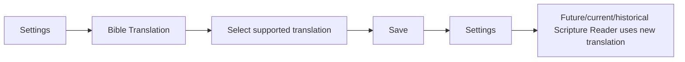

## 14.7 Sign out

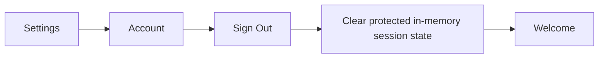

Back navigation must not return to protected screens.

---

# 15. CTA and Interaction Rules

## 15.1 Primary CTA

Each screen should have at most one obvious primary action.

Recommended patterns:

| Screen type | Primary CTA behavior |
| --- | --- |
| Auth form | Submit authentication action |
| Onboarding step | Continue |
| Journey Confirmation | Start Day 1 |
| Today | Continue first incomplete practice |
| Scripture Reader | Mark Scripture complete |
| Reflection | Save & mark reflection complete |
| Practice Settings | Save Changes |
| Delete Account | Delete my account |

On long focused screens, primary CTA may be sticky above the safe area if this does not cover content or keyboard controls.

## 15.2 Secondary actions

- Use text buttons/links for lower-priority navigation.
- Do not style `Review yesterday` with equal dominance to `Continue today`.
- `Cancel` is appropriate for destructive or modal-like flows.
- Standard back is preferable to adding redundant `Cancel` on ordinary pushed screens.

## 15.3 Navigation cards

A card should behave consistently:

- If the whole card navigates, the card should have a clear disclosure/chevron or navigational affordance.
- If a card contains an inline completion control, tapping the checkbox/toggle must not also trigger navigation.
- Do not make visually identical cards navigate on one screen and toggle completion on another.

## 15.4 Completion controls

- Use a checkbox/check-circle style control with an accessible checked state.
- Completion must be reversible for current and historical days in V1.
- Do not require a confirmation to mark/unmark ordinary practice completion.
- Account for an optimistic/pending sync state if local-first writes exist.
- Never rely on color alone to indicate complete/incomplete.

## 15.5 Save vs. autosave

**Autosave recommended:**

- intention drafts,
- reflection drafts,
- simple toggles,
- completion controls.

**Explicit Save recommended:**

- changing optional-practice configuration,
- settings pages where multiple related values are edited together,
- destructive flows.

Bible translation may use either explicit Save or immediate selection, but match the established Settings pattern consistently.

## 15.6 Destructive actions

Require confirmation/reauthentication where appropriate for:

- account deletion,
- deleting user-created content if such deletion is irreversible.

Do not add confirmation dialogs to routine completion toggles, back navigation with reliable autosave, or ordinary settings rows.

---

# 16. Header and Back Navigation Rules

## 16.1 Main tabs

**Today and Journey:**

- no back button,
- clear page title or accessible heading,
- consistent settings/account icon in the same header position,
- bottom tab bar visible.

## 16.2 Pushed screens

**Scripture Reader, Reflection, Historical Day, Settings subpages:**

- native back affordance,
- meaningful title,
- Android hardware back mirrors header back,
- iOS swipe-back is allowed when safe.

## 16.3 Settings

- Settings root back returns to the actual source tab.
- Settings child back returns one level to Settings.
- Do not make each settings row a modal.

## 16.4 Unsaved changes

Only intercept back when leaving would actually discard user input.

If intention/reflection drafts are reliably autosaved, do not interrupt back navigation.

Practice Settings with unsaved changed selections should prompt:

```text
Discard changes?
[Keep Editing] [Discard]
```

## 16.5 Onboarding

- Before Start Day 1, back is allowed between onboarding steps and progress persists.
- After successful Start Day 1, onboarding routes are replaced/guarded out of history.
- Android back from Today must never return to onboarding.

## 16.6 Modals / bottom sheets

Use a modal/form sheet only for short transient tasks. If a modal can be dismissed by gesture, unsaved destructive state must either autosave or block interactive dismissal.

No core daily practice requires a modal route in the recommended V1 architecture.

---

# 17. Loading, Error, Offline, and Empty States

## 17.1 Loading principles

- Avoid full-screen spinners after initial bootstrap when existing content can remain visible.
- Prefer skeletons or retained stale content with a subtle refresh state.
- Keep navigation chrome stable while content loads.
- Do not disable the entire Today screen because one API-backed card is refreshing.

## 17.2 Scripture API failure

When API.Bible is unavailable:

- keep day/theme/prayer/other practices available,
- display the known Scripture reference,
- show retry on the Scripture card/reader,
- do not auto-complete Scripture,
- allow explicit external-reading completion if that product rule is enabled,
- never substitute an unlicensed or guessed Bible text.

## 17.3 Firebase read failure

Minimum behavior:

- keep last successfully loaded local UI state visible if available,
- show a non-blocking sync/read error,
- provide Retry,
- do not sign the user out solely because a Firestore/database request failed.

If no cached data exists and required journey state cannot be resolved, show a retryable blocking error rather than inventing Day 1 or resetting progress.

## 17.4 Firebase write failure

Recommended V1 UX contract:

- user edits should update local UI immediately when a local persistence/sync layer exists,
- failed writes should become a visible `Pending sync`/retry state rather than silently reverting,
- private reflection/intention drafts should be retained locally until sync succeeds or the user deletes them,
- do not mark a write as synced before Firebase confirms it.

If the current codebase has no reliable local write queue, document that limitation explicitly and do not falsely present full offline completion as supported.

## 17.5 Offline usage

Do **not** claim full offline support unless code verification confirms it.

Recommended minimum V1 target:

| Capability | Offline target |
| --- | --- |
| Open last-cached Today content | Yes, if cached |
| View previously cached Journey history | Yes, if cached |
| Edit completion/reflection | Prefer local pending sync; otherwise clearly unavailable |
| Load uncached API.Bible Scripture | No |
| Mark Scripture automatically from failed API load | No |
| Read assigned passage reference | Yes if day content/reference was cached |

If licensing rules restrict caching Bible text, cache only what is permitted and keep the passage reference available.

## 17.6 Empty states

### New Journey Overview

Journey is never truly empty after start. On Day 1:

- Day 1 = Today.
- Days 2–77 = Upcoming.
- Avoid a generic `No history yet` blank screen.

### No completed days

Show the actual Day 1/current rows and explanatory state. Do not show a zero-score dashboard.

### Future Communities

If Community ships and user belongs to none:

- explain private communities briefly,
- primary action = Join/Create only if those features exist,
- do not show empty social metrics.

---

# 18. Authentication Edge Cases

| State | Expected navigation |
| --- | --- |
| Logged out | Welcome/Auth only |
| Firebase restoring session | Native splash/bootstrap; no auth flash |
| Returning authenticated + onboarding complete | Today |
| Returning authenticated + onboarding incomplete | Resume first incomplete onboarding step |
| Authenticated + mandatory email unverified | Verify Email if that gate is enabled |
| Session revoked/expired | Replace protected tree with Sign In/Welcome; preserve only safe local drafts per policy |
| User signs out | Replace with Welcome; clear protected navigation history |
| User deletes account | Complete backend deletion, sign out, replace with Welcome |
| User reauthenticates after password reset | Normal auth gate → onboarding or Today |

## 18.1 Preventing auth flash

The root app must treat Firebase session restoration as unresolved state.

Do not:

```text
initial render → Welcome → Firebase restores → Today
```

Prefer:

```text
initial render → native splash/bootstrap → Firebase resolves → correct destination
```

## 18.2 Partial profile state

If Firebase Auth succeeds but the user's application profile/onboarding document is missing:

- do not assume onboarding complete,
- do not automatically overwrite remote data,
- route to a controlled recovery/onboarding path,
- log the inconsistency without including private user content.

---

# 19. Deep Links

## 19.1 V1 recommendation

Do not publish external deep links until the app's actual URL scheme/universal-link configuration and protected-route redirect preservation are implemented and tested.

Safe candidate paths once supported:

- `/today`
- `/journey`
- `/day/[dayNumber]`

Future:

- `/invite/[inviteId]`
- community-specific destinations after membership validation.

## 19.2 Protected deep-link behavior

When a protected link is supported:

```text
Open protected deep link
    ↓
Restore session
    ↓
IF signed out
    → Authenticate
    ↓
IF onboarding incomplete
    → Finish onboarding
    ↓
Validate original destination
    ↓
Navigate to original destination
```

Validation can change the destination:

- current-day detail link → Today,
- future day → Journey,
- invalid day → Journey,
- future community link without membership → invitation/join flow, not community content.

## 19.3 Do not encode private data in URLs

Never place reflection text, prayer text, intention text, email addresses, or private journal content in route parameters/query strings.

---

# 20. Accessibility and Mobile UX Requirements

## 20.1 Screen-reader semantics

- Every icon-only header action has an accessibility label.
- Completion controls expose checked/unchecked state.
- Future days announce `upcoming`/`locked`, not only a gray color.
- Errors are announced when they appear.
- Page titles/headings are exposed meaningfully to screen readers.

## 20.2 Touch targets

Use at least:

- approximately 44×44 points on iOS,
- approximately 48×48 dp on Android,
- preferably a shared cross-platform target large enough to satisfy both.

Small visible icons may sit inside larger pressable hit areas.

## 20.3 Dynamic text

- Support platform font scaling.
- Avoid fixed-height cards containing variable-length Scripture references, prompts, or accessibility-sized text.
- Primary CTA labels must remain readable at large text sizes.

## 20.4 Keyboard behavior

Reflection and intention editors must:

- avoid being covered by the keyboard,
- keep Save/primary actions reachable,
- scroll focused fields into view,
- preserve drafts when keyboard dismisses.

## 20.5 Focus behavior

On navigation:

- focus/announce the new screen title where appropriate,
- do not auto-focus text fields and open the keyboard unless text entry is clearly the immediate task,
- after a completion action, announce the new state without forcing focus to an unrelated control.

## 20.6 Motion

- Honor reduced-motion preferences for non-essential transitions/celebrations.
- No essential state should depend on animation.
- Avoid excessive celebration animation on daily completion.

## 20.7 Contrast and color

- Completion, current day, errors, and future days must have text/icon/state semantics in addition to color.
- Ensure selected optional practices and disabled CTAs remain distinguishable under accessibility contrast requirements.

## 20.8 Safe areas and scrolling

- Bottom CTAs must sit above home indicator/navigation bar.
- Bottom tabs respect safe-area insets.
- Long Scripture and Reflection screens use one coherent scroll container.
- Do not nest scroll views without a concrete need.

---

# 21. Platform Behavior

## 21.1 iOS

- Use native stack back and swipe-back for ordinary pushed screens.
- Full-screen form/editor screens may use standard iOS push behavior; do not convert core content to sheets solely for aesthetics.
- If a modal/form sheet contains unsaved destructive state, guard interactive dismissal.

## 21.2 Android

- Hardware/system Back must mirror header back.
- From Today/Journey root tabs, Back exits/minimizes per standard app behavior rather than opening auth/onboarding.
- Do not intercept Back globally unless a specific flow requires it.

## 21.3 Shared behavior

Prefer shared product behavior for:

- day progression,
- practice completion,
- auth/onboarding gates,
- privacy,
- historical editing,
- route availability.

Platform-specific behavior should be limited to native navigation, keyboard, permissions, and controls where the platform convention is materially better.

---

# 22. Screen Relationship Matrix

This matrix is the contract for meaningful interactive navigation.

| From | Action | Destination | Navigation type | Conditions / result |
| --- | --- | --- | --- | --- |
| Bootstrap | Session = signed out | Welcome | Replace | Firebase auth restored |
| Bootstrap | Signed in + onboarding incomplete | Onboarding resume step | Replace | Resume first incomplete step |
| Bootstrap | Signed in + onboarding complete | Today | Replace | Journey readable |
| Welcome | Get Started | Sign Up | Push | Always |
| Welcome | I already have an account | Sign In | Push | Always |
| Sign In | Sign In succeeds | Onboarding or Today | Replace | Based on onboarding state |
| Sign In | Forgot password | Forgot Password | Push | Email/password auth exists |
| Sign In | Create account | Sign Up | Replace/Push | Avoid duplicate auth stacks |
| Sign Up | Create account succeeds | Verify Email | Replace | Only if verification enforced |
| Sign Up | Create account succeeds | Onboarding Overview | Replace | Default recommendation |
| Forgot Password | Reset request complete | Sign In | Back/CTA | User chooses return |
| Verify Email | Verification confirmed | Onboarding Overview | Replace | Verification required |
| Onboarding Overview | Continue | Practice Selection | Push | Authenticated |
| Practice Selection | Continue | Bible Translation | Push | Exactly 2 selected |
| Bible Translation Onboarding | Continue | Journey Confirmation | Push | Valid translation selected |
| Journey Confirmation | Start Day 1 | Today | Replace | Journey write succeeds |
| Journey Confirmation | Edit practices | Practice Selection | Navigate within onboarding | Preserve translation selection |
| Journey Confirmation | Edit translation | Bible Translation | Back/navigate | Preserve practices |
| Today | Tap Today tab | Today | Tab | No-op if already selected; may scroll to top on repeated tap if established pattern |
| Today | Continue Day N — Scripture incomplete | Scripture Reader | Push | Current day |
| Today | Continue Day N — Prayer incomplete | Prayer card | In-page focus/scroll | Current day |
| Today | Continue Day N — Optional A/B incomplete | Practice card | In-page focus/scroll | Current day |
| Today | Continue Day N — Reflection incomplete | Reflection | Push | Current day |
| Today | Scripture card | Scripture Reader | Push | Current day unlocked |
| Today | Reflection card | Reflection | Push | Current day unlocked |
| Today | Prayer completion | Today | In-place state | Persist toggle |
| Today | Optional practice completion | Today | In-place state | Persist toggle |
| Today | Edit intention | Today editor/sheet | In-place / transient | Does not affect complete-day status |
| Today | Review yesterday | Historical Day Detail | Push | Yesterday < current day and incomplete |
| Today | Settings header action | Settings | Push | Authenticated |
| Today | Journey tab | Journey Overview | Tab | Authenticated |
| Today | Final Day 1–76 practice completed | Day Complete state | In-place | All five complete |
| Today | Final Day 77 practice completed | Journey Completion | Push after persistence | All five complete |
| Today post-journey | Review your journey | Journey Overview | Tab/replace | Journey ended |
| Today post-journey | View completion | Journey Completion | Push | Journey ended |
| Journey | Today row | Today | Tab switch | row day == current day |
| Journey | Previous day row | Historical Day Detail | Push | day < current day |
| Journey | Future day row | None | Disabled | day > current day |
| Journey | Settings header action | Settings | Push | Authenticated |
| Historical Day Detail | Continue — Scripture incomplete | Scripture Reader | Push | Previous unlocked day |
| Historical Day Detail | Continue — Reflection incomplete | Reflection | Push | Previous unlocked day |
| Historical Day Detail | Prayer/optional toggle | Same screen | In-place | Recompute day state |
| Historical Day Detail | Edit intention | Same screen editor/sheet | In-place | Private |
| Historical Day Detail | Header back | Source | Pop | Usually Journey/Today |
| Scripture Reader | Mark complete | Same screen then source | In-place + Back optional | User action only; never auto from scroll |
| Scripture Reader | Retry API | Same screen | In-place | API failed |
| Scripture Reader | Back | Today/Historical Day | Pop | Preserve completion state |
| Reflection | Save & mark complete | Source | Save + Back | Valid response |
| Reflection | I reflected without writing | Source | Save + Back | Explicit action |
| Reflection | Back | Source | Pop | Autosaved draft or discard guard |
| Journey Completion | Review your journey | Journey Overview | Replace/Tab | Always |
| Journey Completion | Back to Today | Today | Replace/Back | Always |
| Settings | Optional Practices | Practice Settings | Push | Authenticated |
| Settings | Bible Translation | Bible Translation Settings | Push | Authenticated |
| Settings | Notifications | Notification Settings | Push | Only if implemented |
| Settings | Privacy & Data | Privacy & Data | Push | Authenticated |
| Settings | Account | Account | Push | Authenticated |
| Settings | About | About | Push | Authenticated |
| Settings | Help / Feedback | Help / Feedback | Push | Authenticated |
| Practice Settings | Save Changes | Settings | Save + Pop | Exactly 2 selected; takes effect next day |
| Bible Translation Settings | Save | Settings | Save + Pop | Valid supported translation |
| Notification Settings | Open Settings | OS app settings | External/native | Permission denied |
| Account | Sign Out | Welcome | Replace root | Firebase sign-out succeeds |
| Account | Delete Account | Delete Account | Push | Authenticated |
| Delete Account | Cancel | Account | Pop | No deletion |
| Delete Account | Confirm deletion succeeds | Welcome | Replace root | Account + required data deletion complete |
| About | Back | Settings | Pop | Always |
| Help / Feedback | Back | Settings | Pop | Always |
| Communities | Community row | Community Detail | Push | Active membership |
| Community Detail | Prayer Requests | Community Prayer Requests | Push | Active membership |
| Community Detail | Discussion | Community Discussion | Push | Active membership |
| Community Detail | Group Progress | Group Progress | Push | Active membership |
| Community Detail | Settings | Community Settings | Push | Authorized role/member |
| Community Prayer Requests | Back | Community Detail | Pop | Active membership |
| Community Discussion | Back | Community Detail | Pop | Active membership |
| Group Progress | Back | Community Detail | Pop | Active membership |
| Community Settings | Back | Community Detail | Pop | Active membership |
| Community Invite | Authenticate | Sign In / Sign Up | Redirect preserving invite | Signed out |
| Community Invite | Finish onboarding | Onboarding | Redirect preserving invite | Onboarding incomplete |
| Community Invite | Join Community | Community Detail | Replace | Invite valid and membership created |

---

# 23. Route Registry

> Recommended Expo Router registry; replace with actual routes after repository inspection.

| Route | Screen | Route group | Parameters | Protected? | V1/Future | Notes |
| --- | --- | --- | --- | --- | --- | --- |
| `/` | Bootstrap / Session Gate | Root | None | No | V1 | Routing only; no auth flash |
| `/auth/welcome` | Welcome | `(auth)` | None | Signed-out only | V1 | Auth anchor |
| `/auth/sign-in` | Sign In | `(auth)` | Optional preserved destination internally | Signed-out only | V1 | Do not expose private data in redirect params |
| `/auth/sign-up` | Sign Up | `(auth)` | None | Signed-out only | V1 | Only configured auth methods |
| `/auth/forgot-password` | Forgot Password | `(auth)` | None | Signed-out only | V1 | Only if password auth exists |
| `/auth/verify-email` | Verify Email | `(auth)` | None | Authenticated/unverified | Optional | Omit if verification not enforced |
| `/onboarding` | Onboarding Overview | `(onboarding)` | None | Auth + onboarding incomplete | V1 | Resume flow |
| `/onboarding/practices` | Practice Selection | `(onboarding)` | None | Auth + onboarding incomplete | V1 | Exactly two optional practices |
| `/onboarding/bible-translation` | Bible Translation | `(onboarding)` | None | Auth + onboarding incomplete | V1 | API.Bible supported list |
| `/onboarding/confirm` | Journey Confirmation | `(onboarding)` | None | Auth + onboarding incomplete | V1 | Creates journey |
| `/today` | Today | `(app)/(tabs)` | None | Yes | V1 | Canonical current-day screen |
| `/journey` | Journey Overview | `(app)/(tabs)` | None | Yes | V1 | 77-day history/overview |
| `/day/[dayNumber]` | Historical Day Detail | `(app)` | `dayNumber: 1..77` | Yes | V1 | Current day redirects to Today; future redirects Journey |
| `/day/[dayNumber]/scripture` | Scripture Reader | `(app)` | `dayNumber: 1..currentDay` | Yes | V1 | Manual completion |
| `/day/[dayNumber]/reflection` | Reflection | `(app)` | `dayNumber: 1..currentDay` | Yes | V1 | Private content |
| `/journey-complete` | Journey Completion | `(app)` | None | Yes | V1 | End state, not perfection claim |
| `/settings` | Settings | `(app)` | None | Yes | V1 | Open from tab headers |
| `/settings/practices` | Practice Settings | `(app)` | None | Yes | V1 | Effective next day |
| `/settings/bible-translation` | Bible Translation Settings | `(app)` | None | Yes | V1 | Immediate display preference |
| `/settings/notifications` | Notification Settings | `(app)` | None | Yes | Optional V1 | Route omitted if feature absent |
| `/settings/privacy` | Privacy & Data | `(app)` | None | Yes | V1 | Do not overpromise behavior |
| `/settings/account` | Account | `(app)` | None | Yes | V1 | Sign out/delete |
| `/settings/account/delete` | Delete Account | `(app)` | None | Yes | V1 | Destructive flow |
| `/settings/about` | About | `(app)` | None | Yes | V1 | Version/legal info |
| `/settings/help-feedback` | Help / Feedback | `(app)` | None | Yes | V1 | No private-content diagnostics |
| `/communities` | Communities | Future app tabs | None | Yes | Future | Not exposed in V1 |
| `/communities/[communityId]` | Community Detail | Future app | `communityId` | Yes + member check | Future | Membership validated |
| `/communities/[communityId]/prayer` | Community Prayer Requests | Future app | `communityId` | Yes + member check | Future | Shared only when explicitly submitted |
| `/communities/[communityId]/discussion` | Community Discussion | Future app | `communityId` | Yes + member check | Future | Weekly/group discussion |
| `/communities/[communityId]/progress` | Group Progress | Future app | `communityId` | Yes + member check | Future | High-level only |
| `/communities/[communityId]/settings` | Community Settings | Future app | `communityId` | Yes + role check | Future | Admin/member controls |
| `/invite/[inviteId]` | Community Invite | Future root | `inviteId` | Conditional | Future | Preserve destination through auth/onboarding |

---

# 24. Navigation State Rules — Detailed

## 24.1 Auth and onboarding

```text
IF authStatus == restoring
    RENDER bootstrap/splash only

ELSE IF authStatus == signedOut
    ALLOW auth routes
    BLOCK onboarding and app routes

ELSE IF emailVerificationRequired AND emailUnverified
    ALLOW verify-email + sign-out
    BLOCK onboarding and app routes

ELSE IF onboardingStatus == incomplete
    ALLOW onboarding routes
    BLOCK main app routes

ELSE
    ALLOW main app routes
    BLOCK auth/onboarding routes
```

## 24.2 Practice setup

```text
IF selectedOptionalPracticeCount != 2
    DISABLE onboarding Continue
    DISABLE settings Save

IF journey has started AND optional practices change
    APPLY new configuration beginning next calendar day
    PRESERVE current and historical day definitions
```

## 24.3 Bible translation

```text
IF selectedTranslation is supported
    USE it in Scripture Reader

IF selectedTranslation becomes unavailable
    KEEP day progress intact
    REQUIRE user to select a supported replacement before API text can load
```

## 24.4 Day access

```text
IF requestedDay < 1 OR requestedDay > 77
    → Journey

ELSE IF requestedDay > currentDay
    → Journey

ELSE IF requestedDay == currentDay AND target == day-detail
    → Today

ELSE
    → Requested historical/focused screen
```

## 24.5 Daily completion

```text
IF all five practices complete
    dayStatus = complete
ELSE IF one or more practices complete
    dayStatus = inProgress
ELSE
    dayStatus = notStarted
```

Intention never changes `dayStatus`.

## 24.6 Journey end

```text
IF current calendar date is after Day 77 date
    journeyStatus = ended

IF Day 77 becomes complete while it is current
    SHOW journey-completion affordance
```

No Day 78 route exists.

---

# 25. UX Principles Specific to 77Faithful

Use these rules when a screen decision is not otherwise specified.

1. **Scripture before statistics.** The daily passage/theme belongs above generic progress metrics.
2. **One clear next action.** Today should always make the next incomplete practice easy to find without forcing an order.
3. **No catch-up gate.** Historical incompletion can be reviewed but does not block the current day.
4. **No spiritual score.** Counts are logistical progress, not an evaluation of faith.
5. **No competitive social metrics.** Future community progress is high-level and non-ranked.
6. **Private by default.** Journal-like content is never shared without an explicit sharing action.
7. **Minimal interruption.** No repeated popups for reminders, streaks, or missed days.
8. **Stable screen boundaries.** Split screens because the user needs a focused task, not because code is easier to divide.
9. **Standard mobile navigation.** Prefer stack/tab conventions over custom transition logic.
10. **Recoverable failure.** A Scripture or sync error should not make unrelated daily practices inaccessible.

---

# 26. Future Community Architecture

Community is intentionally not part of V1 navigation.

When introduced, recommended top-level navigation becomes:

- Today
- Journey
- Community

Settings remains a header destination rather than a permanent tab.

## 26.1 Community privacy boundaries

Community screens may expose only content explicitly created/shared for the community.

Do not automatically expose:

- personal reflection responses,
- morning intentions,
- private prayer/journal content,
- exact per-practice details unless explicitly designed and consented,
- private streaks/history.

## 26.2 Group progress

Future Group Progress may show high-level aggregate participation, for example:

- `18 of 24 members checked in today`
- weekly participation trend without ranking individuals.

Avoid leaderboards and public individual completion percentages.

## 26.3 Invitation navigation

Future invitation flow:

```text
Open invite
→ Restore session
→ Sign in/sign up if needed
→ Complete onboarding if needed
→ Validate invite
→ Join/confirm membership
→ Community Detail
```

Invitation should not bypass normal app onboarding or expose private community content before membership authorization.

## 26.4 Communities

| Field | Future specification |
| --- | --- |
| **Purpose** | List private communities the user belongs to and provide approved join/create entry points. |
| **Route** | `/communities` |
| **Context** | Future third top-level tab. |
| **Entry points** | Community tab; completed invitation flow. |
| **Primary action** | Open a community. If the user has no memberships, show the defined invitation/join path only after that future membership flow is specified. |
| **Secondary actions** | Invitation entry or community discovery only if the product later supports them. |
| **Back behavior** | Root-tab behavior. |
| **Required data** | Authenticated user and authorized memberships only. |
| **Persistence** | Membership data in backend; list navigation state is transient. |

**States:** loading memberships; no memberships; one or more memberships; permission/error. Never display a community the user is not authorized to access.

## 26.5 Community Detail

| Field | Future specification |
| --- | --- |
| **Purpose** | Home for one private community. |
| **Route** | `/communities/[communityId]` |
| **Context** | Community stack. |
| **Entry points** | Communities list; successful invite acceptance. |
| **Primary action** | Contextual access to the community's current discussion/prayer activity. |
| **Secondary actions** | Prayer Requests, Discussion, Group Progress, Community Settings when authorized. |
| **Back behavior** | Back → Communities; deep-link fallback also anchors to Communities. |
| **Required data** | Valid `communityId`, active membership, permitted community summary. |
| **Persistence** | None directly. |

If membership is revoked while this screen is open, replace it with Communities and remove protected community history rather than rendering stale private content.

## 26.6 Community Prayer Requests

| Field | Future specification |
| --- | --- |
| **Purpose** | View and intentionally share prayer requests within a private community. |
| **Route** | `/communities/[communityId]/prayer` |
| **Context** | Community stack. |
| **Entry points** | Community Detail. |
| **Primary action** | View/respond to shared prayer requests; create a request only through an explicit sharing form. |
| **Secondary actions** | Encourage/pray acknowledgement if product later defines it. |
| **Back behavior** | Back → Community Detail. |
| **Required data** | Active membership and prayer requests explicitly shared to that community. |
| **Persistence** | Community-shared prayer request data only. |

Personal daily prayer/reflection data must never be used as the source of a community prayer request unless the user explicitly copies/shares it through a deliberate action.

## 26.7 Community Discussion

| Field | Future specification |
| --- | --- |
| **Purpose** | Support private weekly-theme or group discussion. |
| **Route** | `/communities/[communityId]/discussion` |
| **Context** | Community stack. |
| **Entry points** | Community Detail. |
| **Primary action** | Read/post in the current authorized discussion context. |
| **Secondary actions** | Reply/edit/delete only when product permissions support them. |
| **Back behavior** | Back → Community Detail. |
| **Required data** | Active membership; authorized discussion content. |
| **Persistence** | Explicitly posted community content only. |

Do not auto-post a user's daily reflection as a discussion response.

## 26.8 Group Progress

| Field | Future specification |
| --- | --- |
| **Purpose** | Show high-level shared participation without ranking members. |
| **Route** | `/communities/[communityId]/progress` |
| **Context** | Community stack. |
| **Entry points** | Community Detail. |
| **Primary action** | Review aggregate participation. |
| **Secondary actions** | Back only unless later product research justifies filters. |
| **Back behavior** | Back → Community Detail. |
| **Required data** | Active membership and privacy-safe aggregates. |
| **Persistence** | None directly. |

Do not expose private reflection text, private prayer text, exact personal journal content, or competitive member rankings.

## 26.9 Community Settings

| Field | Future specification |
| --- | --- |
| **Purpose** | Manage membership/community options permitted by the user's role. |
| **Route** | `/communities/[communityId]/settings` |
| **Context** | Community stack. |
| **Entry points** | Community Detail. |
| **Primary action** | Contextual Save for editable settings. |
| **Secondary actions** | Leave Community; admin controls only when authorized. |
| **Back behavior** | Back → Community Detail; guard unsaved changes only when data would be lost. |
| **Required data** | Active membership and role/permissions. |
| **Persistence** | Community membership/settings writes. |

Destructive membership actions require confirmation when they remove access or content responsibilities.

## 26.10 Community Invite

| Field | Future specification |
| --- | --- |
| **Purpose** | Validate and accept a private community invitation. |
| **Route** | `/invite/[inviteId]` |
| **Context** | Future root/deep-link flow. |
| **Entry points** | External invitation link. |
| **Primary action** | `Join Community` after authentication/onboarding and invite validation. |
| **Secondary actions** | Decline/close. |
| **Back behavior** | Return to the user's prior valid app destination; never reveal the community before authorization. |
| **Required data** | Valid `inviteId`, auth state, onboarding state, invitation validity. |
| **Persistence** | Membership creation only after explicit acceptance. |

Expired, invalid, already-used, or unauthorized invitations should end in a clear non-sensitive error state with a route back to Today/Communities.

---

# 27. Existing UX / Navigation Issues

> **Verification status: blocked by unavailable source archive.** No codebase-specific UX/navigation issue can be truthfully labeled as discovered in this revision.

Do not treat speculative risks as existing defects.

When repository access is available, populate this section using the format below.

| Problem | Why it matters | Recommended change | Priority |
| --- | --- | --- | --- |
| _No verified codebase issue recorded yet_ | Source was unavailable | Inspect actual routes/navigation before adding findings | — |

### Mandatory review targets

The code inspection should specifically look for:

- auth-screen flash during Firebase restore,
- duplicate current-day screens,
- more than two V1 tabs without a high-frequency use case,
- Community exposed before feature readiness,
- separate Prayer/Practice screens that add taps without user value,
- future-day routes that allow editing,
- completion-based day advancement or restart-on-miss logic,
- historical practice labels changing after Settings edits,
- dead-end screens without back/next destination,
- route-level auth redirects repeated across screens,
- mismatched Android hardware-back behavior,
- reflection/intention data exposed in logs or future sharing UI,
- settings presented as inconsistent modals/pushes,
- API.Bible errors blocking the entire day,
- duplicate navigation helpers or route constants,
- unfinished boilerplate routes visible to users.

These are **review targets, not discovered defects**.

---

# 28. Open Product Decisions

These decisions are not fully established by the supplied requirements. Recommended V1 behavior is provided so implementation can proceed without inventing arbitrary behavior.

| Question | Current implementation | Recommended V1 behavior | Reasoning | What changes if decided differently |
| --- | --- | --- | --- | --- |
| Is email verification mandatory before onboarding? | Unverified | **No hard gate** unless abuse/security requires it | Reduces first-run friction | Add Verify Email route guard if mandatory |
| Are notifications in V1? | Unverified | Optional V1; not required for onboarding | Keeps core journey independent of permissions | If omitted, remove Settings row entirely |
| Is written reflection required? | Unverified | No; require writing **or** explicit `I reflected without writing` | Preserves Reflection without forcing journaling | If writing mandatory, remove private-reflection completion alternative |
| Can historical days be edited indefinitely? | Unverified | Yes, including after Day 77 | Supports honest correction and personal record | If locked, define exact lock date and make it explicit |
| Can future days be opened? | Unverified | No; show metadata only in Journey | Keeps daily focus and avoids premature completion | If previews allowed, define exactly what is visible/read-only |
| Can optional practices change mid-journey? | Unverified | Yes, effective next calendar day | Adapts to circumstances while preserving history | Immediate changes require current-day migration rules |
| Should complete-day streak be shown in V1? | Unverified | Optional; de-emphasized on Journey only | Accountability without gamification dominance | If omitted, remove all streak logic/UI |
| What happens after Day 77? | Unverified | Completion/review state; do not auto-start another journey | Avoids overwriting history | Multi-journey support needs journey selection/history model |
| Should users be able to start a future date? | Unverified | No; `Start Day 1` starts today | Simpler onboarding/state | Future scheduling adds date rules/reminders |
| What time zone controls day boundaries? | Unverified | Store a journey time zone at start | Prevents UTC/DST ambiguity | Device-current timezone requires travel/multi-device behavior definition |
| Is full offline mutation required at V1 launch? | Unverified | Prefer pending local writes; do not claim support until implemented | Protects private drafts and daily usability | If online-only, UI must clearly disable/retry writes offline |

---

# 29. Architecture / Product Conflicts

## 29.1 Code-vs-product conflicts

**Not verifiable in this revision** because the source code was unavailable.

When code is available, every contradiction must be recorded here rather than silently resolved.

## 29.2 Product tensions resolved by this contract

### A. 77-day journey vs. missed days

**Tension:** A 77-day product could be interpreted as either calendar-based or 77 completed days.

**Recommended authority:** calendar-based progression.

**Why:** it preserves a real 77-day period while allowing incomplete days to remain honest historical records. Completion-based progression can turn the journey into an indefinite checklist and creates pressure to catch up before moving forward.

### B. Reflection is required vs. private journaling should not be coerced

**Recommended authority:** Reflection is a required practice, but written text is optional if the user explicitly confirms they reflected without writing.

### C. Scripture centrality vs. API outage/external Bible use

**Recommended authority:** The assigned passage remains central, but API rendering is not the sole valid way to complete Scripture. Completion is manual and never inferred from reader activity.

### D. Adaptable optional practices vs. historical integrity

**Recommended authority:** practice changes take effect the next calendar day; past/current day labels do not mutate.

### E. Progress accountability vs. anti-gamification principles

**Recommended authority:** counts/streaks may exist as subdued accountability information, but no score/rank/competitive framing.

### F. Future Community vs. V1 simplicity

**Recommended authority:** no Community tab, placeholders, or disabled community destinations in V1.

---

# 30. Final Validation Checklist

## 30.1 Behavioral contract validation — completed in this document

- [x] Every recommended V1 user-facing destination is listed.
- [x] Every recommended V1 route has at least one legitimate entry point.
- [x] Every major CTA has an explicit destination or in-place behavior.
- [x] Authenticated/signed-out routing is defined.
- [x] Onboarding resume routing is defined.
- [x] Back behavior is defined for root tabs, pushes, onboarding, and destructive flows.
- [x] The daily journey can be completed from Scripture through Reflection.
- [x] Previous days can be reviewed and edited consistently.
- [x] Missing a day does not restart or block the journey.
- [x] Current day is canonicalized to Today rather than a duplicate detail screen.
- [x] Future days are visible but non-interactive.
- [x] Day 77 and post-Day-77 states are defined.
- [x] Settings changes have defined effect timing and return behavior.
- [x] V1 navigation does not depend on Community.
- [x] Reflection/intention privacy is represented in navigation behavior.
- [x] API.Bible failure behavior is defined without falsely completing Scripture.
- [x] Offline behavior is not overclaimed.

## 30.2 Codebase validation — not completed because source was unavailable

- [ ] Every existing user-facing route is accounted for.
- [ ] Existing route groups match or are mapped to the contract.
- [ ] Existing auth provider/session logic is documented.
- [ ] Existing onboarding state keys/redirects are documented.
- [ ] Existing Firebase persistence behavior is documented.
- [ ] Existing API.Bible route/client behavior is documented.
- [ ] Existing tabs/stacks/modals are reconciled.
- [ ] Existing deep-link configuration is documented.
- [ ] Existing navigation dead ends are identified.
- [ ] Existing reusable navigation/layout components are documented.
- [ ] Existing theme/design-system constraints are reflected.
- [ ] Existing placeholder/TODO/community routes are classified.
- [ ] Actual Expo Router/React Navigation version conventions are confirmed.

### Code verification completion rule

This document should not be marked `Repository Verified` until every unchecked codebase validation item above has been reviewed against the actual project.

---

# 31. Rules for AI Coding Agents

1. Read this document before creating or modifying a screen, route, navigator, auth redirect, onboarding step, or day-state behavior.
2. Verify the repository-status warning at the top. Do not treat recommended file paths as existing code until repository reconciliation is complete.
3. Do not create a new top-level navigation destination without updating this document.
4. Do not create duplicate routes for an existing experience.
5. V1 permanent bottom navigation is Today + Journey unless an explicit product decision changes it.
6. Do not expose Community in V1 navigation unless the feature is explicitly enabled for release.
7. Reuse the project's existing routing technology. Do not introduce Expo Router alongside an established React Navigation architecture, or vice versa, without an approved migration.
8. Reuse existing navigation/layout/header components and design tokens where appropriate.
9. Keep navigation/state decisions separate from presentation components where practical.
10. Do not hard-code navigation behavior that conflicts with the documented route/state rules.
11. Do not silently change authentication, email-verification, onboarding, or journey redirects.
12. Do not show signed-out UI while Firebase authentication is still restoring.
13. Do not create a duplicate current-day detail experience. `/today` is the canonical current-day destination.
14. Do not allow future-day completion or editing.
15. Do not advance days based on completion count. Journey progression is calendar-based unless the product owner changes this decision.
16. Do not restart the journey because a day or practice is incomplete.
17. Do not add a catch-up gate that blocks today's journey behind an incomplete historical day.
18. Do not mutate past-day optional-practice labels when the user changes Settings.
19. Optional-practice changes during an active journey take effect the next calendar day unless this contract is explicitly revised.
20. Do not infer Scripture completion from opening, scrolling, or time spent in the reader.
21. Do not mark Scripture complete because API.Bible failed.
22. Do not require written journal text to prove Reflection if `I reflected without writing` remains the product rule.
23. Keep intention outside the five-practice complete-day calculation.
24. Do not expose private reflections, intentions, journal entries, or private prayer content by default.
25. Do not include private journal-like text in analytics, navigation URLs, crash breadcrumbs, logs, notifications, or support diagnostics.
26. Do not introduce competitive spiritual scoring, leaderboards, rankings, grades, or popularity metrics.
27. Do not add screens merely because separating code is easier. Screen boundaries must reflect a user task that benefits from focus/navigation.
28. Use standard mobile push/tab behavior unless a documented UX need justifies a modal or custom navigator.
29. Preserve Android hardware-back behavior and iOS native back gestures unless unsaved destructive state requires a guard.
30. Do not add repeated confirmation dialogs for normal practice completion or ordinary back navigation when autosave makes them unnecessary.
31. A Settings feature that is not implemented should be omitted, not shown as a dead row.
32. Validate dynamic `dayNumber` parameters before rendering day content.
33. Never encode private user content in route/query parameters.
34. Preserve the rest of the daily experience when API.Bible fails.
35. Do not claim full offline support unless the implemented persistence/sync architecture actually provides it.
36. If code, product requirements, and this document conflict, add the conflict to **Architecture / Product Conflicts** and resolve it explicitly rather than choosing silently.
37. Update **Screen Relationship Matrix** and **Route Registry** whenever navigation materially changes.
38. Update this document in the same change/PR whenever navigation behavior materially changes.

---

# 32. Repository Verification Procedure for the Next Agent

When source access is available, perform this sequence before editing product code:

1. Locate `package.json` and confirm Expo, React Native, Expo Router/React Navigation, Firebase, and relevant package versions.
2. Generate an actual route tree from `app/` or `src/app/`.
3. Open every `_layout.*`, navigator, route-group layout, tab config, and modal presentation declaration.
4. Trace initial launch from native/root layout through Firebase session restoration.
5. Trace signed-out → sign-in → signed-in redirects.
6. Trace first account creation through onboarding and Day 1.
7. Identify persisted fields that determine onboarding completion and journey day.
8. Trace every user-facing `router.push`, `router.replace`, `Link`, `navigation.navigate`, `navigation.replace`, modal open, and tab action.
9. Search for all route-string constants/navigation helpers and compare them with the registry.
10. Search for practice completion, streak, missed-day, reset, and day-progression logic.
11. Verify whether past/future days can be opened and edited.
12. Inspect API.Bible failure/loading behavior.
13. Inspect Firebase failure/offline behavior and local persistence.
14. Inspect notification permission and deep-link configuration.
15. Inspect Settings/account deletion/sign-out behavior.
16. Search for Community routes/placeholders and confirm they are not exposed in V1.
17. Update this document with actual Existing / Planned / Recommended-change labels.
18. Record all observed defects under **Existing UX / Navigation Issues** with severity.
19. Record contradictions under **Architecture / Product Conflicts**.
20. Re-run the Final Validation Checklist against the actual codebase.

---

# 33. External Standards / References

These are implementation references, not product requirements. Verify compatibility with the installed project versions before applying an API directly.

- Expo Router authentication: https://docs.expo.dev/router/advanced/authentication/
- Expo Router protected routes: https://docs.expo.dev/router/advanced/protected/
- Expo Router common navigation patterns: https://docs.expo.dev/router/basics/common-navigation-patterns/
- Expo Router navigation/deep links: https://docs.expo.dev/router/basics/navigation/
- Expo Router modals: https://docs.expo.dev/router/advanced/modals/
- Apple account deletion guidance: https://developer.apple.com/support/offering-account-deletion-in-your-app/
- Google Play User Data / account deletion policy: https://support.google.com/googleplay/android-developer/answer/10144311

---

## End of Contract

When repository verification is completed, remove the top-level verification warning only after the actual route tree, auth/onboarding gates, dynamic-route rules, and screen relationship matrix have been reconciled with the source code.
