# 77Faithful — Application Navigation & UX Contract

**Project path:** `docs/APP_NAVIGATION_AND_UX.md`  
**Document role:** Single source of truth for pages, navigation, screen relationships, major user flows, navigation state, and navigation-related UI/UX behavior.  
**Last updated:** 2026-09-08\
**Product scope:** V1 personal 77-day journey, with future community architecture documented separately.

> [!IMPORTANT]
> **Repository verification status:** Source and configuration were inspected on 2026-09-08 after completing the V1 navigation scaffold. The auth, onboarding, Today/Journey, day, Settings, and journey-completion routes listed as existing below are present as **Existing — navigation scaffold**. `/` replaces to `/auth/welcome`. Home/Explore starter navigation has been removed. An Auth-only AWS Amplify Gen 2 definition and client bootstrap exist; [project context](engineering/project-context.md#observed-state-data-backend-and-environment) records development deployment and runtime evidence. Application authentication, Amplify Data, onboarding persistence, and journey state are not implemented. Curated Scripture data access and validation exist, with no approved assignments or translation text; reader/selection routes remain scaffolds.
>
> The scaffold is deliberately accessible by direct route for development and contains no personal data. Authentication/onboarding protection, state-dependent day access, and successful submissions remain **Planned — V1**. Existing route status does not establish those features or backend authorization. Verify Email and Notifications now exist as **Existing — navigation scaffold** routes; their authentication and reminder behavior remains **Planned — V1**. Community remains Future. Sections 28–29 record settled V1 decisions and intentionally deferred Future questions; section 30 separates specification coverage from implementation evidence.

---

## 1. Authority and Status Vocabulary

Use the following labels consistently when reconciling this document with the codebase.

| Label                              | Meaning                                                                                                                      |
| ---------------------------------- | ---------------------------------------------------------------------------------------------------------------------------- |
| **Existing**                       | Verified in the inspected source/configuration; runtime behavior is verified only when stated separately.                    |
| **Existing — navigation scaffold** | Route, layout, and deterministic navigation exist; feature data, persistence, and state-dependent protection remain planned. |
| **Provided product context**       | Explicitly supplied as a product requirement, but not verified in source code.                                               |
| **Planned — V1**                   | Expected in the first personal-journey release.                                                                              |
| **Future**                         | Intentionally excluded from V1 navigation.                                                                                   |
| **V1.x / post-launch**             | Follow-up maintenance/refinement scope under product requirements; not a substitute for required V1 work.                    |
| **Future — undecided**             | A deliberately deferred question about a feature outside V1.                                                                 |
| **External setup prerequisite**    | Real account, configuration, legal, or support facts that the product owner must supply.                                     |
| **Recommended change**             | Preferred behavior if the current code differs, subject to codebase reconciliation.                                          |
| **Unverified**                     | Must not be assumed to exist until source inspection confirms it.                                                            |

### 1.1 Conflict precedence

Explicit current requirements from the product owner take precedence. Otherwise, identify the owner of the concern:

| Concern                                                                                                                                               | Authority                                                                                                                  |
| ----------------------------------------------------------------------------------------------------------------------------------------------------- | -------------------------------------------------------------------------------------------------------------------------- |
| Intended screens, routes, screen relationships, redirects, daily/journey behavior, back navigation, navigation states, route-level V1/Future exposure | This contract                                                                                                              |
| Code architecture, integration and security/data boundaries                                                                                           | [Architecture decisions](engineering/architecture-decisions.md), with actual source/configuration establishing what exists |
| Visual primitives, theme, layout techniques                                                                                                           | [Design system](engineering/design-system.md)                                                                              |
| Product identity, audience, feature-level release scope, practice semantics, trust/privacy and theological guardrails                                 | [Product requirements](PRODUCT_REQUIREMENTS.md)                                                                            |
| Curriculum structure, authored fields, content approval, versioning/storage, fixtures and future variants                                             | [Formation content specification](FORMATION_CONTENT_SPEC.md)                                                               |
| Current implementation inventory and external setup facts                                                                                             | [Project context](engineering/project-context.md), with source/configuration establishing what exists                      |
| Verification requirements and evidence limits                                                                                                         | [Testing](engineering/testing.md)                                                                                          |
| Shared agent workflow, scope, verification and review rules                                                                                           | [AGENTS.md](../AGENTS.md); task prompts inherit it                                                                         |

Identify conflicts, follow the concern's authority, and update stale documentation within an authorized change; reviews report the required correction without editing. Record unresolved cross-concern conflicts in section 29 instead of introducing a third behavior. A navigation recommendation cannot waive backend authorization, privacy, or provider terms. Existing starter code, older mockups, TODOs, and archived prompts do not define the target product flow.

Do **not** rewrite working architecture merely to match example file paths. Expo Router is verified in this checkout; preserve it and its platform variants. Material navigation changes must update this contract in the same change, while small visual adjustments need no update unless user behavior changes. Reference this document rather than copying the route registry, screen inventory, or journey specification into prompts.

---

## 2. Product UX Guardrails

77Faithful is a Christian spiritual formation application, not a competitive habit tracker.

Apply the [product trust principles](PRODUCT_REQUIREMENTS.md#identity-mission-and-commercial-principles) to navigation and UI:

- Scripture is central to the daily experience.
- The app supports faithfulness and continued participation rather than perfection.
- Missing a practice or an entire day never restarts the user at Day 1.
- Spiritual maturity is never represented as a score.
- No leaderboard, rank, popularity metric, or competitive holiness mechanic belongs in V1.
- A complete day means the user recorded all five daily practices as complete; it does not mean the app is evaluating the user's spiritual condition.
- Personal intention text, reflection text, prayer content, and journal-like content are private by default.
- Future community features must never make private reflection/journal content public unless the user explicitly chooses to share a specific item.
- Avoid artificial urgency, shame-based copy, punitive missed-day UI, excessive celebration animation, and repeated interruption.
- Progress should be visible enough for accountability without becoming the emotional center of the experience.

---

## 3. Provided Product Context vs. Code Verification

### 3.1 Settled product context

[Product requirements](PRODUCT_REQUIREMENTS.md) owns the personal-journey V1 scope, practice catalog/semantics, audience, commercial/privacy principles, and exclusions. [Formation content](FORMATION_CONTENT_SPEC.md) owns the 11-week curriculum and approval/versioning rules. This contract translates those requirements into flows; backend and curated Scripture technical choices remain in [architecture decisions](engineering/architecture-decisions.md).

### 3.2 Existing source and configuration — inspected 2026-09-08

| Area                       | Existing implementation and evidence                                                                                                                                                                                | Relationship to this contract                                                                                                                           |
| -------------------------- | ------------------------------------------------------------------------------------------------------------------------------------------------------------------------------------------------------------------- | ------------------------------------------------------------------------------------------------------------------------------------------------------- |
| Stack                      | [package.json](../package.json), lockfile, installed Expo 57.0.20 / Expo Router 57.0.19 / React Native 0.86.3 / React 19.2.3                                                                                        | Versions preserved; SDK 57 references and installed APIs checked                                                                                        |
| Routes                     | [src/app/](../src/app/) contains the existing V1 route groups and placeholders, including Verify Email and Notifications; `/` redirects to `/auth/welcome`; `/explore` removed                                      | Screen Inventory and Route Registry distinguish scaffolding from feature behavior                                                                       |
| Root layout/startup        | [Root layout](../src/app/_layout.tsx) retains theme integration and `AnimatedSplashOverlay`, and hosts the bootstrap/auth/onboarding/app stack                                                                      | Root group declarations are the future centralized `Stack.Protected` boundary; splash restoration gating remains deferred                               |
| Native/web navigation      | [Native tabs](../src/components/app-tabs.tsx) and [web tabs](../src/components/app-tabs.web.tsx) expose exactly Today/Journey; each tab has a header stack and Settings action                                      | Settings and focused routes push above tabs; ordinary history preserves the originating tab                                                             |
| Auth and backend           | Amplify dependencies, Auth-only definition, and client bootstrap exist locally; no application Auth, Data/owner authorization, Lambda handlers, or profile/onboarding persistence                                   | No guards backed by fabricated state; direct scaffold routes are not protected                                                                          |
| Formation state            | No journey records, dates, completion, practices, reflections, or intentions                                                                                                                                        | Today/Journey show no sample day or history; implementation of settled current/future/ended-day policies remains deferred                               |
| Dynamic days               | Shared `day/[dayNumber]/_layout.tsx` validates through [parseDayNumber](../src/navigation/day-number.ts), redirects invalid values to Journey, and provides the validated number to children                        | One future journey-access boundary; `generateStaticParams` supplies exactly Day 1–77 to all three routes                                                |
| Scripture                  | Reader and translation-setting routes remain navigation placeholders; curated content data access and validation exist                                                                                              | No approved passage assignments, supplied translation text, saved preferences, or completion actions                                                    |
| Navigation UI              | Shared ScreenScrollView, ScreenHeading, state feedback, and navigation controls provide truthful route previews; [SettingsHeaderAction](../src/components/settings-header-action.tsx) is shared by both tab headers | Direct Expo Router APIs; no route registry/store/service in application code                                                                            |
| Deep links/platform        | [app.json](../app.json) retains the scheme, typed routes, static web output, and disabled predictive back                                                                                                           | Protected destination preservation and published product links remain deferred; simulator evidence is separate from configuration                       |
| State/privacy              | Local UI/theme state and a route-scoped validated day number only; no private data or persistence                                                                                                                   | No offline, sync, authentication, save, or deletion success is implied                                                                                  |
| Shared UI and instructions | Existing theme primitives, reusable external link, and splash infrastructure retained; obsolete tutorial hint/badge removed                                                                                         | [Design inventory](engineering/design-system.md) and [project context](engineering/project-context.md) record current limits; no Community entry points |

The base route architecture and Verify Email/Notifications navigation additions exist; integrations and implementation of settled domain policies remain planned. The full implementation inventory remains in [project context](engineering/project-context.md).

### 3.3 Keeping reconciliation current

When an affected feature is implemented or navigation changes, update:

- **Screen Inventory** — set each row to Existing / Planned / Recommended change.
- **Route Registry** — record implemented paths and statuses; do not replace planned product paths with unrelated starter routes.
- **Existing UX / Navigation Issues** — add only observed problems.
- **Architecture / Product Conflicts** — document real contradictions.
- **Validation Results** — distinguish source inspection from actual runtime/test evidence and mark unresolved checks honestly.

---

## 4. Core Product Model That Drives Navigation

Navigation depends on a small set of conceptual state. Exact backend schemas are intentionally out of scope.

### 4.1 Session state

```text
authStatus = restoring | signedOut | confirmingSignUp | signedIn
```

`restoring` is a first-class state. Do not render the signed-out UI until authentication has finished restoring the session. A signed-in session also requires verified email before onboarding/app access; use verified authentication state from the service, not an invented client flag.

`confirmingSignUp` represents the authentication service's pending account-confirmation step, not a signed-in session. It permits Verify Email before Cognito issues session tokens. After confirmation, leave `confirmingSignUp` and complete the required sign-in step before onboarding; if no session is available, use Sign In. After relaunch without confirmation context, normal Sign In must resume any required confirmation without creating another account. Never persist passwords or confirmation codes in app storage or routes.

### 4.2 Onboarding state

```text
onboardingStatus = incomplete | complete
```

Onboarding is complete only after the user has:

- accepted/continued through the journey explanation,
- selected exactly two optional practices,
- selected a supported Bible translation,
- confirmed and started the journey.

Resume the first incomplete step after relaunch. Notification permission is not part of onboarding, and morning intention is not required during onboarding.

### 4.3 Journey state

```text
journeyStatus = notStarted | active | ended
```

Settled V1 behavior:

- `notStarted`: verified authenticated user has not confirmed a journey start.
- `active`: current calendar day is Day 1 through Day 77.
- `ended`: the local journey calendar has advanced beyond the Day 77 calendar date. Completing Day 77 may open the Journey Completion screen immediately, but the journey remains the current Day 77 experience until the calendar period ends.

### 4.4 Day status

```text
dayStatus = futureLocked | notStarted | inProgress | complete
```

For an unlocked day:

- `notStarted` = 0 of 5 practices complete.
- `inProgress` = 1–4 of 5 practices complete.
- `complete` = all 5 practices complete.

Do not introduce a `failed` day status.

### 4.5 Current-day calculation — Planned — V1

The journey advances by **calendar day**, not by number of completed days.

```text
journeyToday = current calendar date in the fixed journey timezone
elapsedJourneyDay = calendarDayDifference(journeyStartDate, journeyToday) + 1
journeyStatus = active when 1 <= elapsedJourneyDay <= 77, ended when elapsedJourneyDay > 77
currentDay = elapsedJourneyDay only while active (1..77)
```

Rules:

- Day 1 begins today when Journey Confirmation succeeds; initial creation requires connectivity.
- Missing Day 4 does not make the next calendar day still Day 4.
- The next calendar day becomes Day 5.
- Day 4 remains reviewable/editable as an incomplete historical day.
- Completion count never controls which day is current.
- Never reset `journeyStartDate` because a day is incomplete.

**Settled timezone rule:** capture the current IANA timezone when creating the journey and keep it fixed for its duration. No future scheduling or manual journey-timezone change in V1. Device travel does not change journey-day boundaries. Persist the start calendar date and timezone under the architecture record; elapsed 24-hour intervals or UTC-only dates do not model DST calendar boundaries correctly. After the period ends there is no current day: all Days 1–77 are historical, and Today is a summary.

### 4.6 Weekly theme calculation

77 days is exactly 11 weeks.

```text
weekNumber = floor((dayNumber - 1) / 7) + 1
```

The settled theme order and authored theme identifiers belong to the [V1 curriculum structure](FORMATION_CONTENT_SPEC.md#v1-curriculum-structure). Read the journey's pinned content version; do not duplicate its theme mapping in navigation code or let an incidental content edit change the published sequence.

---

# 5. V1 Top-Level Navigation Architecture

## 5.1 V1 main navigation: two tabs

V1 should use **two permanent bottom tabs**:

| Tab         | Purpose                                               | Default screen      | Icon concept                   | Badge |
| ----------- | ----------------------------------------------------- | ------------------- | ------------------------------ | ----- |
| **Today**   | Complete and review the current day's journey         | Current Day / Today | Today/calendar/sunrise concept | None  |
| **Journey** | Review Day 1–77, weekly themes, history, and progress | Journey Overview    | Calendar/path/list concept     | None  |

### Why only two tabs

- Today and Journey are the only high-frequency top-level destinations in V1.
- Settings, account, help, and about are infrequent utilities and do not justify permanent tab space.
- A consistent header Settings action should open Settings from either tab.
- Community must not appear as a disabled or empty V1 tab.
- When Community ships, it can become a third tab if community use is frequent enough to justify permanent navigation.

## 5.2 Root stack

The root application stack should contain:

- bootstrap/session route,
- authentication group,
- onboarding group,
- protected app group,
- focused day routes,
- settings routes,
- journey-completion route,
- future invitation routes only when community ships.

## 5.3 Focused routes vs. inline sections

V1 should avoid splitting every practice into a separate screen.

**Separate focused routes are justified for:**

- Scripture Reader — focused reading, content availability, translation context.
- Reflection — text input, keyboard behavior, autosave, privacy.
- Historical Day Detail — viewing/editing a previous day.
- Settings subpages — clear preference management.
- Account deletion — deliberate destructive flow.

**Keep inline on Today / Day Detail:**

- prayer prompt,
- prayer completion,
- optional practice completion controls,
- morning intention summary/editor,
- weekly theme summary,
- day progress summary.

Do not create separate daily Prayer or Practices routes unless later usability testing demonstrates a real need.

---

## 6. Expo Router Mapping

Expo Router, the route groups/stacks, and the V1 paths below are **Existing — navigation scaffold**. Guards, data, and feature actions remain **Planned — V1**. Verify Email and Notifications now provide only their deterministic scaffold relationships. Native/web `AppTabs` variants are preserved. Additional tab layouts provide native headers, and the shared dynamic day layout owns validation and static parameters; these additions do not change URLs.

```text
src/app/
├── _layout.tsx                       # Providers + root stack/route guards
├── index.tsx                         # Bootstrap redirect after auth state resolves
│
├── (auth)/
│   ├── _layout.tsx
│   └── auth/
│       ├── welcome.tsx
│       ├── sign-in.tsx
│       ├── sign-up.tsx
│       ├── forgot-password.tsx
│       └── verify-email.tsx          # Scaffold; verification behavior Planned — V1
│
├── (onboarding)/
│   ├── _layout.tsx
│   └── onboarding/
│       ├── index.tsx                 # Journey overview + foundational practices
│       ├── practices.tsx             # Choose exactly two optional practices
│       ├── bible-translation.tsx     # Select supported translation
│       └── confirm.tsx               # Review + Start Day 1
│
└── (app)/
    ├── _layout.tsx                   # Verified account + onboarding-complete guard
    │
    ├── (tabs)/
    │   ├── _layout.tsx
    │   ├── today/
    │   │   ├── _layout.tsx           # Tab header + Settings action
    │   │   └── index.tsx
    │   └── journey/
    │       ├── _layout.tsx           # Tab header + Settings action
    │       └── index.tsx
    │
    ├── day/
    │   └── [dayNumber]/
    │       ├── _layout.tsx           # Validation + bounded static parameters
    │       ├── index.tsx             # Historical day detail
    │       ├── scripture.tsx
    │       └── reflection.tsx
    │
    ├── settings/
    │   ├── _layout.tsx
    │   ├── index.tsx
    │   ├── practices.tsx
    │   ├── bible-translation.tsx
    │   ├── notifications.tsx        # Scaffold; local reminders Planned — V1
    │   ├── privacy.tsx
    │   ├── account.tsx
    │   ├── about.tsx
    │   ├── help-feedback.tsx
    │   └── account/
    │       └── delete.tsx
    │
    └── journey-complete.tsx
```

### 6.1 Router conventions

- Route groups organize navigation/state but should not be relied on as user-visible URL segments.
- Protect authenticated/onboarding routes centrally rather than duplicating redirect effects in every screen.
- Use native stack behavior for push screens.
- Use normal pushed screens for Scripture and Reflection; they are primary content, not temporary dialogs.
- Use modal/form-sheet presentation only for short transient tasks where dismissal is expected.
- Avoid custom navigators unless the existing codebase already requires them.
- Reuse internal route/navigation helpers where present; keep gates and route validation with their navigation/state owner rather than scattered through presentation components. The shared day layout owns parameter validation; state-dependent access checks belong there when journey state exists.
- Use ordinary pushes and pops when a return path is expected. Use replacement redirects intentionally for state gates or the canonical redirects in this contract; preserve Android hardware Back and iOS back gestures.

### 6.2 If the installed Expo Router version supports protected routes

Prefer centralized guards such as `Stack.Protected` or the equivalent current Expo Router mechanism instead of per-screen redirect effects.

If the installed version does not support that API, preserve the current version and implement one centralized auth/onboarding gate. Do not upgrade Expo solely to obtain a navigation API without reviewing upgrade impact.

---

# 7. Launch and Navigation State Rules

## 7.1 Initial launch gate

```text
IF authStatus == restoring
    → Keep native splash/bootstrap surface visible
    → Do not show auth or app UI yet

ELSE IF authStatus == confirmingSignUp
    → /auth/verify-email

ELSE IF authStatus == signedOut
    → /auth/welcome

ELSE IF signedIn AND emailUnverified
    → /auth/verify-email

ELSE IF onboardingStatus == incomplete
    → Resume the first incomplete onboarding step

ELSE
    → /today
```

## 7.2 Journey gate

```text
IF authenticated AND email verified AND onboarding complete AND journeyStatus == active
    → /today

IF authenticated AND email verified AND onboarding complete AND journeyStatus == ended
    → /today in post-journey state
    → User may open /journey-complete
```

A user should not normally reach `onboardingStatus == complete` with `journeyStatus == notStarted`; the confirmation step should atomically establish the journey start. If a persisted completion flag conflicts with confirmed `notStarted` journey state, resolve `onboardingStatus = incomplete` before applying launch and route guards, then resume the first incomplete step (`/onboarding/confirm` when only journey creation remains). Unreadable journey data follows section 17.3 rather than being treated as `notStarted`; do not invent Day 1 client-side.

## 7.3 Day route validation

For any `/day/[dayNumber]` route, after the real auth/verification/onboarding and journey gates resolve:

```text
IF dayNumber is not a canonical integer from 1 through 77
    → Replace with /journey

ELSE IF journeyStatus == ended
    → Render requested historical detail / Scripture / Reflection for any Day 1–77

ELSE IF journeyStatus == active AND dayNumber > currentDay
    → Replace with /journey
    → Optionally announce "That day has not opened yet."

ELSE IF journeyStatus == active AND dayNumber == currentDay AND route is day detail index
    → Replace with /today

ELSE
    → Render requested unlocked historical/focused screen
```

`scripture` and `reflection` child routes are valid for current or previous days, but never for future days. While active, only the current-day detail index canonicalizes to Today. Once ended, Journey opens historical Day 77 exactly like Days 1–76, including editing and child routes; it never redirects that historical day to the Today summary. Missing/unreadable journey state follows the gates and recovery rules, not invented day data.

---

# 8. Navigation Map

## 8.1 Authentication, onboarding, and main application

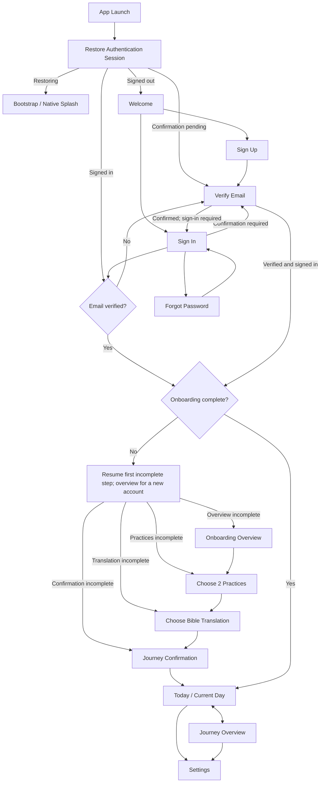

## 8.2 Daily experience

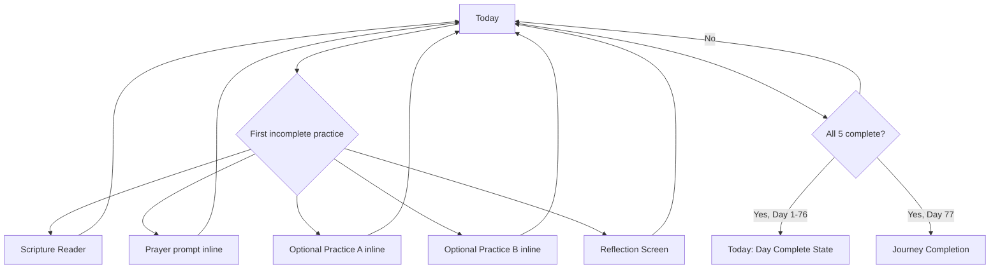

## 8.3 Journey/history

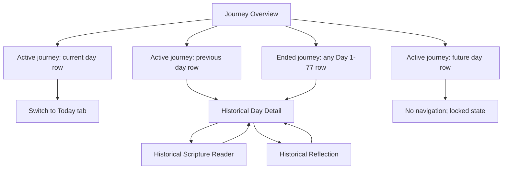

## 8.4 Settings

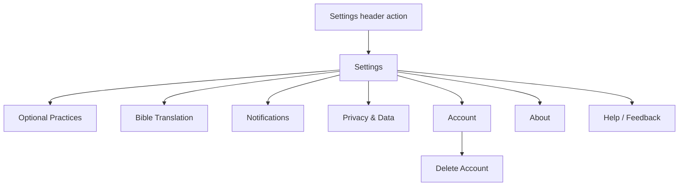

---

# 9. Complete Screen Inventory

> **Implementation status note:** V1 routes exist as navigation scaffolding, including Verify Email and Notifications. Their screen purposes, data requirements, auth requirements, and successful submissions below describe intended product behavior, which remains planned. `/` currently performs only the signed-out launch redirect. Home and Explore have been removed; Future routes are absent. In the target policy, every onboarding/app screen requires verified email; the Yes auth cells below include that requirement, with onboarding completion additionally required for app screens.

| Screen                       | Recommended route                       | Purpose                                                                | Entry points                                  | Primary exit / destination           | Auth               | Scope  | Status                         |
| ---------------------------- | --------------------------------------- | ---------------------------------------------------------------------- | --------------------------------------------- | ------------------------------------ | ------------------ | ------ | ------------------------------ |
| Bootstrap / Session Gate     | `/`                                     | Restore session and route without UI flash                             | App launch, external route fallback           | Auth / Onboarding / Today            | No                 | V1     | Existing — navigation scaffold |
| Welcome                      | `/auth/welcome`                         | Entry for signed-out users                                             | Bootstrap, sign-out                           | Sign Up or Sign In                   | No                 | V1     | Existing — navigation scaffold |
| Sign In                      | `/auth/sign-in`                         | Authenticate existing account                                          | Welcome, Verify Email, protected redirect     | Verify Email / Onboarding / Today    | No                 | V1     | Existing — navigation scaffold |
| Sign Up                      | `/auth/sign-up`                         | Create account                                                         | Welcome                                       | Verify Email                         | No                 | V1     | Existing — navigation scaffold |
| Forgot Password              | `/auth/forgot-password`                 | Request and complete password reset                                    | Sign In                                       | Sign In                              | No                 | V1     | Existing — navigation scaffold |
| Verify Email                 | `/auth/verify-email`                    | Verify email before onboarding                                         | Sign Up, Sign In, restored unverified session | Sign In / Onboarding / Today         | Pending/unverified | V1     | Existing — navigation scaffold |
| Onboarding Overview          | `/onboarding`                           | Explain journey + 3 required practices                                 | Auth gate                                     | Practice Selection                   | Yes                | V1     | Existing — navigation scaffold |
| Practice Selection           | `/onboarding/practices`                 | Choose exactly 2 optional practices                                    | Onboarding Overview                           | Bible Translation                    | Yes                | V1     | Existing — navigation scaffold |
| Bible Translation Onboarding | `/onboarding/bible-translation`         | Select an available registry translation                               | Practice Selection                            | Journey Confirmation                 | Yes                | V1     | Existing — navigation scaffold |
| Journey Confirmation         | `/onboarding/confirm`                   | Review configuration and start Day 1                                   | Bible Translation                             | Today                                | Yes                | V1     | Existing — navigation scaffold |
| Today                        | `/today`                                | Complete current day's journey                                         | Launch, Today tab, current-day Journey row    | Scripture / Reflection / Settings    | Yes                | V1     | Existing — navigation scaffold |
| Journey Overview             | `/journey`                              | Review all 77 days + weekly groupings                                  | Journey tab                                   | Historical Day / Today / Settings    | Yes                | V1     | Existing — navigation scaffold |
| Historical Day Detail        | `/day/[dayNumber]`                      | Review/edit previous unlocked day                                      | Journey previous-day row                      | Scripture / Reflection / Back        | Yes                | V1     | Existing — navigation scaffold |
| Scripture Reader             | `/day/[dayNumber]/scripture`            | Read day's passage and record Scripture practice                       | Today / Historical Day                        | Return to source                     | Yes                | V1     | Existing — navigation scaffold |
| Reflection                   | `/day/[dayNumber]/reflection`           | Respond to reflection question or record private reflection completion | Today / Historical Day                        | Return to source                     | Yes                | V1     | Existing — navigation scaffold |
| Journey Completion           | `/journey-complete`                     | Acknowledge reaching the end and offer review                          | Day 77 completion, post-Day-77 Today          | Journey / Today                      | Yes                | V1     | Existing — navigation scaffold |
| Settings                     | `/settings`                             | Preference/account hub                                                 | Header action from Today/Journey              | Settings subpage / Back              | Yes                | V1     | Existing — navigation scaffold |
| Practice Settings            | `/settings/practices`                   | Change 2 optional practices                                            | Settings                                      | Save → Settings                      | Yes                | V1     | Existing — navigation scaffold |
| Bible Translation Settings   | `/settings/bible-translation`           | Change Scripture translation                                           | Settings                                      | Save → Settings                      | Yes                | V1     | Existing — navigation scaffold |
| Notification Settings        | `/settings/notifications`               | Configure optional reminders                                           | Settings                                      | Back → Settings                      | Yes                | V1     | Existing — navigation scaffold |
| Privacy & Data               | `/settings/privacy`                     | Explain private data, policy links, data controls                      | Settings                                      | Back → Settings                      | Yes                | V1     | Existing — navigation scaffold |
| Account                      | `/settings/account`                     | Account identity, sign out, deletion entry                             | Settings                                      | Back / Sign Out / Delete Account     | Yes                | V1     | Existing — navigation scaffold |
| Delete Account               | `/settings/account/delete`              | Confirm destructive deletion                                           | Account                                       | Sign-out completion or Back          | Yes                | V1     | Existing — navigation scaffold |
| About                        | `/settings/about`                       | Product purpose, version, legal/about links                            | Settings                                      | Back → Settings                      | Yes                | V1     | Existing — navigation scaffold |
| Help / Feedback              | `/settings/help-feedback`               | Support and feedback path                                              | Settings                                      | Back / external support action       | Yes                | V1     | Existing — navigation scaffold |
| Communities                  | `/communities`                          | Private community list                                                 | Future Community tab                          | Community Detail                     | Yes                | Future | Future                         |
| Community Detail             | `/communities/[communityId]`            | Community home                                                         | Communities / invite                          | Prayer / Discussion / Progress       | Yes                | Future | Future                         |
| Community Prayer Requests    | `/communities/[communityId]/prayer`     | Shared prayer requests                                                 | Community Detail                              | Request interaction within screen    | Yes                | Future | Future                         |
| Community Discussion         | `/communities/[communityId]/discussion` | Weekly/group discussion                                                | Community Detail                              | Discussion interaction within screen | Yes                | Future | Future                         |
| Group Progress               | `/communities/[communityId]/progress`   | High-level group participation                                         | Community Detail                              | Back                                 | Yes                | Future | Future                         |
| Community Settings           | `/communities/[communityId]/settings`   | Membership/admin settings                                              | Community Detail                              | Back                                 | Yes                | Future | Future                         |
| Community Invite             | `/invite/[inviteId]`                    | Accept private invitation                                              | External deep link                            | Auth → Onboarding → Community        | Depends            | Future | Future                         |

---

# 10. Detailed Screen Specifications

## 10.1 Bootstrap / Session Gate

| Field              | Specification                                                                                                                                               |
| ------------------ | ----------------------------------------------------------------------------------------------------------------------------------------------------------- |
| **Purpose**        | Restore authentication and required app state without showing the wrong navigation tree.                                                                    |
| **Route**          | `/`                                                                                                                                                         |
| **Context**        | Root stack; routing-only surface.                                                                                                                           |
| **Entry points**   | Cold launch, app reload, external route fallback.                                                                                                           |
| **Primary action** | None. Automatic state resolution only.                                                                                                                      |
| **Destinations**   | Confirmation pending → Verify Email. Signed out → Welcome. Signed in + unverified → Verify Email. Verified → onboarding resume or Today according to state. |
| **Back behavior**  | Not applicable. This route should be replaced, not pushed beneath the destination.                                                                          |
| **Required data**  | Authentication restoration; verification state first, then minimal onboarding state for verified accounts.                                                  |
| **Persistence**    | None directly. Reads persisted auth/onboarding state.                                                                                                       |

**States**

- **Restoring:** keep native splash or neutral bootstrap surface; do not flash Welcome.
- **Auth restore failure:** if Amplify Auth definitively reports no valid session and no confirmation step is pending, route to Welcome. If network failure leaves a cached session valid, follow Amplify Auth's actual session semantics rather than force-signing out.
- **Profile/onboarding fetch loading:** keep protected neutral shell/splash until enough state exists to route safely.
- **Profile fetch error:** show a retryable bootstrap error only after auth is known; do not alternate between signed-in and signed-out trees.

---

## 10.2 Welcome

| Field                 | Specification                                                                                                             |
| --------------------- | ------------------------------------------------------------------------------------------------------------------------- |
| **Purpose**           | Give signed-out users a concise entry into account creation or sign-in.                                                   |
| **Route**             | `/auth/welcome`                                                                                                           |
| **Context**           | Authentication stack; headerless.                                                                                         |
| **Entry points**      | Bootstrap when signed out; successful sign-out; protected-route redirect.                                                 |
| **Primary action**    | `Get Started` → Sign Up.                                                                                                  |
| **Secondary actions** | `I already have an account` → Sign In. Privacy Policy/Terms links open configured external documents required for launch. |
| **Back behavior**     | Android back may exit/minimize the app when this is the root auth screen. No artificial previous screen.                  |
| **Required data**     | None beyond static product copy and configured auth-provider availability.                                                |
| **Persistence**       | None.                                                                                                                     |

**States**

- Avoid a carousel or multi-screen marketing tour before account creation.
- Do not imply performance, streak, or scoring benefits here.
- V1 uses email/password only; no guest, anonymous, or social provider entry points.

---

## 10.3 Sign In

| Field                 | Specification                                                                                                    |
| --------------------- | ---------------------------------------------------------------------------------------------------------------- |
| **Purpose**           | Authenticate an existing user.                                                                                   |
| **Route**             | `/auth/sign-in`                                                                                                  |
| **Context**           | Auth stack; pushed from Welcome.                                                                                 |
| **Entry points**      | Welcome; Verify Email when sign-in is required; protected deep-link redirect if supported.                       |
| **Primary action**    | `Sign In` → auth gate → Verify Email, Onboarding, or Today.                                                      |
| **Secondary actions** | `Forgot password?` → Forgot Password; `Create account` → Sign Up.                                                |
| **Back behavior**     | Back → Welcome unless entered as an auth gate from a deep link; destination preservation must not create a loop. |
| **Required data**     | Configured email/password authentication.                                                                        |
| **Persistence**       | Authenticated session on success. Form input is transient; password is never persisted by app state.             |

**States**

- **Submitting:** disable duplicate submission while preserving entered email.
- **Invalid credentials:** inline error; remain on screen.
- **Network error:** clear retryable error; remain on screen.
- **Success:** use `replace`, not `push`, so Back cannot return to Sign In.
- **Confirmation required or authenticated but unverified:** replace with Verify Email. A pending account-confirmation step does not establish a signed-in session; existing unverified sessions use the same gate.
- **Verified but onboarding incomplete:** resume the first incomplete step; do not route directly to Today.

---

## 10.4 Sign Up

| Field                 | Specification                                                                                      |
| --------------------- | -------------------------------------------------------------------------------------------------- |
| **Purpose**           | Create an email/password user account.                                                             |
| **Route**             | `/auth/sign-up`                                                                                    |
| **Context**           | Auth stack.                                                                                        |
| **Entry points**      | Welcome; Sign In.                                                                                  |
| **Primary action**    | `Create Account` → Verify Email.                                                                   |
| **Secondary actions** | `Sign in instead` → Sign In.                                                                       |
| **Back behavior**     | Back → previous auth screen.                                                                       |
| **Required data**     | Email and password only; no extra profile fields under product requirements.                       |
| **Persistence**       | Authentication identity; defer cloud personal-data/onboarding writes until verified and signed in. |

**States**

- **Validation:** show field-level errors without clearing form.
- **Duplicate account:** explain existing-account path and link to Sign In.
- **Network error:** preserve form except password according to security decisions.
- **Success:** replace Sign Up with Verify Email before onboarding.

Do not collect profile fields solely because future Community might need them.

---

## 10.5 Forgot Password

| Field                 | Specification                                                                                    |
| --------------------- | ------------------------------------------------------------------------------------------------ |
| **Purpose**           | Complete the V1 email/password recovery flow.                                                    |
| **Route**             | `/auth/forgot-password`                                                                          |
| **Context**           | Auth stack.                                                                                      |
| **Entry points**      | Sign In.                                                                                         |
| **Primary action**    | `Send reset email`, then `Reset password` with the emailed code and new password on this screen. |
| **Secondary actions** | Back to Sign In.                                                                                 |
| **Back behavior**     | Standard back → Sign In.                                                                         |
| **Required data**     | Email address, then reset code and new password.                                                 |
| **Persistence**       | Authentication service handles recovery; code/password input stays transient.                    |

**States**

- After a reset email is requested, collect its code and the new password inline on this route; sending the email alone is not a completed password reset.
- Show usable validation and invalid/expired-code, resend, submission, and network/retry states. Keep passwords and codes out of persisted app state, routes, and diagnostics.
- Only after the authentication service confirms the new password should success show a calm confirmation with `Back to Sign In`.
- Avoid revealing whether an email address exists if the chosen auth/security pattern intentionally prevents account enumeration.

---

## 10.6 Verify Email — Planned — V1

| Field                 | Specification                                                                                                                |
| --------------------- | ---------------------------------------------------------------------------------------------------------------------------- |
| **Purpose**           | Require verified email before onboarding and cloud personal-data writes.                                                     |
| **Route**             | `/auth/verify-email` — navigation scaffold exists; verification behavior is not implemented.                                 |
| **Context**           | Auth stack for pending account confirmation or an authenticated but unverified session.                                      |
| **Entry points**      | Successful sign-up; sign-in or restored session with unverified email.                                                       |
| **Primary action**    | `Verify email` submits the emailed code; verified users complete sign-in before the normal onboarding/journey gate.          |
| **Secondary actions** | Resend verification; cancel to Welcome before sign-in, or sign out for an existing session.                                  |
| **Back behavior**     | Cannot bypass verification into onboarding/app content. Cancel/sign out returns to Welcome; Sign In can resume confirmation. |
| **Required data**     | Account email and current confirmation/verification state; connectivity to confirm verification.                             |
| **Persistence**       | Authentication-service verification state; no cloud personal-data writes while unverified.                                   |

**States:** waiting for the emailed confirmation code, confirmation/refresh/resend in progress, invalid or expired code, still unverified, retryable network/send/refresh failure, and confirmed verification. Submit the code through the authentication service; for an existing unverified session, complete its required email-verification step and refresh authorization state. Do not claim verification or sign-in succeeded from a button press or stale local flag. Confirmation alone does not create a session: complete the SDK's supported sign-in continuation or replace with Sign In when credentials are needed. Backend enforcement remains mandatory under [architecture decisions](engineering/architecture-decisions.md#aws-amplify-gen-2).

Once verified and signed in, new accounts continue to the overview; returning accounts resume their first incomplete onboarding step, or Today when onboarding/journey state is already complete and readable. No unconfirmed or unverified account can bypass this gate into cloud personal-data writes.

---

## 10.7 Onboarding Overview

| Field                 | Specification                                                                                                                           |
| --------------------- | --------------------------------------------------------------------------------------------------------------------------------------- |
| **Purpose**           | Explain what the 77-day journey is and the five-practice structure.                                                                     |
| **Route**             | `/onboarding`                                                                                                                           |
| **Context**           | Onboarding stack.                                                                                                                       |
| **Entry points**      | Auth gate; resumed incomplete onboarding.                                                                                               |
| **Primary action**    | `Continue` → Practice Selection.                                                                                                        |
| **Secondary actions** | Sign out through a small account action if needed; no extra marketing pages.                                                            |
| **Back behavior**     | Onboarding root does not return to Sign Up/verification after verification succeeds. Sign out returns to Welcome; progress is retained. |
| **Required data**     | Static product copy and saved onboarding progress.                                                                                      |
| **Persistence**       | Persist overview completion when Continue succeeds so relaunch resumes the first incomplete step.                                       |

**Must communicate:**

- 77 calendar days.
- Scripture, Prayer, Reflection are foundational.
- User chooses two additional practices.
- Missing a day does not restart the journey.
- The goal is consistent participation, not earning favor or scoring spirituality.

Keep this to one screen unless content cannot be made readable with scrolling.

---

## 10.8 Practice Selection — Onboarding

| Field                 | Specification                                                                                                                        |
| --------------------- | ------------------------------------------------------------------------------------------------------------------------------------ |
| **Purpose**           | Choose exactly two optional practices.                                                                                               |
| **Route**             | `/onboarding/practices`                                                                                                              |
| **Context**           | Onboarding stack.                                                                                                                    |
| **Entry points**      | Onboarding Overview; back from Bible Translation.                                                                                    |
| **Primary action**    | `Continue` → Bible Translation; enabled only when exactly 2 distinct practices are selected.                                         |
| **Secondary actions** | Select/deselect optional practice cards.                                                                                             |
| **Back behavior**     | Back → Onboarding Overview; selected values remain saved.                                                                            |
| **Required data**     | The ten-practice catalog in [product requirements](PRODUCT_REQUIREMENTS.md#v1-optional-practice-catalog); current selections.        |
| **Persistence**       | Save selection as onboarding configuration after each change or on Continue; final selection becomes journey configuration at Start. |

**States**

- **0–1 selected:** Continue disabled with accessible explanation.
- **2 selected:** Continue enabled.
- **Attempt third selection:** either prevent selection with explanatory text or replace only after explicit deselection; do not silently drop an existing choice.
- **Catalog loading error:** retry; do not proceed with missing practice identifiers.

Required practices are visible as context but cannot be deselected.

---

## 10.9 Bible Translation — Onboarding

| Field                 | Specification                                                       |
| --------------------- | ------------------------------------------------------------------- |
| **Purpose**           | Select an available registry translation before the journey begins. |
| **Route**             | `/onboarding/bible-translation`                                     |
| **Context**           | Onboarding stack.                                                   |
| **Entry points**      | Practice Selection; back from Confirmation.                         |
| **Primary action**    | `Continue` → Journey Confirmation.                                  |
| **Secondary actions** | Search/filter supported translations if the list is long.           |
| **Back behavior**     | Back → Practice Selection.                                          |
| **Required data**     | Available translations from the centralized Scripture service.      |
| **Persistence**       | Save selected translation preference.                               |

**States**

- **Available:** show only enabled translations with cleared, complete content from the service; the local list needs no loading spinner.
- **None available:** explain that translations are not available yet; no broken choices or licensing implementation details. Production Continue is disabled.
- **No selection:** production Continue is disabled until an available choice is confirmed.
- **Selection unavailable later:** resolve to the configured available fallback and show its actual name, preserving day progress; if fallback is unavailable, retain the reference and own-Bible path.

V1 translations are English and controlled by the central registry. The configured fallback may be preselected only when available; Continue confirms the participant's choice. Store its stable internal translation ID. No translation arrays or availability policy belong in navigation code. The existing scaffold's `Continue to Confirmation` remains an explicitly labeled navigation preview and saves nothing.

---

## 10.10 Journey Confirmation

| Field                 | Specification                                                                                                                                         |
| --------------------- | ----------------------------------------------------------------------------------------------------------------------------------------------------- |
| **Purpose**           | Review the selected practices and translation, then create the journey.                                                                               |
| **Route**             | `/onboarding/confirm`                                                                                                                                 |
| **Context**           | Final onboarding screen.                                                                                                                              |
| **Entry points**      | Bible Translation.                                                                                                                                    |
| **Primary action**    | `Start Day 1` → create journey → replace with Today.                                                                                                  |
| **Secondary actions** | Edit practices → Practice Selection; edit translation → Bible Translation.                                                                            |
| **Back behavior**     | Back → Bible Translation before journey starts. After successful start, onboarding is removed from navigation history.                                |
| **Required data**     | Exactly 2 optional practices; confirmed allowed translation; verified user; approved content version; connectivity.                                   |
| **Persistence**       | Persist onboarding complete, journey start calendar date/fixed IANA timezone, selected practices, translation preference, and pinned content version. |

**Important behavior**

- V1 starts Day 1 **today** and captures the current IANA timezone, fixed for this journey. No future scheduling or manual journey-timezone change.
- Enforce at most one active journey. No restart/reset, individual journey deletion, or new-journey action in initial V1.
- Submission must be idempotent. Double-tap/network retry must not create multiple journeys.
- If write partially fails, remain on Confirmation with retry; do not route to Today until the journey state can be read coherently.

---

## 10.11 Today

| Field                 | Specification                                                                                                                                                                                    |
| --------------------- | ------------------------------------------------------------------------------------------------------------------------------------------------------------------------------------------------ |
| **Purpose**           | Primary daily home and current-day spiritual formation experience.                                                                                                                               |
| **Route**             | `/today`                                                                                                                                                                                         |
| **Context**           | Default tab.                                                                                                                                                                                     |
| **Entry points**      | Launch after gate; Today tab; Journey current-day row; completion return.                                                                                                                        |
| **Primary action**    | `Continue Day N` → scroll/focus first incomplete practice, or open the destination if that practice has a focused route.                                                                         |
| **Secondary actions** | Scripture Reader; Reflection; prayer completion; optional-practice completion; intention edit; Settings header action.                                                                           |
| **Back behavior**     | As root tab, Android back exits/minimizes according to platform navigation conventions rather than navigating to auth/onboarding.                                                                |
| **Required data**     | Current journey/day, weekly theme, day's content, passage reference, prayer prompt, reflection question, five practice definitions/statuses, intention/reflection summary, selected translation. |
| **Persistence**       | Practice completion, intention text, sync metadata; navigation/expanded-card state remains transient.                                                                                            |

### Required content order

1. Day number + weekly theme, including the concise inline theme explanation on the first day of each week.
2. Scripture passage reference and Scripture card.
3. Morning intention area.
4. Five-practice progress/controls in a clear sequence.
5. Reflection entry near the end of the daily flow.
6. Day-complete state when applicable.

The exact visual order can evolve, but Scripture must not be visually demoted beneath generic habit statistics.

### Practice interaction

Default interaction order:

1. Scripture — tap card → Scripture Reader.
2. Prayer — prompt displayed/expanded inline; explicit completion control.
3. Optional Practice A — inline completion control.
4. Optional Practice B — inline completion control.
5. Reflection — tap → Reflection screen.

### Primary `Continue Day N` behavior

The primary CTA should act on the **first incomplete practice** using this sequence:

```text
Scripture → Prayer → Optional A → Optional B → Reflection
```

- If Scripture is first incomplete, open Scripture Reader.
- If Prayer is first incomplete, scroll/focus Prayer card.
- If Optional A/B is first incomplete, scroll/focus that practice.
- If Reflection is first incomplete, open Reflection.
- If all five are complete, replace the CTA with a non-urgent `Day N complete` state and review actions.

### Morning intention

- Intention is encouraged but **does not count as one of the five practices**.
- It is optional, including during onboarding, and never affects daily completion.
- Drafts autosave when persistence exists; show truthful save/sync state. The stable prompt is specified in [formation content](FORMATION_CONTENT_SPEC.md#authored-data-for-each-v1-day).
- It should be editable on the current day and viewable/editable on previous days.
- Recommended interaction: inline expandable editor or lightweight sheet, not a dedicated route.
- Treat intention text as private journal-like data.

### Current-day states

**Not started**

- Show 0 of 5 recorded without negative language.
- Primary CTA = Begin/Continue with Scripture.

**In progress**

- Show actual completed controls.
- Primary CTA points to first incomplete practice.

**Complete**

- Show a calm completion acknowledgement.
- Keep all content accessible and editable.
- Do not auto-lock the day after completion.
- Do not automatically advance to tomorrow; calendar day controls progression.

**Previous day incomplete notice**

If yesterday is incomplete, show at most one understated notice such as:

> Yesterday is still incomplete. You can review it, or continue with today.

`Continue today` remains the dominant action. `Review yesterday` opens Historical Day Detail.

Do not surface a growing stack of missed-day warnings on Today. Journey is the place for full history.

**Post-Day-77**

- Replace daily CTA with a journey-end summary.
- Primary action = `Review your journey` → Journey.
- Secondary action = `View journey completion` → Journey Completion.
- Do not auto-create another journey.

---

## 10.12 Journey Overview

| Field                 | Specification                                                                         |
| --------------------- | ------------------------------------------------------------------------------------- |
| **Purpose**           | Provide a readable overview of all 77 days and historical participation.              |
| **Route**             | `/journey`                                                                            |
| **Context**           | Second permanent tab.                                                                 |
| **Entry points**      | Journey tab; Journey Completion; post-journey Today.                                  |
| **Primary action**    | Contextual: current-day row → Today; previous-day row → Historical Day Detail.        |
| **Secondary actions** | Settings header action; week expansion if used.                                       |
| **Back behavior**     | Root tab behavior.                                                                    |
| **Required data**     | Journey start, current day, per-day status, weekly themes, completed-practice counts. |
| **Persistence**       | None for navigation; expansion/filter state may remain transient.                     |

### Recommended layout

Group journey Days 1–77 by Week 1–11, with each week showing its theme and seven journey day numbers from the pinned content version.

Per-day status can use text/icon combinations:

- `Complete`
- `3 of 5`
- `Not recorded`
- `Today`
- `Upcoming`

Do not use red `failed` states for incomplete past days.

### Row behavior

- **Current day while active:** tap → switch/replace to Today, not duplicate current day in Historical Day Detail.
- **Historical day:** tap → `/day/[dayNumber]`; after journey end every Day 1–77 row, including Day 77, uses this path.
- **Future day:** non-navigable. It may show day number, theme, and date, but no future Scripture, prompts, completion, or editing UI.

### Progress summary

Required V1 summary:

- Current day / 77 while active; ended-period context after Day 77.
- Count of fully recorded days (5 of 5).
- Count of days with partial participation (1–4 of 5).
- Complete-day streak, shown only as subdued accountability information on Journey; see section 12.4.

Historical edits recompute these derived values. The streak is informational, not the product's primary success measure.

Avoid:

- percentage labeled as faithfulness/spiritual score,
- ranking,
- grades,
- comparative performance.

---

## 10.13 Historical Day Detail

| Field                 | Specification                                                                                                       |
| --------------------- | ------------------------------------------------------------------------------------------------------------------- |
| **Purpose**           | Review and optionally correct a previous unlocked day's record.                                                     |
| **Route**             | `/day/[dayNumber]`                                                                                                  |
| **Context**           | Root push over tabs; tab bar may be hidden for focus.                                                               |
| **Entry points**      | Previous-day row in Journey; yesterday-incomplete notice on Today.                                                  |
| **Primary action**    | Contextual `Continue this day` → first incomplete practice for that historical day.                                 |
| **Secondary actions** | Scripture Reader; Reflection; edit intention; toggle manual practice completion.                                    |
| **Back behavior**     | Back returns to the actual source stack when navigated internally; deep-link fallback should return to Journey.     |
| **Required data**     | Valid previous day number; historical content and progress snapshot; practice configuration applicable to that day. |
| **Persistence**       | Historical edits persist and recompute derived progress/statistics, including the streak.                           |

### Important rules

- Historical days remain editable indefinitely in V1, including all Days 1–77 after the journey ends.
- Editing a previous day never changes the current day number.
- Historical days must retain the optional practices that applied to that day. Changing current settings must not rewrite old day labels.
- If a past day becomes complete after an edit, recompute any derived complete-day streak rather than preserving a stale value.
- While active only: if `dayNumber == currentDay`, the detail index redirects to Today; if `dayNumber > currentDay`, redirect to Journey.
- Once ended: valid Days 1–77 all render historical detail and remain editable; Day 77 never redirects to the Today summary.

---

## 10.14 Scripture Reader

| Field                 | Specification                                                                                                                                                 |
| --------------------- | ------------------------------------------------------------------------------------------------------------------------------------------------------------- |
| **Purpose**           | Provide focused Scripture reading for the day's assigned passage.                                                                                             |
| **Route**             | `/day/[dayNumber]/scripture`                                                                                                                                  |
| **Context**           | Pushed focused screen.                                                                                                                                        |
| **Entry points**      | Today Scripture card; Historical Day Detail Scripture card.                                                                                                   |
| **Primary action**    | `Mark Scripture complete` / `Scripture complete` toggle.                                                                                                      |
| **Secondary actions** | Back; translation context; `I read this passage elsewhere` manual completion path if text is unavailable or the user uses a physical Bible.                   |
| **Back behavior**     | Standard back to source. Reading progress is not required to be saved unless implemented.                                                                     |
| **Required data**     | Valid unlocked day; passage reference; selected translation; verified text and attribution from the curated Scripture service for the pinned content version. |
| **Persistence**       | Scripture practice completion; selected translation is a separate user preference.                                                                            |

### Completion behavior

Opening, scrolling, or reaching the bottom of the passage must **not** automatically mark Scripture complete.

The user may manually mark Scripture complete because:

- they may read the same assigned passage in a physical Bible,
- they may use another Bible app,
- the assigned text may be unavailable in the app.

This manual path should still show the assigned passage reference so the practice remains tied to the day's Scripture.

### Unavailable Scripture text

If Scripture text cannot load:

1. Keep the locally authored passage reference visible.
2. Explain unavailable text plainly; offer retry only for an actual recoverable loading failure.
3. Keep the rest of the day's experience accessible.
4. Do not auto-complete Scripture.
5. Provide `I read this passage elsewhere` as an explicit manual completion action.

### Translation changes

If the user changes translation in Settings, both current and historical Scripture Reader screens should render the selected translation for the same passage reference. Translation preference is a display preference, not part of historical completion state. A missing/unavailable preference uses the configured available fallback and identifies the actual translation shown; a missing fallback leaves text unavailable. Display verified attribution supplied by the service with the passage and translation name. No copyright TODO or internal licensing status belongs in the reader.

---

## 10.15 Reflection

| Field                 | Specification                                                                                                                       |
| --------------------- | ----------------------------------------------------------------------------------------------------------------------------------- |
| **Purpose**           | Help the user intentionally reflect on the day's prompt and optionally preserve a private written response.                         |
| **Route**             | `/day/[dayNumber]/reflection`                                                                                                       |
| **Context**           | Pushed focused editor.                                                                                                              |
| **Entry points**      | Today; Historical Day Detail.                                                                                                       |
| **Primary action**    | `Save & mark reflection complete` when text exists.                                                                                 |
| **Secondary actions** | `I reflected without writing`; Back.                                                                                                |
| **Back behavior**     | Normal back if draft autosave is reliable. If drafts are not autosaved, leaving a changed unsaved response requires a confirmation. |
| **Required data**     | Valid unlocked day; reflection question; existing private response; reflection completion state.                                    |
| **Persistence**       | Private reflection text/draft and reflection completion.                                                                            |

### Settled V1 completion rule

Reflection is complete when either:

1. the user explicitly chooses `Save & mark reflection complete` with a non-empty response, **or**
2. the user explicitly chooses `I reflected without writing`.

This preserves Reflection as a real practice without forcing journaling as a condition of spiritual participation.

Reflection drafts autosave when persistence exists. Typing, draft autosave, or creating a separate journal entry is not a completion action. Persisting a draft and explicitly recording the practice are distinct operations.

### Privacy

- Reflection content is private by default.
- Do not show community sharing controls in V1.
- Do not include raw reflection text in analytics, crash breadcrumbs, push notifications, logs, or support diagnostics.
- Future sharing must require a deliberate item-specific action.

### Editing

- Current and previous reflection responses may be edited later.
- Editing text does not un-complete Reflection unless the user explicitly marks it incomplete.
- Clearing text does not silently un-complete Reflection. Keep its recorded completion separate from whether written text remains, and retain an explicit control to mark the practice incomplete.

---

## 10.16 Journey Completion

| Field                 | Specification                                                           |
| --------------------- | ----------------------------------------------------------------------- |
| **Purpose**           | Mark the end of the 77-day period without implying perfect performance. |
| **Route**             | `/journey-complete`                                                     |
| **Context**           | Root pushed screen; may be presented after Day 77 completion.           |
| **Entry points**      | Completion of final Day 77 practice; post-journey Today action.         |
| **Primary action**    | `Review your journey` → Journey.                                        |
| **Secondary actions** | `Back to Today`. No `Start another journey` action in initial V1.       |
| **Back behavior**     | Back → Today or source; must not expose onboarding.                     |
| **Required data**     | Journey dates, participation summary, Day 77 status.                    |
| **Persistence**       | Optional one-time `completionAcknowledged` UI flag; no spiritual score. |

### Copy principle

Say that the user has **reached the end of the 77-day journey**, not that they achieved perfection.

A journey can end with incomplete days. The end state allows reviewing and completing/correcting all historical Days 1–77 indefinitely, including incomplete Day 77, without claiming all practices were completed.

### Repeating the journey

Starting another journey is excluded from initial V1 even if the data model can retain history. Do not auto-start, reset, or overwrite a journey. [Product requirements](PRODUCT_REQUIREMENTS.md#future-repeat-journeys) owns Future repeat-journey scope; [formation content](FORMATION_CONTENT_SPEC.md#future-repeat-journey-variants--not-v1) owns pinned variant plans.

---

## 10.17 Settings

| Field                 | Specification                                                                        |
| --------------------- | ------------------------------------------------------------------------------------ |
| **Purpose**           | Central hub for preferences, privacy, account, and support.                          |
| **Route**             | `/settings`                                                                          |
| **Context**           | Root push from either main tab.                                                      |
| **Entry points**      | Consistent header Settings icon on Today and Journey.                                |
| **Primary action**    | None; this is a destination list.                                                    |
| **Secondary actions** | Practices, Bible Translation, Notifications, Privacy, Account, About, Help/Feedback. |
| **Back behavior**     | Back returns to the tab from which Settings was opened.                              |
| **Required data**     | User preference summaries, auth identity basics.                                     |
| **Persistence**       | None directly.                                                                       |

Use standard list-row navigation. Do not make rows look like toggles unless they are actual inline toggles.

---

## 10.18 Practice Settings

| Field                 | Specification                                                                            |
| --------------------- | ---------------------------------------------------------------------------------------- |
| **Purpose**           | Allow the user to change the two optional practices without altering required practices. |
| **Route**             | `/settings/practices`                                                                    |
| **Context**           | Settings stack.                                                                          |
| **Entry points**      | Settings.                                                                                |
| **Primary action**    | `Save Changes` → Settings.                                                               |
| **Secondary actions** | Select/deselect practice cards.                                                          |
| **Back behavior**     | If changed but not saved, confirm discard; otherwise back → Settings.                    |
| **Required data**     | Current two optional practices; allowed practice catalog; current journey day.           |
| **Persistence**       | Effective-dated practice configuration.                                                  |

### Settled V1 rule for mid-journey changes

Changing optional practices is allowed, but once a journey has started the change takes effect **the next calendar day in the fixed journey timezone**, never retroactively.

Example:

```text
Current day: Day 18
Current optional practices: Movement + Gratitude
User changes to: Serve or Encourage + Scripture Memorization
Day 18 keeps Movement + Gratitude
Day 19 and later use Serve or Encourage + Scripture Memorization
Days 1–18 history remains unchanged
```

Reasons:

- preserves historical meaning,
- prevents a partially completed current day from changing requirements mid-day,
- avoids rewriting previous day records,
- still allows the journey to adapt to changing circumstances.

Before Day 1 is started, changes apply immediately. If no next journey day remains (Day 77 or an ended journey), explain that a selection change cannot affect this journey; never create Day 78 or rewrite its current/historical practices.

The Save confirmation should state when the change begins. No additional confirmation dialog is needed unless data would be lost.

---

## 10.19 Bible Translation Settings

| Field                 | Specification                                                                                                                  |
| --------------------- | ------------------------------------------------------------------------------------------------------------------------------ |
| **Purpose**           | Change the translation used by the Scripture Reader.                                                                           |
| **Route**             | `/settings/bible-translation`                                                                                                  |
| **Context**           | Settings stack.                                                                                                                |
| **Entry points**      | Settings.                                                                                                                      |
| **Primary action**    | Select translation and `Save` → Settings, or autosave with explicit selected state if existing settings patterns use autosave. |
| **Secondary actions** | Search/filter supported translations.                                                                                          |
| **Back behavior**     | If explicit Save is used and selection changed, confirm discard; otherwise standard back.                                      |
| **Required data**     | Available translations from the centralized Scripture service; current selection.                                              |
| **Persistence**       | User translation preference.                                                                                                   |

Change applies immediately to current and historical Scripture Reader rendering without altering completion states or the authored passage reference. The Scripture service supplies available English translations and stable IDs; never display unavailable registry entries as selectable options. Missing/unavailable saved preferences resolve to the configured available fallback, labeled with its actual name. If none is usable, show an unavailable state without a successful save or arbitrary substitution.

---

## 10.20 Notification Settings — Planned — V1

| Field                 | Specification                                                                                 |
| --------------------- | --------------------------------------------------------------------------------------------- |
| **Purpose**           | Configure one optional local-device daily reminder.                                           |
| **Route**             | `/settings/notifications` — navigation scaffold exists; reminder behavior is not implemented. |
| **Context**           | Settings stack.                                                                               |
| **Entry points**      | Notifications row in Settings, required for V1.                                               |
| **Primary action**    | Explicitly enable/disable reminders and explicitly select the reminder time.                  |
| **Secondary actions** | Open OS Settings when permission is denied.                                                   |
| **Back behavior**     | Standard back to Settings; use one consistent save pattern for time/enable changes.           |
| **Required data**     | OS permission, device-local reminder preference/time, scheduling result.                      |
| **Persistence**       | Local-device reminder settings and scheduling; no backend push infrastructure.                |

### Permission and reminder behavior

- Notification permission is not part of onboarding. Request permission only through the participant's reminder-enabling action, explaining the benefit first.
- Both enablement and a chosen time are explicit. Do not silently enable 8:00 AM or any other default reminder.
- Schedule one daily reminder at the device's current local time; travel may change its wall-clock scheduling context while journey-day boundaries stay in the fixed journey timezone.
- Show enabled, disabled, permission-denied, and scheduling-failure/retry states truthfully. Do not claim a reminder is scheduled when permission or scheduling failed.
- Do not repeatedly prompt after denial; provide `Open Settings` instead.
- Keep copy generic (for example `Your 77Faithful day is ready`) and payloads free of reflection/intention/prayer text. No missed-practice escalation, streak-loss warning, or guilt/pressure copy.

The route and Settings row exist as navigation scaffolding. Permissions, scheduling, and reminder persistence remain Planned — V1 implementation work; reminders are a settled launch requirement.

---

## 10.21 Privacy & Data

| Field                 | Specification                                                     |
| --------------------- | ----------------------------------------------------------------- |
| **Purpose**           | Explain data privacy and provide access to privacy/data controls. |
| **Route**             | `/settings/privacy`                                               |
| **Context**           | Settings stack.                                                   |
| **Entry points**      | Settings.                                                         |
| **Primary action**    | Read/access Privacy Policy; no forced action.                     |
| **Secondary actions** | Links to data/account controls where implemented.                 |
| **Back behavior**     | Back → Settings.                                                  |
| **Required data**     | Privacy-policy URL/text and actual data-handling disclosures.     |
| **Persistence**       | None unless consent controls are implemented.                     |

Must state accurately that reflection/intention/journal-like content is private by default. Do not promise encryption, offline privacy, deletion timing, or data retention behavior that is not actually implemented.

---

## 10.22 Account

| Field                 | Specification                                                                                |
| --------------------- | -------------------------------------------------------------------------------------------- |
| **Purpose**           | Manage authentication/account actions.                                                       |
| **Route**             | `/settings/account`                                                                          |
| **Context**           | Settings stack.                                                                              |
| **Entry points**      | Settings.                                                                                    |
| **Primary action**    | None; display account actions.                                                               |
| **Secondary actions** | Sign Out; Delete Account; provider-specific security actions if implemented.                 |
| **Back behavior**     | Back → Settings.                                                                             |
| **Required data**     | Authenticated user email; no additional profile or dedicated change-email requirement in V1. |
| **Persistence**       | Auth/session changes only when user acts.                                                    |

### Sign out

1. If online, attempt to complete synchronization of pending private writes before signing out.
2. If writes remain pending, keep them and offer an explicit choice: **cancel sign-out and keep pending work**, or **discard unsynced changes and sign out**. Destructive discard requires clear confirmation identifying that unsynced work will be lost; cancellation leaves the account and work intact. Offline sign-out uses the same choice when writes are pending.
3. After synchronization succeeds or discard is explicitly confirmed, end the authenticated session, clear protected in-memory state/history, and complete the private-cache account boundary before allowing another sign-in. Failure to complete that boundary is a recoverable sign-out error, not successful sign-out.
4. Replace the protected navigation tree with Welcome. Back cannot return to Today or private content.

Direct multi-account switching is not a V1 feature: sign out completely before another sign-in. A subsequently signed-in account must never see the previous account's cached private data. [Architecture decisions](engineering/architecture-decisions.md#offline-persistence-and-account-boundaries) owns the SDK/cache implementation dependency; the selected persistence architecture does not prove this flow works.

---

## 10.23 Delete Account

| Field                 | Specification                                                                 |
| --------------------- | ----------------------------------------------------------------------------- |
| **Purpose**           | Let users initiate permanent account and associated-data deletion.            |
| **Route**             | `/settings/account/delete`                                                    |
| **Context**           | Dedicated destructive push screen, not a one-line alert.                      |
| **Entry points**      | Account.                                                                      |
| **Primary action**    | `Delete my account` after explicit confirmation/reauthentication as required. |
| **Secondary actions** | `Cancel` → Account.                                                           |
| **Back behavior**     | Back/cancel safely aborts. After success, replace with Welcome.               |
| **Required data**     | Authenticated user; deletion requirements; reauthentication state if needed.  |
| **Persistence**       | Permanent backend deletion plus sign-out on success.                          |

Use a dedicated screen because the action is consequential and may require reauthentication/network work.

Account deletion is required in V1 and requires connectivity. The authenticated backend operation must remove the authentication identity and all related personal application data. Do not report success after deleting only Auth, and do not promise exact backup-erasure timing without verified infrastructure/provider policy.

---

## 10.24 About

| Field                 | Specification                                                                               |
| --------------------- | ------------------------------------------------------------------------------------------- |
| **Purpose**           | Explain 77Faithful's purpose and show app/version/legal information.                        |
| **Route**             | `/settings/about`                                                                           |
| **Context**           | Settings stack.                                                                             |
| **Entry points**      | Settings.                                                                                   |
| **Primary action**    | None.                                                                                       |
| **Secondary actions** | Required Privacy Policy and Terms of Service links; configured product website if supplied. |
| **Back behavior**     | Back → Settings.                                                                            |
| **Required data**     | App version/build number; static product copy.                                              |
| **Persistence**       | None.                                                                                       |

Keep this informational. Do not duplicate onboarding or create a marketing feed.

---

## 10.25 Help / Feedback

| Field                 | Specification                                                                               |
| --------------------- | ------------------------------------------------------------------------------------------- |
| **Purpose**           | Give users a clear support/feedback path.                                                   |
| **Route**             | `/settings/help-feedback`                                                                   |
| **Context**           | Settings stack.                                                                             |
| **Entry points**      | Settings; recoverable error screens may link here when appropriate.                         |
| **Primary action**    | Send feedback/open configured support destination.                                          |
| **Secondary actions** | FAQ/help links if they exist.                                                               |
| **Back behavior**     | Back → Settings.                                                                            |
| **Required data**     | Configured support destination.                                                             |
| **Persistence**       | None; open the configured support contact destination, with no support-ticket system in V1. |

Never prefill support diagnostics with private Scripture reflection, intention, prayer, or journal text. External launch facts and their current supplied/TBD status are maintained in [project context](engineering/project-context.md#external-setup-and-release-prerequisites). Do not fabricate support/legal destinations or infer them from the supplied domain.

---

# 11. Core Daily User Flow

## 11.1 Normal returning day

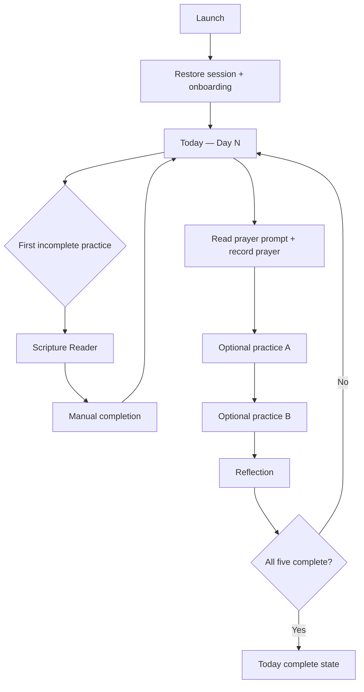

The user does not need to follow the sequence rigidly. They may complete practices in any order. `Continue Day N` simply directs them to the first incomplete item in the settled sequence.

## 11.2 Scripture behavior

- The user taps the Scripture card from Today.
- Reader loads the assigned passage in the selected translation.
- Opening or scrolling never auto-completes the practice.
- User explicitly marks Scripture complete.
- User may mark it complete after reading the assigned passage outside the app.
- Back returns to Today or Historical Day Detail.

## 11.3 Prayer behavior

- Prayer prompt is visible or expandable inline on Today/Day Detail.
- User reads the prompt and prays outside any tracked timer.
- User explicitly marks Prayer complete.
- Do not require a prayer text entry.
- Do not time the prayer.

## 11.4 Optional practices

- Display the two practices from the [V1 catalog](PRODUCT_REQUIREMENTS.md#v1-optional-practice-catalog) applicable to that day; no custom practices, timers, metrics, or per-practice note fields.
- Each has one clear completion control.
- Tapping the completion control records/unrecords completion.
- Tapping the explanatory area may expand instructions if needed, but should not unexpectedly navigate unless the card clearly looks navigational.

## 11.5 Reflection behavior

- Reflection opens a focused screen.
- User can write and save a response or explicitly choose that they reflected without writing.
- Returning to Today updates the practice status.

## 11.6 Daily completion

A day becomes complete when all five practice states are complete:

```text
scripture == complete
AND prayer == complete
AND optionalPracticeA == complete
AND optionalPracticeB == complete
AND reflection == complete
```

Morning intention is not included in this calculation.

After the final practice:

- update the current screen immediately,
- persist the change,
- show a calm `Day N complete` state,
- keep the day editable,
- do not navigate to tomorrow,
- do not require a completion modal.

If this is Day 77, offer/navigate to Journey Completion after state persistence succeeds.

---

# 12. Missed-Day UX

Missed-day behavior is a core product contract.

## 12.1 Progression rule

77Faithful is calendar-based.

Example:

```text
Monday = Day 10, user completes 3 of 5
Tuesday = Day 11

The app does NOT:
- reset to Day 1
- force completion of Day 10 before Day 11
- rename Tuesday as Day 10
```

## 12.2 How the previous day appears

On Today:

- if only yesterday is incomplete, one subtle non-blocking notice may appear,
- primary action remains today's journey,
- secondary action opens yesterday.

On Journey:

- previous incomplete day shows `Not recorded` or `N of 5`, depending on actual state,
- it remains tappable,
- no red failure icon is required.

## 12.3 Can previous days be edited later?

**Settled V1: yes, indefinitely, including after Day 77.**

Users may:

- mark/unmark practice completion,
- add/edit intention,
- add/edit reflection,
- open historical Scripture.

Historical edits never change the current day number.

## 12.4 Streak behavior

The V1 complete-day streak is derived from consecutive calendar days with all five practices complete.

- An incomplete day breaks the derived streak.
- The journey continues regardless.
- If the user later corrects a historical record, recompute the streak from recorded state.
- Do not make streak loss the primary message on Today.
- Do not show streak restoration animations intended to pressure daily completion.

**Required placement:** subdued Journey summary only. No streak display or streak-loss pressure on Today. It is informational accountability, not the primary success measure.

## 12.5 Appropriate missed-day language

Prefer factual, non-punitive language:

- `Day 12 — 3 of 5 recorded`
- `Yesterday is incomplete`
- `Review Day 12`
- `Continue with Day 13`

Avoid:

- `You failed Day 12`
- `Your journey is broken`
- `Start over`
- `You lost everything`
- `Don't lose your streak!`

---

# 13. Journey Progression — Day 1 Through Day 77

## 13.1 Day 1

- Created only after Journey Confirmation succeeds.
- Immediately becomes current day.
- Today opens Day 1.
- Journey shows Day 1 as Today and Days 2–77 as Upcoming.

## 13.2 Previous days

- Always visible in Journey.
- Tappable.
- Editable in V1.
- Use historical practice configuration that applied on that date.

## 13.3 Current day

- Current-day row in Journey navigates to Today.
- Today is the canonical current-day screen.
- Do not create a duplicate current-day detail route with slightly different controls.

## 13.4 Future days

**Settled V1:** future days may expose limited metadata in Journey but cannot be opened.

They may show:

- day number,
- week number/theme,
- calendar date,
- `Upcoming` state.

They must not expose future Scripture or prompts, nor allow:

- completion changes,
- reflection entry,
- intention entry,
- Scripture Reader access for the future day.

Do not expose an interactive lock screen. The row can simply be disabled/non-navigable with an accessibility label such as `Day 28, upcoming`.

## 13.5 Weekly transitions

- Week changes automatically based on day number.
- Today shows the current week theme and its concise inline explanation on the first day of that theme, from the journey's pinned content version.
- Journey groups days under weekly theme headings.
- A separate Weekly Theme screen is **not** required in V1.
- If longer weekly content is later authored, add a theme-detail route only after there is meaningful content that warrants a screen.

## 13.6 Day 77

Day 77 works like any other day until the final practice is complete.

After all five are complete:

1. persist Day 77 completion,
2. update Today state,
3. offer/navigate to Journey Completion,
4. keep Journey and historical entries accessible.

## 13.7 End of the calendar period with incomplete Day 77

If the calendar advances beyond Day 77 while Day 77 or earlier days remain incomplete:

- journey status becomes `ended`,
- Today becomes a post-journey summary rather than creating Day 78,
- Journey remains fully accessible,
- all historical Days 1–77 remain editable indefinitely, with Day 77 reached through its Journey row exactly like Days 1–76,
- completion copy must say the 77-day period has ended, not that every practice was completed.

## 13.8 Starting another journey

**Settled: excluded from initial V1.** No manual active-journey restart/reset, individual journey deletion, auto-start, or new-journey action. At most one journey is active. Preserve the data boundary for future multiple historical journeys; implementation of that Future flow requires its own scope and the content specification's variant rules.

---

# 14. Major User Flow Diagrams

## 14.1 First-time user

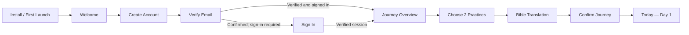

## 14.2 Returning user

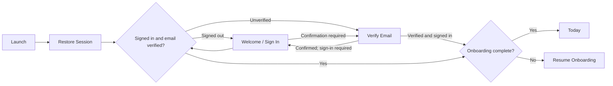

## 14.3 Complete daily journey

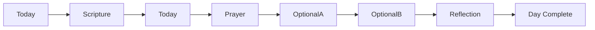

Order may vary by user action; this is the recommended `Continue` order.

## 14.4 Missed / incomplete previous day

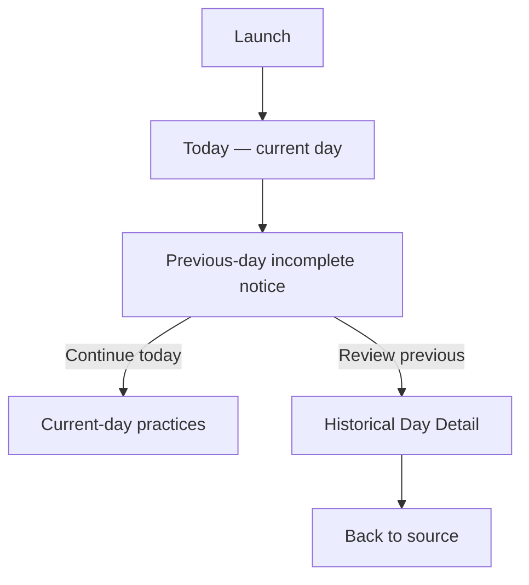

The previous day never blocks the current day.

## 14.5 Change optional practices

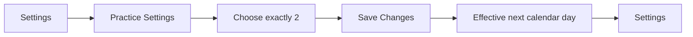

Past and current-day practice definitions remain unchanged.

## 14.6 Change Bible translation

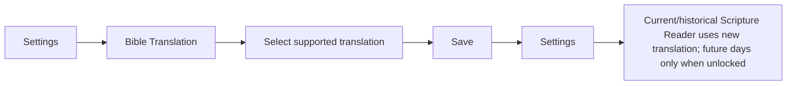

## 14.7 Sign out

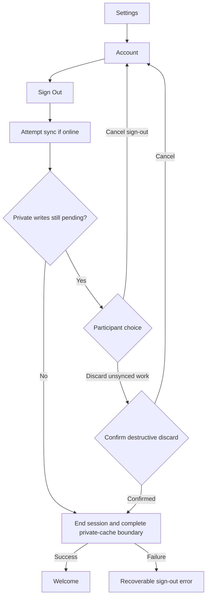

Back navigation must not return to protected screens. Another account cannot sign in until the previous account's private cache boundary is complete; see section 10.22.

---

# 15. CTA and Interaction Rules

## 15.1 Primary CTA

Each screen should have at most one obvious primary action.

Recommended patterns:

| Screen type          | Primary CTA behavior               |
| -------------------- | ---------------------------------- |
| Auth form            | Submit authentication action       |
| Onboarding step      | Continue                           |
| Journey Confirmation | Start Day 1                        |
| Today                | Continue first incomplete practice |
| Scripture Reader     | Mark Scripture complete            |
| Reflection           | Save & mark reflection complete    |
| Practice Settings    | Save Changes                       |
| Delete Account       | Delete my account                  |

On long focused screens, primary CTA may be sticky above the safe area if this does not cover content or keyboard controls.

## 15.2 Secondary actions

- Use text buttons/links for lower-priority navigation.
- Do not style `Review yesterday` with equal dominance to `Continue today`.
- `Cancel` is appropriate for destructive or modal-like flows.
- Standard back is preferable to adding redundant `Cancel` on ordinary pushed screens.

## 15.3 Navigation cards

A card should behave consistently:

- If the whole card navigates, the card should have a clear disclosure/chevron or navigational affordance.
- If a card contains an inline completion control, tapping the checkbox/toggle must not also trigger navigation.
- Do not make visually identical cards navigate on one screen and toggle completion on another.

## 15.4 Completion controls

- Use a checkbox/check-circle style control with an accessible checked state.
- Completion must be reversible for current and historical days in V1.
- Do not require a confirmation to mark/unmark ordinary practice completion.
- Account for an optimistic/pending sync state if local-first writes exist.
- Never rely on color alone to indicate complete/incomplete.

## 15.5 Save vs. autosave

**Required when persistence exists:** autosave intention and reflection drafts; typing/autosave never completes Reflection.

**Immediate persistence recommended:**

- intention/reflection draft changes,
- simple toggles,
- completion controls.

**Explicit Save recommended:**

- changing optional-practice configuration,
- settings pages where multiple related values are edited together,
- destructive flows.

Bible translation may use either explicit Save or immediate selection, but match the established Settings pattern consistently.

## 15.6 Destructive actions

Require confirmation/reauthentication where appropriate for:

- account deletion,
- explicitly discarding unsynced private changes during sign-out,
- deleting user-created content if such deletion is irreversible.

Do not add confirmation dialogs to routine completion toggles, back navigation with reliable autosave, or ordinary settings rows.

---

# 16. Header and Back Navigation Rules

## 16.1 Main tabs

**Today and Journey:**

- no back button,
- clear page title or accessible heading,
- consistent Settings icon in the same header position,
- bottom tab bar visible.

## 16.2 Pushed screens

**Scripture Reader, Reflection, Historical Day, Settings subpages:**

- native back affordance,
- meaningful title,
- Android hardware back mirrors header back,
- iOS swipe-back is allowed when safe.

## 16.3 Settings

- Settings root back returns to the actual source tab.
- Settings child back returns one level within the Settings stack; Delete Account returns to Account, as specified in section 10.23.
- Do not make each settings row a modal.

## 16.4 Unsaved changes

Only intercept back when leaving would actually discard user input.

If intention/reflection drafts are reliably autosaved, do not interrupt back navigation.

Practice Settings with unsaved changed selections should prompt:

```text
Discard changes?
[Keep Editing] [Discard]
```

## 16.5 Onboarding

- Before Start Day 1, back is allowed between onboarding steps and progress persists.
- After successful Start Day 1, onboarding routes are replaced/guarded out of history.
- Android back from Today must never return to onboarding.

## 16.6 Modals / bottom sheets

Use a modal/form sheet only for short transient tasks. If a modal can be dismissed by gesture, unsaved destructive state must either autosave or block interactive dismissal.

No core daily practice requires a modal route in the settled V1 architecture.

---

# 17. Loading, Error, Offline, and Empty States

## 17.1 Loading principles

- Avoid full-screen spinners after initial bootstrap when existing content can remain visible.
- Prefer skeletons or retained stale content with a subtle refresh state.
- Keep navigation chrome stable while content loads.
- Do not disable the entire Today screen because Scripture text is unavailable or a remote operation is pending.

## 17.2 Unavailable Scripture text

When Scripture text is unavailable:

- keep day/theme/prayer/other practices available,
- display the known Scripture reference,
- show retry only for a recoverable text-loading operation; bundled text has no artificial network loading state,
- do not auto-complete Scripture,
- allow explicit manual completion after reading the assigned passage in the participant's own Bible,
- never substitute an unlicensed or guessed Bible text.

## 17.3 Application-data read failure

Minimum behavior:

- keep last successfully loaded local UI state visible if available,
- show a non-blocking sync/read error,
- provide Retry,
- do not sign the user out solely because an application-data request failed.

If no cached data exists and required journey state cannot be resolved, show a retryable blocking error rather than inventing Day 1 or resetting progress.

## 17.4 Application-data write failure

Settled V1 UX contract:

- user edits should update local UI immediately when a local persistence/sync layer exists,
- distinguish locally saved/pending writes from rejected or failed writes with a recoverable `Failed` state; retain private drafts rather than silently reverting,
- private reflection/intention drafts should be retained locally until sync succeeds or the user deletes them,
- do not mark a write as synced before the backend confirms it.

If the current codebase has no reliable local write queue, document that limitation explicitly and do not falsely present full offline completion as supported.

## 17.5 Offline usage

Do **not** claim full offline support unless code verification confirms it.

Required native V1 behavior once relevant journey data has loaded:

| Capability                                                                               | Offline requirement                                                                                   |
| ---------------------------------------------------------------------------------------- | ----------------------------------------------------------------------------------------------------- |
| Open loaded Today/Journey data                                                           | Available through native personal-record persistence.                                                 |
| Completion toggles, intentions, reflection drafts                                        | Work offline through native persistence; sync when connectivity returns.                              |
| Application-authored local formation content and passage references                      | Available offline for unlocked days from the pinned content version.                                  |
| Enabled bundled Scripture text                                                           | Available without a network request once supplied; later remote-only text follows its verified terms. |
| Login, sign-up, verification, password reset, account deletion, initial journey creation | Require connectivity with clear unavailable/retry states.                                             |

Show saved / pending sync / failed when material without making status dominant. Sign-out with pending private writes follows section 10.22, including the online sync attempt, cancel-or-confirmed-discard choice, and subsequent-account isolation.

[Architecture decisions](engineering/architecture-decisions.md#offline-persistence-and-account-boundaries) owns native persistence and cache account boundaries. [Curated Scripture storage](engineering/architecture-decisions.md#curated-scripture) is separate from personal records: bundle permitted text and apply verified terms to any future remote source. Personal-record offline requirements remain **Planned — V1**; the Scripture data boundary has no network dependency, but no production text is supplied yet. An unavailable-write state is honest for a partial implementation but does not fulfill V1 or authorize an online-only release.

## 17.6 Empty states

### New Journey Overview

Journey is never truly empty after start. On Day 1:

- Day 1 = Today.
- Days 2–77 = Upcoming.
- Avoid a generic `No history yet` blank screen.

### No completed days

Show the actual Day 1/current rows and explanatory state. Do not show a zero-score dashboard.

### Future Communities

If Community ships and user belongs to none:

- explain private communities briefly,
- primary action = Join/Create only if those features exist,
- do not show empty social metrics.

---

# 18. Authentication Edge Cases

| State                                      | Expected navigation                                                                     |
| ------------------------------------------ | --------------------------------------------------------------------------------------- |
| Confirmation pending                       | Verify Email; no onboarding/app access until verified and signed in                     |
| Logged out                                 | Welcome/Auth only                                                                       |
| Authentication restoring session           | Native splash/bootstrap; no auth flash                                                  |
| Returning verified + onboarding complete   | Today                                                                                   |
| Returning verified + onboarding incomplete | Resume first incomplete onboarding step                                                 |
| Authenticated + email unverified           | Verify Email before onboarding/app access                                               |
| Session revoked/expired                    | Replace protected tree with Sign In/Welcome; preserve only safe local drafts per policy |
| User signs out                             | Replace with Welcome; clear protected navigation history                                |
| User deletes account                       | Complete backend deletion, sign out, replace with Welcome                               |
| User reauthenticates after password reset  | Normal verification gate → onboarding resume or Today                                   |

## 18.1 Preventing auth flash

The root app must treat authentication session restoration as unresolved state.

Do not:

```text
initial render → Welcome → authentication restores → Today
```

Prefer:

```text
initial render → native splash/bootstrap → authentication resolves → correct destination
```

## 18.2 Partial profile state

If authentication succeeds but the user's application onboarding record is missing, check verification first. Unverified sessions go to Verify Email without attempting cloud personal-data writes. For a verified session:

- do not assume onboarding complete,
- do not automatically overwrite remote data,
- route to a controlled recovery/onboarding path,
- log the inconsistency without including private user content.

---

# 19. Deep Links

## 19.1 V1 recommendation

Do not publish external deep links until the app's actual URL scheme/universal-link configuration and protected-route redirect preservation are implemented and tested.

Safe candidate paths once supported:

- `/today`
- `/journey`
- `/day/[dayNumber]`

Future:

- `/invite/[inviteId]`
- community-specific destinations after membership validation.

## 19.2 Protected deep-link behavior

When a protected link is supported:

```text
Open protected deep link
    ↓
Restore session
    ↓
IF signed out
    → Authenticate
    ↓
IF email unverified
    → Verify email
    ↓
IF onboarding incomplete
    → Finish onboarding
    ↓
Validate original destination
    ↓
Navigate to original destination
```

Validation can change the destination:

- while active, current-day detail link → Today; once ended, every valid Day 1–77 link remains historical,
- future day → Journey,
- invalid day → Journey,
- future community link without membership → invitation/join flow, not community content.

## 19.3 Do not encode private data in URLs

Never place reflection text, prayer text, intention text, email addresses, or private journal content in route parameters/query strings.

---

# 20. Accessibility and Mobile UX Requirements

## 20.1 Screen-reader semantics

- Every icon-only header action has an accessibility label.
- Native Today/Journey tabs use platform tab semantics. Their web equivalents are links in a named navigation region with the current page exposed to assistive technology.
- Completion controls expose checked/unchecked state.
- Future days announce `upcoming`/`locked`, not only a gray color.
- Errors are announced when they appear.
- Page titles/headings are exposed meaningfully to screen readers.

## 20.2 Touch targets

Use at least:

- approximately 44×44 points on iOS,
- approximately 48×48 dp on Android,
- preferably a shared cross-platform target large enough to satisfy both.

Small visible icons may sit inside larger pressable hit areas.

## 20.3 Dynamic text

- Support platform font scaling.
- Avoid fixed-height cards containing variable-length Scripture references, prompts, or accessibility-sized text.
- Primary CTA labels must remain readable at large text sizes.

## 20.4 Keyboard behavior

Reflection and intention editors must:

- avoid being covered by the keyboard,
- keep Save/primary actions reachable,
- scroll focused fields into view,
- preserve drafts when keyboard dismisses.

## 20.5 Focus behavior

On navigation:

- focus/announce the new screen title where appropriate,
- do not auto-focus text fields and open the keyboard unless text entry is clearly the immediate task,
- after a completion action, announce the new state without forcing focus to an unrelated control.

## 20.6 Motion

- Honor reduced-motion preferences for non-essential transitions/celebrations.
- No essential state should depend on animation.
- Avoid excessive celebration animation on daily completion.

## 20.7 Contrast and color

- Completion, current day, errors, and future days must have text/icon/state semantics in addition to color.
- Ensure selected optional practices and disabled CTAs remain distinguishable under accessibility contrast requirements.

## 20.8 Safe areas and scrolling

- Bottom CTAs must sit above home indicator/navigation bar.
- Bottom tabs respect safe-area insets.
- Long Scripture and Reflection screens use one coherent scroll container.
- Do not nest scroll views without a concrete need.

---

# 21. Platform Behavior

## 21.1 iOS

- Use native stack back and swipe-back for ordinary pushed screens.
- Full-screen form/editor screens may use standard iOS push behavior; do not convert core content to sheets solely for aesthetics.
- If a modal/form sheet contains unsaved destructive state, guard interactive dismissal.

## 21.2 Android

- Hardware/system Back must mirror header back.
- From Today/Journey root tabs, Back exits/minimizes per standard app behavior rather than opening auth/onboarding.
- Do not intercept Back globally unless a specific flow requires it.

## 21.3 Shared behavior

Architect and test iOS and Android together even if store release timing later differs. Use automatic system light/dark mode with no required manual theme setting in V1. Web remains a development/preview/static-export target.

Prefer shared product behavior for:

- day progression,
- practice completion,
- auth/onboarding gates,
- privacy,
- historical editing,
- route availability.

Platform-specific behavior should be limited to native navigation, keyboard, permissions, and controls where the platform convention is materially better.

---

# 22. Screen Relationship Matrix

This matrix is the contract for meaningful interactive navigation. The existing scaffold wires only deterministic navigation: auth links and Verify Email cancellation, onboarding step links (explicitly without selection/persistence), tab switching, Settings pushes and returns including Notifications, validated day-child links, and completion review. Successful submissions and all state-dependent conditions remain planned. Authenticated conditions for onboarding/app entries below include verified email; app entries also require completed onboarding. See section 3.2 for the integration boundary.

| From                         | Action                                   | Destination                       | Navigation type            | Conditions / result                                                                       |
| ---------------------------- | ---------------------------------------- | --------------------------------- | -------------------------- | ----------------------------------------------------------------------------------------- |
| Bootstrap                    | Session = signed out                     | Welcome                           | Replace                    | Authentication restoration resolved                                                       |
| Bootstrap                    | Confirmation pending or email unverified | Verify Email                      | Replace                    | Required before onboarding/app access                                                     |
| Bootstrap                    | Verified + onboarding incomplete         | Onboarding resume step            | Replace                    | Resume first incomplete step                                                              |
| Bootstrap                    | Verified + onboarding complete           | Today                             | Replace                    | Journey readable                                                                          |
| Welcome                      | Get Started                              | Sign Up                           | Push                       | Always                                                                                    |
| Welcome                      | I already have an account                | Sign In                           | Push                       | Always                                                                                    |
| Sign In                      | Sign In next step                        | Verify Email / Onboarding / Today | Replace                    | Confirmation if required; otherwise verification and onboarding/journey gate              |
| Sign In                      | Forgot password                          | Forgot Password                   | Push                       | Email/password auth exists                                                                |
| Sign In                      | Create account                           | Sign Up                           | Replace/Push               | Avoid duplicate auth stacks                                                               |
| Sign Up                      | Create account succeeds                  | Verify Email                      | Replace                    | Required immediately after sign-up                                                        |
| Forgot Password              | Reset email sent                         | Code/new-password form            | Inline                     | Stay on this route; reset is not complete                                                 |
| Forgot Password              | Password reset confirmed                 | Sign In                           | Back/CTA                   | User chooses return after successful code/new-password submission                         |
| Verify Email                 | Verification confirmed                   | Sign In / Onboarding / Today      | Replace                    | Establish verified session, then normal state gate                                        |
| Verify Email                 | Cancel confirmation / sign out           | Welcome                           | Replace                    | Scaffold returns to Welcome; future integration clears pending confirmation or signs out  |
| Onboarding Overview          | Continue                                 | Practice Selection                | Push                       | Verified authenticated account                                                            |
| Practice Selection           | Continue                                 | Bible Translation                 | Push                       | Exactly 2 selected                                                                        |
| Bible Translation Onboarding | Continue                                 | Journey Confirmation              | Push                       | Valid translation selected                                                                |
| Journey Confirmation         | Start Day 1                              | Today                             | Replace                    | Online verified write succeeds; fixed timezone/content version pinned; one active journey |
| Journey Confirmation         | Edit practices                           | Practice Selection                | Navigate within onboarding | Preserve translation selection                                                            |
| Journey Confirmation         | Edit translation                         | Bible Translation                 | Back/navigate              | Preserve practices                                                                        |
| Today                        | Tap Today tab                            | Today                             | Tab                        | No-op if already selected; may scroll to top on repeated tap if established pattern       |
| Today                        | Continue Day N — Scripture incomplete    | Scripture Reader                  | Push                       | Current day                                                                               |
| Today                        | Continue Day N — Prayer incomplete       | Prayer card                       | In-page focus/scroll       | Current day                                                                               |
| Today                        | Continue Day N — Optional A/B incomplete | Practice card                     | In-page focus/scroll       | Current day                                                                               |
| Today                        | Continue Day N — Reflection incomplete   | Reflection                        | Push                       | Current day                                                                               |
| Today                        | Scripture card                           | Scripture Reader                  | Push                       | Current day unlocked                                                                      |
| Today                        | Reflection card                          | Reflection                        | Push                       | Current day unlocked                                                                      |
| Today                        | Prayer completion                        | Today                             | In-place state             | Persist toggle                                                                            |
| Today                        | Optional practice completion             | Today                             | In-place state             | Persist toggle                                                                            |
| Today                        | Edit intention                           | Today editor/sheet                | In-place / transient       | Does not affect complete-day status                                                       |
| Today                        | Review yesterday                         | Historical Day Detail             | Push                       | Yesterday < current day and incomplete                                                    |
| Today                        | Settings header action                   | Settings                          | Push                       | Authenticated                                                                             |
| Today                        | Journey tab                              | Journey Overview                  | Tab                        | Authenticated                                                                             |
| Today                        | Final Day 1–76 practice completed        | Day Complete state                | In-place                   | All five complete                                                                         |
| Today                        | Final Day 77 practice completed          | Journey Completion                | Push after persistence     | All five complete                                                                         |
| Today post-journey           | Review your journey                      | Journey Overview                  | Tab/replace                | Journey ended                                                                             |
| Today post-journey           | View completion                          | Journey Completion                | Push                       | Journey ended                                                                             |
| Journey                      | Today row                                | Today                             | Tab switch                 | Journey active; row day == current day                                                    |
| Journey                      | Historical day row                       | Historical Day Detail             | Push                       | Active: day < current day; ended: every Day 1–77, including Day 77                        |
| Journey                      | Future day row                           | None                              | Disabled                   | Journey active; day > current day; metadata only                                          |
| Journey                      | Settings header action                   | Settings                          | Push                       | Authenticated                                                                             |
| Historical Day Detail        | Continue — Scripture incomplete          | Scripture Reader                  | Push                       | Previous unlocked day                                                                     |
| Historical Day Detail        | Continue — Reflection incomplete         | Reflection                        | Push                       | Previous unlocked day                                                                     |
| Historical Day Detail        | Prayer/optional toggle                   | Same screen                       | In-place                   | Recompute day state                                                                       |
| Historical Day Detail        | Edit intention                           | Same screen editor/sheet          | In-place                   | Private                                                                                   |
| Historical Day Detail        | Header back                              | Source                            | Pop                        | Usually Journey/Today                                                                     |
| Scripture Reader             | Mark complete                            | Same screen then source           | In-place + Back optional   | User action only; never auto from scroll                                                  |
| Scripture Reader             | Retry text loading                       | Same screen                       | In-place                   | Recoverable remote loading failure, if remote content is introduced                       |
| Scripture Reader             | Back                                     | Today/Historical Day              | Pop                        | Preserve completion state                                                                 |
| Reflection                   | Save & mark complete                     | Source                            | Save + Back                | Valid response                                                                            |
| Reflection                   | I reflected without writing              | Source                            | Save + Back                | Explicit action                                                                           |
| Reflection                   | Back                                     | Source                            | Pop                        | Autosaved draft or discard guard                                                          |
| Journey Completion           | Review your journey                      | Journey Overview                  | Replace/Tab                | Always                                                                                    |
| Journey Completion           | Back to Today                            | Today                             | Replace/Back               | Always                                                                                    |
| Settings                     | Optional Practices                       | Practice Settings                 | Push                       | Authenticated                                                                             |
| Settings                     | Bible Translation                        | Bible Translation Settings        | Push                       | Authenticated                                                                             |
| Settings                     | Notifications                            | Notification Settings             | Push                       | Scaffold exists; reminder behavior remains Planned — V1                                   |
| Settings                     | Privacy & Data                           | Privacy & Data                    | Push                       | Authenticated                                                                             |
| Settings                     | Account                                  | Account                           | Push                       | Authenticated                                                                             |
| Settings                     | About                                    | About                             | Push                       | Authenticated                                                                             |
| Settings                     | Help / Feedback                          | Help / Feedback                   | Push                       | Authenticated                                                                             |
| Practice Settings            | Save Changes                             | Settings                          | Save + Pop                 | Exactly 2 selected; takes effect next day                                                 |
| Bible Translation Settings   | Save                                     | Settings                          | Save + Pop                 | Valid supported translation                                                               |
| Notification Settings        | Open Settings                            | OS app settings                   | External/native            | Permission denied                                                                         |
| Account                      | Sign Out                                 | Welcome                           | Replace root               | Sync succeeds or discard confirmed; session/cache boundary completes                      |
| Account                      | Delete Account                           | Delete Account                    | Push                       | Authenticated                                                                             |
| Delete Account               | Cancel                                   | Account                           | Pop                        | No deletion                                                                               |
| Delete Account               | Confirm deletion succeeds                | Welcome                           | Replace root               | Account + required data deletion complete                                                 |
| About                        | Back                                     | Settings                          | Pop                        | Always                                                                                    |
| Help / Feedback              | Back                                     | Settings                          | Pop                        | Always                                                                                    |
| Communities                  | Community row                            | Community Detail                  | Push                       | Active membership                                                                         |
| Community Detail             | Prayer Requests                          | Community Prayer Requests         | Push                       | Active membership                                                                         |
| Community Detail             | Discussion                               | Community Discussion              | Push                       | Active membership                                                                         |
| Community Detail             | Group Progress                           | Group Progress                    | Push                       | Active membership                                                                         |
| Community Detail             | Settings                                 | Community Settings                | Push                       | Authorized role/member                                                                    |
| Community Prayer Requests    | Back                                     | Community Detail                  | Pop                        | Active membership                                                                         |
| Community Discussion         | Back                                     | Community Detail                  | Pop                        | Active membership                                                                         |
| Group Progress               | Back                                     | Community Detail                  | Pop                        | Active membership                                                                         |
| Community Settings           | Back                                     | Community Detail                  | Pop                        | Active membership                                                                         |
| Community Invite             | Authenticate                             | Sign In / Sign Up                 | Redirect preserving invite | Signed out                                                                                |
| Community Invite             | Finish onboarding                        | Onboarding                        | Redirect preserving invite | Onboarding incomplete                                                                     |
| Community Invite             | Join Community                           | Community Detail                  | Replace                    | Invite valid and membership created                                                       |

---

# 23. Route Registry

> V1 paths are implemented as navigation scaffolding, including Verify Email and Notifications. Their feature behavior remains Planned — V1. The protection column specifies the target policy, not a working guard: auth/onboarding and journey state are absent. Only day-parameter validity is enforced today. Future paths remain absent. Yes in the protection column means verified account plus completed onboarding; no client gate replaces backend authorization.

| Route                                   | Screen                     | Route group     | Parameters                                | Protection required              | V1/Future | Notes                                                                     | Status                         |
| --------------------------------------- | -------------------------- | --------------- | ----------------------------------------- | -------------------------------- | --------- | ------------------------------------------------------------------------- | ------------------------------ |
| `/`                                     | Bootstrap / Session Gate   | Root            | None                                      | No                               | V1        | Routing only; no auth flash                                               | Existing — navigation scaffold |
| `/auth/welcome`                         | Welcome                    | `(auth)`        | None                                      | Signed-out only                  | V1        | Auth anchor                                                               | Existing — navigation scaffold |
| `/auth/sign-in`                         | Sign In                    | `(auth)`        | Optional preserved destination internally | Signed-out only                  | V1        | Do not expose private data in redirect params                             | Existing — navigation scaffold |
| `/auth/sign-up`                         | Sign Up                    | `(auth)`        | None                                      | Signed-out only                  | V1        | Email/password; success → Verify Email                                    | Existing — navigation scaffold |
| `/auth/forgot-password`                 | Forgot Password            | `(auth)`        | None                                      | Signed-out only                  | V1        | Email-code/new-password steps on this route                               | Existing — navigation scaffold |
| `/auth/verify-email`                    | Verify Email               | `(auth)`        | None                                      | Confirming / unverified          | V1        | Scaffold cancels to Welcome; verification behavior remains planned        | Existing — navigation scaffold |
| `/onboarding`                           | Onboarding Overview        | `(onboarding)`  | None                                      | Verified + onboarding incomplete | V1        | Resume flow                                                               | Existing — navigation scaffold |
| `/onboarding/practices`                 | Practice Selection         | `(onboarding)`  | None                                      | Verified + onboarding incomplete | V1        | Exactly two optional practices                                            | Existing — navigation scaffold |
| `/onboarding/bible-translation`         | Bible Translation          | `(onboarding)`  | None                                      | Verified + onboarding incomplete | V1        | Available curated translation registry                                    | Existing — navigation scaffold |
| `/onboarding/confirm`                   | Journey Confirmation       | `(onboarding)`  | None                                      | Verified + onboarding incomplete | V1        | Creates journey                                                           | Existing — navigation scaffold |
| `/today`                                | Today                      | `(app)/(tabs)`  | None                                      | Yes                              | V1        | Canonical current-day screen                                              | Existing — navigation scaffold |
| `/journey`                              | Journey Overview           | `(app)/(tabs)`  | None                                      | Yes                              | V1        | 77-day history/overview                                                   | Existing — navigation scaffold |
| `/day/[dayNumber]`                      | Historical Day Detail      | `(app)`         | `dayNumber: 1..77`                        | Yes                              | V1        | Active current → Today; active future → Journey; ended Days 1–77 editable | Existing — navigation scaffold |
| `/day/[dayNumber]/scripture`            | Scripture Reader           | `(app)`         | `dayNumber: 1..77`; unlocked only         | Yes                              | V1        | Manual completion                                                         | Existing — navigation scaffold |
| `/day/[dayNumber]/reflection`           | Reflection                 | `(app)`         | `dayNumber: 1..77`; unlocked only         | Yes                              | V1        | Private content                                                           | Existing — navigation scaffold |
| `/journey-complete`                     | Journey Completion         | `(app)`         | None                                      | Yes                              | V1        | End state, not perfection claim                                           | Existing — navigation scaffold |
| `/settings`                             | Settings                   | `(app)`         | None                                      | Yes                              | V1        | Open from tab headers                                                     | Existing — navigation scaffold |
| `/settings/practices`                   | Practice Settings          | `(app)`         | None                                      | Yes                              | V1        | Effective next day                                                        | Existing — navigation scaffold |
| `/settings/bible-translation`           | Bible Translation Settings | `(app)`         | None                                      | Yes                              | V1        | Immediate display preference                                              | Existing — navigation scaffold |
| `/settings/notifications`               | Notification Settings      | `(app)`         | None                                      | Yes                              | V1        | Scaffold only; local reminder behavior remains planned                    | Existing — navigation scaffold |
| `/settings/privacy`                     | Privacy & Data             | `(app)`         | None                                      | Yes                              | V1        | Do not overpromise behavior                                               | Existing — navigation scaffold |
| `/settings/account`                     | Account                    | `(app)`         | None                                      | Yes                              | V1        | Sign out/delete                                                           | Existing — navigation scaffold |
| `/settings/account/delete`              | Delete Account             | `(app)`         | None                                      | Yes                              | V1        | Destructive flow                                                          | Existing — navigation scaffold |
| `/settings/about`                       | About                      | `(app)`         | None                                      | Yes                              | V1        | Version/legal info                                                        | Existing — navigation scaffold |
| `/settings/help-feedback`               | Help / Feedback            | `(app)`         | None                                      | Yes                              | V1        | No private-content diagnostics                                            | Existing — navigation scaffold |
| `/communities`                          | Communities                | Future app tabs | None                                      | Yes                              | Future    | Not exposed in V1                                                         | Future                         |
| `/communities/[communityId]`            | Community Detail           | Future app      | `communityId`                             | Yes + member check               | Future    | Membership validated                                                      | Future                         |
| `/communities/[communityId]/prayer`     | Community Prayer Requests  | Future app      | `communityId`                             | Yes + member check               | Future    | Shared only when explicitly submitted                                     | Future                         |
| `/communities/[communityId]/discussion` | Community Discussion       | Future app      | `communityId`                             | Yes + member check               | Future    | Weekly/group discussion                                                   | Future                         |
| `/communities/[communityId]/progress`   | Group Progress             | Future app      | `communityId`                             | Yes + member check               | Future    | High-level only                                                           | Future                         |
| `/communities/[communityId]/settings`   | Community Settings         | Future app      | `communityId`                             | Yes + role check                 | Future    | Admin/member controls                                                     | Future                         |
| `/invite/[inviteId]`                    | Community Invite           | Future root     | `inviteId`                                | Conditional                      | Future    | Preserve destination through auth/onboarding                              | Future                         |

---

# 24. Navigation State Rules — Detailed

## 24.1 Auth and onboarding

```text
IF authStatus == restoring
    RENDER bootstrap/splash only

ELSE IF authStatus == confirmingSignUp
    ALLOW verify-email + cancel confirmation
    BLOCK onboarding and app routes

ELSE IF authStatus == signedOut
    ALLOW welcome, sign-in, sign-up, forgot-password
    BLOCK verify-email, onboarding, and app routes

ELSE IF emailUnverified
    ALLOW verify-email + sign-out
    BLOCK signed-out auth screens, onboarding, and app routes

ELSE IF onboardingStatus == incomplete
    ALLOW onboarding routes + sign-out
    BLOCK auth and main app routes

ELSE
    ALLOW main app routes
    BLOCK auth/onboarding routes
```

## 24.2 Practice setup

```text
IF selectedOptionalPracticeCount != 2
    DISABLE onboarding Continue
    DISABLE settings Save

IF journey has started AND optional practices change
    APPLY new configuration beginning next calendar day
    PRESERVE current and historical day definitions
```

## 24.3 Bible translation

```text
IF selectedTranslation is supported
    USE it in Scripture Reader

IF selectedTranslation is missing, unknown, or unavailable
    KEEP day progress and assigned passage intact
    USE the configured fallback only when available
    LABEL the actual translation displayed

IF no available selection or fallback exists
    SHOW text unavailable, the known reference, and the own-Bible completion path
    NEVER substitute arbitrary or mislabeled text
```

## 24.4 Day access

After real auth/verification/onboarding and journey state resolve, apply the shared day-access boundary from section 7.3:

```text
IF requestedDay is not a canonical integer from 1 through 77
    → Journey

ELSE IF journeyStatus == ended
    → Requested historical/focused screen for Day 1–77, including Day 77

ELSE IF journeyStatus == active AND requestedDay > currentDay
    → Journey

ELSE IF journeyStatus == active AND requestedDay == currentDay AND target == day-detail
    → Today

ELSE
    → Requested unlocked historical/focused screen
```

Never clamp an ended journey to an active `currentDay = 77` and apply the canonical-current-day redirect; Today is then a summary, and historical Day 77 must stay reachable/editable.

## 24.5 Daily completion

```text
IF all five practices complete
    dayStatus = complete
ELSE IF one or more practices complete
    dayStatus = inProgress
ELSE
    dayStatus = notStarted
```

Intention never changes `dayStatus`.

## 24.6 Journey end

```text
IF current calendar date in the fixed journey timezone is after Day 77 date
    journeyStatus = ended

IF Day 77 becomes complete while it is current
    SHOW journey-completion affordance
```

No Day 78 exists. Once ended, Today is summary/review and Journey opens all historical Days 1–77 indefinitely. No restart/reset, individual journey deletion, or new-journey action in initial V1.

---

# 25. UX Principles Specific to 77Faithful

Use these rules when a screen decision is not otherwise specified.

1. **Scripture before statistics.** The daily passage/theme belongs above generic progress metrics.
2. **One clear next action.** Today should always make the next incomplete practice easy to find without forcing an order.
3. **No catch-up gate.** Historical incompletion can be reviewed but does not block the current day.
4. **No spiritual score.** Counts are logistical progress, not an evaluation of faith.
5. **No competitive social metrics.** Future community progress is high-level and non-ranked.
6. **Private by default.** Journal-like content is never shared without an explicit sharing action.
7. **Minimal interruption.** No repeated popups for reminders, streaks, or missed days.
8. **Stable screen boundaries.** Split screens because the user needs a focused task, not because code is easier to divide.
9. **Standard mobile navigation.** Prefer stack/tab conventions over custom transition logic.
10. **Recoverable failure.** A Scripture or sync error should not make unrelated daily practices inaccessible.

---

# 26. Future Community Architecture

Community is intentionally not part of V1 navigation. [Product requirements](PRODUCT_REQUIREMENTS.md#community--intentional-future-scope) owns its guardrails and unresolved Future mechanics. The following existing route sketches are Future proposals, not launch commitments or decisions on roles, group sizes, joining, moderation, profiles, invite expiry, or progress formulas. Shared group Scripture assignments must follow the [content plan consistency rule](FORMATION_CONTENT_SPEC.md#future-group-curriculum-consistency).

When introduced, a possible top-level navigation is:

- Today
- Journey
- Community

Settings remains a header destination rather than a permanent tab.

## 26.1 Community privacy boundaries

Community screens may expose only content explicitly created/shared for the community.

Do not automatically expose:

- personal reflection responses,
- morning intentions,
- private prayer/journal content,
- exact per-practice details unless explicitly designed and consented,
- private streaks/history.

## 26.2 Group progress

Future Group Progress may show high-level aggregate participation, for example:

- `18 of 24 members checked in today`
- weekly participation trend without ranking individuals.

Avoid leaderboards and public individual completion percentages.

## 26.3 Invitation navigation

Future invitation flow:

```text
Open invite
→ Restore session
→ Sign in/sign up if needed
→ Verify email if unverified
→ Complete onboarding if needed
→ Validate invite
→ Join/confirm membership
→ Community Detail
```

Invitation should not bypass normal app onboarding or expose private community content before membership authorization.

## 26.4 Communities

| Field                 | Future specification                                                                                                                         |
| --------------------- | -------------------------------------------------------------------------------------------------------------------------------------------- |
| **Purpose**           | List private communities the user belongs to and provide approved join/create entry points.                                                  |
| **Route**             | `/communities`                                                                                                                               |
| **Context**           | Future third top-level tab.                                                                                                                  |
| **Entry points**      | Community tab; completed invitation flow.                                                                                                    |
| **Primary action**    | Open a community. If the user has no memberships, show the defined invitation/join path only after that future membership flow is specified. |
| **Secondary actions** | Invitation entry or community discovery only if the product later supports them.                                                             |
| **Back behavior**     | Root-tab behavior.                                                                                                                           |
| **Required data**     | Authenticated user and authorized memberships only.                                                                                          |
| **Persistence**       | Membership data in backend; list navigation state is transient.                                                                              |

**States:** loading memberships; no memberships; one or more memberships; permission/error. Never display a community the user is not authorized to access.

## 26.5 Community Detail

| Field                 | Future specification                                                             |
| --------------------- | -------------------------------------------------------------------------------- |
| **Purpose**           | Home for one private community.                                                  |
| **Route**             | `/communities/[communityId]`                                                     |
| **Context**           | Community stack.                                                                 |
| **Entry points**      | Communities list; successful invite acceptance.                                  |
| **Primary action**    | Contextual access to the community's current discussion/prayer activity.         |
| **Secondary actions** | Prayer Requests, Discussion, Group Progress, Community Settings when authorized. |
| **Back behavior**     | Back → Communities; deep-link fallback also anchors to Communities.              |
| **Required data**     | Valid `communityId`, active membership, permitted community summary.             |
| **Persistence**       | None directly.                                                                   |

If membership is revoked while this screen is open, replace it with Communities and remove protected community history rather than rendering stale private content.

## 26.6 Community Prayer Requests

| Field                 | Future specification                                                                            |
| --------------------- | ----------------------------------------------------------------------------------------------- |
| **Purpose**           | View and intentionally share prayer requests within a private community.                        |
| **Route**             | `/communities/[communityId]/prayer`                                                             |
| **Context**           | Community stack.                                                                                |
| **Entry points**      | Community Detail.                                                                               |
| **Primary action**    | View/respond to shared prayer requests; create a request only through an explicit sharing form. |
| **Secondary actions** | Encourage/pray acknowledgement if product later defines it.                                     |
| **Back behavior**     | Back → Community Detail.                                                                        |
| **Required data**     | Active membership and prayer requests explicitly shared to that community.                      |
| **Persistence**       | Community-shared prayer request data only.                                                      |

Personal daily prayer/reflection data must never be used as the source of a community prayer request unless the user explicitly copies/shares it through a deliberate action.

## 26.7 Community Discussion

| Field                 | Future specification                                          |
| --------------------- | ------------------------------------------------------------- |
| **Purpose**           | Support private weekly-theme or group discussion.             |
| **Route**             | `/communities/[communityId]/discussion`                       |
| **Context**           | Community stack.                                              |
| **Entry points**      | Community Detail.                                             |
| **Primary action**    | Read/post in the current authorized discussion context.       |
| **Secondary actions** | Reply/edit/delete only when product permissions support them. |
| **Back behavior**     | Back → Community Detail.                                      |
| **Required data**     | Active membership; authorized discussion content.             |
| **Persistence**       | Explicitly posted community content only.                     |

Do not auto-post a user's daily reflection as a discussion response.

## 26.8 Group Progress

| Field                 | Future specification                                          |
| --------------------- | ------------------------------------------------------------- |
| **Purpose**           | Show high-level shared participation without ranking members. |
| **Route**             | `/communities/[communityId]/progress`                         |
| **Context**           | Community stack.                                              |
| **Entry points**      | Community Detail.                                             |
| **Primary action**    | Review aggregate participation.                               |
| **Secondary actions** | Back only unless later product research justifies filters.    |
| **Back behavior**     | Back → Community Detail.                                      |
| **Required data**     | Active membership and privacy-safe aggregates.                |
| **Persistence**       | None directly.                                                |

Do not expose private reflection text, private prayer text, exact personal journal content, or competitive member rankings.

## 26.9 Community Settings

| Field                 | Future specification                                                         |
| --------------------- | ---------------------------------------------------------------------------- |
| **Purpose**           | Manage membership/community options permitted by the user's role.            |
| **Route**             | `/communities/[communityId]/settings`                                        |
| **Context**           | Community stack.                                                             |
| **Entry points**      | Community Detail.                                                            |
| **Primary action**    | Contextual Save for editable settings.                                       |
| **Secondary actions** | Leave Community; admin controls only when authorized.                        |
| **Back behavior**     | Back → Community Detail; guard unsaved changes only when data would be lost. |
| **Required data**     | Active membership and role/permissions.                                      |
| **Persistence**       | Community membership/settings writes.                                        |

Destructive membership actions require confirmation when they remove access or content responsibilities.

## 26.10 Community Invite

| Field                 | Future specification                                                                               |
| --------------------- | -------------------------------------------------------------------------------------------------- |
| **Purpose**           | Validate and accept a private community invitation.                                                |
| **Route**             | `/invite/[inviteId]`                                                                               |
| **Context**           | Future root/deep-link flow.                                                                        |
| **Entry points**      | External invitation link.                                                                          |
| **Primary action**    | `Join Community` after authentication/onboarding and invite validation.                            |
| **Secondary actions** | Decline/close.                                                                                     |
| **Back behavior**     | Return to the user's prior valid app destination; never reveal the community before authorization. |
| **Required data**     | Valid `inviteId`, auth state, onboarding state, invitation validity.                               |
| **Persistence**       | Membership creation only after explicit acceptance.                                                |

Expired, invalid, already-used, or unauthorized invitations should end in a clear non-sensitive error state with a route back to Today/Communities.

---

# 27. Existing UX / Navigation Issues

Source inspection after completing the navigation scaffold on 2026-09-08 confirms that starter navigation has been replaced. The remaining gaps below are explicitly deferred product work, not working integrations.

| Observed state                                                                                          | Classification                               | Consequence / next scoped work                                                                |
| ------------------------------------------------------------------------------------------------------- | -------------------------------------------- | --------------------------------------------------------------------------------------------- |
| Existing auth/onboarding/app route scaffold and Today/Journey tabs                                      | Existing — navigation scaffold               | Implement individual screens and their actual data/state contracts in place                   |
| Root launch replaces to Welcome; auth/onboarding route groups have no guards yet                        | Planned integration                          | Connect real session restoration and onboarding state centrally before adding private content |
| All day routes reject invalid parameters, but no current/future/ended journey state exists              | Existing validation; planned domain access   | Add shared journey access checks using the settled active/ended rules                         |
| Settings has pushed child routes and source-aware stack returns; no preference/account operations exist | Existing navigation; planned feature actions | Add persistence, unsaved-change behavior, and real account operations within these routes     |
| URL scheme exists without protected destination preservation                                            | Planned product deep links                   | Preserve and validate destinations through real gates before publishing links                 |
| Community is absent                                                                                     | Consistent with Future scope                 | Keep all Community routes and entry points absent in V1                                       |
| Verify Email and Notifications routes exist without auth or reminder operations                         | Existing navigation; planned feature actions | Connect real verification and local reminder behavior in their later integration milestones   |

Email-gate placement and ended-Day-77 access are settled under section 29.1; their implementation remains deferred. Native back/gesture verification is recorded separately in section 30.

### Mandatory review targets

The code inspection should specifically look for:

- auth-screen flash during authentication restore,
- duplicate current-day screens,
- more than two V1 tabs without a high-frequency use case,
- Community exposed before feature readiness,
- separate Prayer/Practice screens that add taps without user value,
- future-day routes that allow editing,
- completion-based day advancement or restart-on-miss logic,
- historical practice labels changing after Settings edits,
- dead-end screens without back/next destination,
- route-level auth redirects repeated across screens,
- mismatched Android hardware-back behavior,
- reflection/intention data exposed in logs or future sharing UI,
- settings presented as inconsistent modals/pushes,
- unavailable Scripture text blocking the entire day,
- duplicate navigation helpers or route constants,
- unfinished boilerplate routes visible to users.

These are **review targets, not discovered defects**.

---

# 28. Settled V1 Decisions and Deferred Future Decisions

## 28.1 Settled V1 decisions

The product owner settled these decisions on 2026-09-07. **No known V1 product decisions remain unresolved.** This records the decision locations and rationale, not working feature evidence; source inspection found the domain/integration behavior unimplemented. External account/legal/support facts remain [setup prerequisites](engineering/project-context.md#external-setup-and-release-prerequisites).

| Decision                                                                                                          | Owning flow/rule                                                      | Rationale retained                                                                                  |
| ----------------------------------------------------------------------------------------------------------------- | --------------------------------------------------------------------- | --------------------------------------------------------------------------------------------------- |
| Verification is mandatory immediately after sign-up and before onboarding, including restored unverified sessions | Sections 7.1, 10.6, 18, 24.1; verified-write boundary in architecture | Resolves friction versus denied personal writes without weakening authorization.                    |
| One explicitly enabled local daily reminder is V1; permission is outside onboarding                               | Section 10.20                                                         | Keeps participation independent of permission while allowing a participant-chosen reminder.         |
| Reflection is required; writing is optional with explicit completion                                              | Section 10.15                                                         | Preserves Reflection without coercing journaling; autosave is not completion.                       |
| Historical days remain editable indefinitely, including after Day 77                                              | Sections 10.13, 12.3                                                  | Supports honest correction and an enduring personal record.                                         |
| Future days cannot be opened; only limited metadata may appear                                                    | Sections 7.3, 13.4                                                    | Keeps daily focus and prevents premature content/completion access.                                 |
| Mid-journey optional-practice changes take effect next journey/calendar day                                       | Section 10.18                                                         | Adapts to circumstances without changing today's requirements or history.                           |
| V1 includes a subdued complete-day streak on Journey only                                                         | Sections 10.12, 12.4                                                  | Provides accountability without score/rank or streak pressure on Today.                             |
| After Day 77's date, Today is a summary; no Day 78 or automatic/new journey in initial V1                         | Sections 10.16, 13.7–13.8                                             | Preserves history and distinguishes reaching the period's end from completing every practice.       |
| Start Day 1 starts today; no future scheduling                                                                    | Section 10.10                                                         | Keeps onboarding and initial journey state coherent.                                                |
| Capture the current IANA timezone at creation and keep it fixed; no manual change                                 | Section 4.5                                                           | Avoids DST/UTC ambiguity and travel/device-dependent day progression.                               |
| Loaded native personal records support offline edits; pending sign-out offers cancel or confirmed discard         | Sections 17.5, 10.22; architecture owns cache boundary                | Protects private drafts and subsequent-account isolation; selected SDKs alone do not prove support. |
| Ended-journey Day 77 opens from Journey as editable history                                                       | Sections 7.3, 10.12–10.13, 22–24                                      | Prevents a clamped current-day redirect from hiding the final historical day behind Today summary.  |

Intentional changes to settled policy require an explicit product decision and updates to the affected concern owners, screen specs, relationships, registry, and state rules. Missing implementation is not permission to reopen or bypass these rules.

## 28.2 Deferred Future decisions

[Product requirements](PRODUCT_REQUIREMENTS.md#community--intentional-future-scope) lists the intentionally unresolved Community mechanics, including roles, size/membership rules, synchronized starts/joining, moderation, profiles, invitations, and group-progress formulas. Future repeat-journey scope and [content-variant requirements](FORMATION_CONTENT_SPEC.md#future-repeat-journey-variants--not-v1) are recorded without choosing selection algorithms or exposing a V1 flow. These Future questions are not V1 gaps; section 26's navigation sketches do not resolve them.

---

# 29. Architecture / Product Conflicts

## 29.1 Code-vs-product conflicts

The source-to-target differences in sections 3 and 27 now distinguish existing navigation scaffolding from planned integrations. The navigation foundation does not implement auth, onboarding persistence, journey state, or Community policy. No product policy was changed to make a placeholder appear functional.

The two prior cross-concern contradictions are now reconciled by explicit product-owner decisions. Implementation/test dependencies remain:

| Former conflict                                                                   | Settled resolution                                                                                                                                             | Required implementation verification                                                                                                                                                     |
| --------------------------------------------------------------------------------- | -------------------------------------------------------------------------------------------------------------------------------------------------------------- | ---------------------------------------------------------------------------------------------------------------------------------------------------------------------------------------- |
| Non-gating verification recommendation versus verified cloud personal-data writes | Verification precedes onboarding and any cloud personal-data writes, including resumed unverified sessions. Sign-up creates Auth identity only until verified. | Test unverified direct-route/writes denial, resend/refresh failures, verified authorization refresh, first-incomplete-step resume, and coherent successful persistence before redirects. |
| Canonical current-day redirect versus historical Day 77 after journey end         | Current-day detail → Today applies only while active. Ended journeys open every historical Day 1–77 from Journey, including Day 77 and its focused routes.     | Test active Day 77 canonicalization, end-date transition, incomplete Day 77 summary copy, ended Day 77 editing/Back without redirects or lost access, and recomputed history statistics. |

The owner's 2026-09-07 Scripture refactor also replaces dynamic provider delivery with curated, licensing-aware content and available-fallback preference resolution. The product, content, architecture, and affected screen/state specifications were updated together; routes, entry/back behavior, and journey/access rules are unchanged. Approved content and persistence remain implementation prerequisites.

No known unresolved V1 product contradiction remains. Source scaffolding and diagrams do not establish native persistence, deployed authorization, or passing integrated flows.

The missing-journey recovery in section 7.2 now resolves onboarding state before the guards in sections 7.1 and 24.1 and the route registry in section 23. This reconciles the recovery destination with guards that otherwise block onboarding for a completed account.

## 29.2 Product tensions resolved by this contract

### A. 77-day journey vs. missed days

**Tension:** A 77-day product could be interpreted as either calendar-based or 77 completed days.

**Settled authority:** calendar-based progression.

**Why:** it preserves a real 77-day period while allowing incomplete days to remain honest historical records. Completion-based progression can turn the journey into an indefinite checklist and creates pressure to catch up before moving forward.

### B. Reflection is required vs. private journaling should not be coerced

**Settled authority:** Reflection is a required practice, but written text is optional if the user explicitly confirms they reflected without writing.

### C. Scripture centrality vs. unavailable text/external Bible use

**Settled authority:** The assigned passage remains central, but in-app rendering is not the sole valid way to complete Scripture. Completion is manual and never inferred from reader activity.

### D. Adaptable optional practices vs. historical integrity

**Settled authority:** practice changes take effect the next calendar day; past/current day labels do not mutate.

### E. Progress accountability vs. anti-gamification principles

**Settled authority:** V1 includes participation counts and a subdued Journey-only complete-day streak, with no score/rank/competitive framing.

### F. Future Community vs. V1 simplicity

**Settled authority:** no Community tab, placeholders, or disabled community destinations in V1.

### G. Reconciliation of older engineering guidance

- [AGENTS.md](../AGENTS.md) and the prompt index previously directed journey behavior to the architecture record without a navigation owner. They now route screen/flow work here while retaining separate code, visual, and security responsibilities.
- [Architecture decisions](engineering/architecture-decisions.md) previously described a chosen start date and a scheduled pre-start state. This contract's V1 Confirmation starts today; the duplicate journey specification was replaced with a reference here. A future start picker remains an explicit product change.
- Earlier architecture/product-review wording emphasized independent checkmarks and no automatic completion from journaling. Section 10.15 now distinguishes `Save & mark reflection complete` from typing, autosaving, or a separate journal entry. The product review prompt follows that explicit-action distinction; writing remains optional.
- The owner selected curated Scripture on 2026-09-07: a fixed approved reading plan, central translation registry, permitted bundled text, and stable preference IDs. Missing/unavailable preferences now resolve to the configured available fallback with its actual label. Remote text, if later required, stays behind the content boundary; native personal-record persistence remains a separate V1 requirement.
- The translation-flow diagram now describes future readers only after their day unlocks, and the generic Settings back rule now follows one level of the actual stack, including Delete Account → Account. These clarify the existing future-day and account specifications rather than add routes.

---

# 30. Final Validation Checklist

## 30.1 Behavioral contract coverage and remaining dependencies

- [x] Every required V1 user-facing destination is listed.
- [x] Every required V1 route has at least one legitimate entry point.
- [x] Every major CTA has an explicit destination or in-place behavior.
- [x] Authenticated/signed-out routing is defined.
- [x] Onboarding resume routing is defined.
- [x] Back behavior is defined for root tabs, pushes, onboarding, and destructive flows.
- [x] The daily journey can be completed from Scripture through Reflection.
- [x] Previous days can be reviewed and edited consistently.
- [x] Missing a day does not restart or block the journey.
- [x] Current day is canonicalized to Today rather than a duplicate detail screen.
- [x] Future days are visible but non-interactive.
- [x] Day 77 and post-Day-77 states are defined.
- [x] Settings changes have defined effect timing and return behavior.
- [x] V1 navigation does not depend on Community.
- [x] Reflection/intention privacy is represented in navigation behavior.
- [x] Unavailable Scripture behavior is defined without falsely completing the practice.
- [x] Offline behavior is not overclaimed.
- [x] Email-verification placement is reconciled with verified cloud personal-data writes; see section 29.1 (specification only).
- [x] Ended-journey Day 77 entry/guard is fully specified; see section 29.1 (specification only).
- [x] V1 reminders and pending-write sign-out choices are specified; implementation remains planned.

## 30.2 Navigation foundation inspection — 2026-09-08

- [x] Required V1 route files/groups are present; bootstrap replaces to Welcome, and Verify Email and Notifications remain navigation-only scaffolds.
- [x] Today and Journey are the only permanent tabs on native and web.
- [x] Tab header stacks and Settings/focused stacks retain ordinary push/pop history.
- [x] Auth links and onboarding navigation-only steps are wired without fake submissions.
- [x] Shared day validation rejects malformed/noncanonical values and values outside 1–77, replacing with Journey before content renders.
- [x] Shared static parameters generate all 77 public day/detail/Scripture/Reflection paths without user data; Expo also emits its group aliases and dynamic fallback files.
- [x] Home/Explore navigation and unused tutorial hint/badge components are removed; splash and theme integration are retained.
- [x] Verify Email and Notifications routes exist without fake submissions, permissions, scheduling, or persistence; Community/invitation and separate Prayer/generic Practice routes remain absent as intended.
- [x] Auth/onboarding guards, session-aware splash gating, and protected deep-link preservation are deferred at the root group boundary.
- [x] Current/future-day guards, historical status, Day 77 completion, and ended-journey access are deferred at the shared day layout until journey state exists.
- [x] No authentication, save, completion, sign-out, deletion, support submission, or provider response is fabricated.

### Navigation-only development preview

Open a required path directly in the local preview to inspect its shared unavailable state, including `/onboarding`, `/today`, `/journey`, or a bounded `/day/1` route. This does not authenticate a user or establish a current day. Welcome links stay within auth, and Confirmation has no Start Day 1 action. A real Journey day entry will use the existing typed dynamic route once records exist. Production deep-link guarantees and state-backed access remain deferred; the source history of an internal push is preserved without a `returnTo` parameter.

### Verification results

Targeted navigation tests passed for Verify Email cancellation and Settings → Notifications → Back, alongside the existing day parsing and real Expo Router JavaScript navigation coverage using the web tab component and mocked native boundaries. `npm run check` passed 131 tests across nine suites, and `npm run export:web` passed with 517 static routes, including `/auth/verify-email`, `/settings/notifications`, and all 231 concrete ungrouped day pages (77 × 3), plus Router-generated group aliases and dynamic fallback files. These are not native gesture, permission, notification-delivery, authentication, or deployed-authorization tests. Historical runtime evidence and its limits are recorded in [testing guidance](engineering/testing.md).

### Code verification completion rule

These checks establish source facts and absences, not native runtime behavior, working integrations, or passing product-flow tests. Refresh the affected entries when implementing features. Native back/gestures, deep links, auth flows, persistence, and product states remain unverified until implemented and exercised under [testing guidance](engineering/testing.md).

---

# 31. Rules for AI Coding Agents

1. Read this document before creating/deleting screens, renaming routes, changing navigation/tabs or navigating CTAs, auth/onboarding, modals/sheets, day/progression/completion states, settings flows, deep links, or future Community navigation.
2. Check the repository-status note and current source. Existing, Planned — V1, V1.x / post-launch, Future, and external setup prerequisites are distinct; a listed route is not necessarily implemented.
3. Do not create or remove a screen/route, or change its responsibility, without updating the affected specification in this document as part of the same change.
4. Do not create duplicate routes for an existing experience.
5. V1 permanent bottom navigation is Today + Journey unless an explicit product decision changes it.
6. Do not expose Community in V1 navigation unless the feature is explicitly enabled for release.
7. Preserve the existing Expo Router technology and conventions. Do not add a parallel router or reorganize groups without a documented navigation/state problem and a scoped migration.
8. Reuse existing navigation/layout/header components and design tokens where appropriate.
9. Keep navigation/state decisions separate from presentation components where practical.
10. Do not hard-code navigation behavior that conflicts with the documented route/state rules.
11. Do not silently change authentication, email-verification, onboarding, or journey redirects.
12. Do not show signed-out UI while authentication is still restoring.
13. Do not create a duplicate current-day detail experience. `/today` is the canonical current-day destination.
14. Do not allow future-day completion or editing.
15. Do not advance days based on completion count. Journey progression is calendar-based unless the product owner changes this decision.
16. Do not restart the journey because a day or practice is incomplete.
17. Do not add a catch-up gate that blocks today's journey behind an incomplete historical day.
18. Do not mutate past-day optional-practice labels when the user changes Settings.
19. Optional-practice changes during an active journey take effect the next calendar day unless this contract is explicitly revised.
20. Do not infer Scripture completion from opening, scrolling, or time spent in the reader.
21. Do not mark Scripture complete because text is unavailable.
22. Do not require written journal text to prove Reflection; `I reflected without writing` is a settled V1 completion action.
23. Keep intention outside the five-practice complete-day calculation.
24. Do not expose private reflections, intentions, journal entries, or private prayer content by default.
25. Do not include private journal-like text in analytics, navigation URLs, crash breadcrumbs, logs, notifications, or support diagnostics.
26. Do not introduce competitive spiritual scoring, leaderboards, rankings, grades, or popularity metrics.
27. Do not add screens merely because separating code is easier. Screen boundaries must reflect a user task that benefits from focus/navigation.
28. Use standard mobile push/tab behavior unless a documented UX need justifies a modal or custom navigator.
29. Preserve Android hardware-back behavior and iOS native back gestures unless unsaved destructive state requires a guard.
30. Do not add repeated confirmation dialogs for normal practice completion or ordinary back navigation when autosave makes them unnecessary.
31. Do not ship dead Settings rows. Navigation-only development scaffolds may expose planned routes honestly; required V1 rows/features, including Notifications, must work before launch.
32. Validate dynamic `dayNumber` parameters before rendering day content.
33. Never encode private user content in route/query parameters.
34. Preserve the rest of the daily experience when Scripture text is unavailable.
35. Do not claim full offline support unless the implemented persistence/sync architecture actually provides it.
36. If code, product requirements, or documents conflict, identify the owning concern under section 1.1, record the conflict in **Architecture / Product Conflicts**, and resolve it explicitly. Inspect settled V1 decisions, deferred Future questions, and current code. Follow the concern owners in section 1.1 and record intentional policy changes explicitly without weakening security or privacy. Reviews report corrections without editing.
37. Update **Screen Relationship Matrix** and **Route Registry** whenever navigation materially changes.
38. Update this document in the same change/PR whenever navigation behavior materially changes, including auth/onboarding, CTA destinations, back behavior, screen responsibilities, progression/completion, historical/future days, Day 77, settings, deep links, or enabling Community. Small visual changes do not require updates unless behavior changes. Do not copy the full specification into prompts or feature docs.

---

# 32. Repository Verification Procedure for Implementation Work

Source inspection for the navigation foundation is recorded in sections 3 and 30. Before editing product code, refresh the affected parts of this procedure; trace an integration only when it exists and record absent work as planned. This is not a requirement to build or re-audit unrelated features for every task.

1. Locate `package.json` and confirm Expo, React Native, Expo Router/React Navigation, installed Amplify packages when present, and relevant package versions.
2. Generate an actual route tree from `app/` or `src/app/`.
3. Open every `_layout.*`, navigator, route-group layout, tab config, and modal presentation declaration.
4. Trace initial launch from native/root layout through authentication session restoration.
5. Trace signed-out → sign-in → signed-in redirects.
6. Trace first account creation through onboarding and Day 1.
7. Identify persisted fields that determine onboarding completion and journey day.
8. Trace every user-facing `router.push`, `router.replace`, `Link`, `navigation.navigate`, `navigation.replace`, modal open, and tab action.
9. Search for all route-string constants/navigation helpers and compare them with the registry.
10. Search for practice completion, streak, missed-day, reset, and day-progression logic.
11. Verify whether past/future days can be opened and edited.
12. Inspect curated Scripture availability, attribution, fallback labels, and actual loading behavior.
13. Inspect Amplify Auth/Data failure behavior and application-owned offline persistence/synchronization.
14. Inspect notification permission and deep-link configuration.
15. Inspect Settings/account deletion/sign-out behavior.
16. Search for Community routes/placeholders and confirm they are not exposed in V1.
17. Update this document with actual Existing / Planned / Recommended-change labels.
18. Record all observed defects under **Existing UX / Navigation Issues** with severity.
19. Record contradictions under **Architecture / Product Conflicts**.
20. Re-run the Final Validation Checklist against the actual codebase.

---

# 33. External Standards / References

These are implementation references, not product requirements. Read the relevant [Expo SDK 57 reference](https://docs.expo.dev/versions/v57.0.0/) before writing Expo/React Native-dependent code or changing Expo configuration, as required by `AGENTS.md`. The general guides below supplement versioned API checks; verify compatibility with installed packages before applying examples.

- Expo Router authentication: https://docs.expo.dev/router/advanced/authentication/
- Expo Router protected routes: https://docs.expo.dev/router/advanced/protected/
- Expo Router common navigation patterns: https://docs.expo.dev/router/basics/common-navigation-patterns/
- Expo Router navigation/deep links: https://docs.expo.dev/router/basics/navigation/
- Expo Router modals: https://docs.expo.dev/router/advanced/modals/
- Apple account deletion guidance: https://developer.apple.com/support/offering-account-deletion-in-your-app/
- Google Play User Data / account deletion policy: https://support.google.com/googleplay/android-developer/answer/10144311

---

## End of Contract

Keep the top-level source-status note accurate as implementation advances. An inspection that confirms a feature is absent does not verify its planned user flow; retain that distinction, follow settled V1 decisions, and label Future questions and external setup prerequisites separately.
